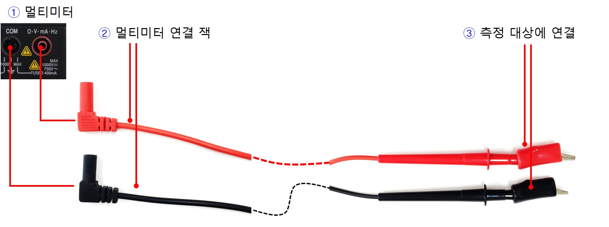
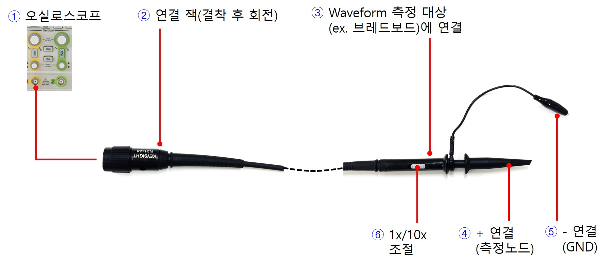
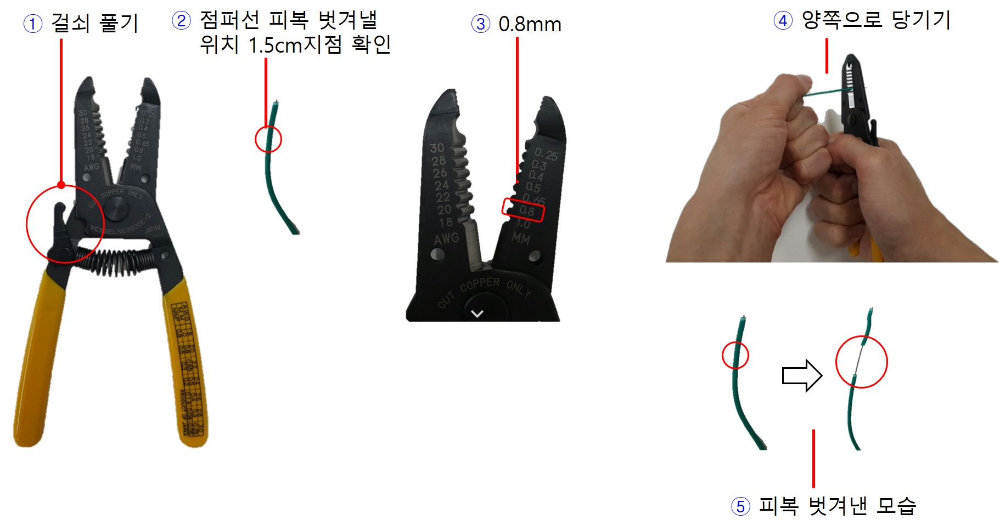

# 실험에 사용할 각종 케이블

### 멀티미터 케이블

실험준비실로 이동하여 그림과 같은 케이블을 수령한다. 

1. 멀티미터 연결포트를 확인한다.
2. 멀티미터 케이블의 연결 잭 부분의 색깔을 확인하여 해당 위치에 연결한다.
3. 클립 형태의 단자를 측정 대상에 정확하게 연결한다. (색깔에 주의한다.)

------------------
### 전원공급기 케이블

실험준비실로 이동하여 위의 그림과 같은 케이블을 수령한 뒤 전원공급기에 본체에 연결하고 반대편 클립을 브레드보드의 회로에 연결해본다.

1. 전원공급기의 출력 채널 포트를 확인한다. 고정전압 출력 포트와 가변전압 출력포트가 존재한다. 자세한 내용은 전원공급기 섹션을 참고한다. 
2. 연결잭의 색깔에 주의하여 전원공급기의 해당 채널포트에 정확하게 연결한다. (그림은 P1채널에 케이블을 연결한 모습이다.)
3. 전원공급기 케이블의 반대쪽 클립을 브레드보드의 회로에 연결한다. 이때 전원 (+) VDD 노드는 빨간색 단자를 연결하고 (-) GND 노드에는 검은색 단자를 연결한다. (색깔에 주의한다.)

------------------
### 함수발생기 케이블

실험준비실로 이동하여 위의 그림과 같은 형태의 함수발생기 연결 케이블을 수령한다. 함수 발생기 본체에 연결하는 포트의 모양이 오실로스코프 케이블과 유사하므로 주의한다. 

1. 함수발생기의 출력 포트를 먼저 확인한다. 고정 주파수 출력 포트와 가변주파수 출력포트가 존재한다. 자세한 내용은 함수발생기 섹션을 참고한다.
2. 연결 케이블을 본체의 출력포트에 정확하게 삽입하고 회전하여 정확하게 결착한다.
3. 연결 케이블의 반대쪽 클립을 회로(브레드보드)에 연결하여 신호를 공급해본다. 이때 회로에 신호를 공급할 노드에는 빨간색 클립을 연결하고 검은색은 GND에 연결한다.

------------------
### 오실로스코프 케이블

실험준비실로 이동하여 그림과 같은 오실로스코프 연결 케이블을 수령한다. 본체 연결부가 함수 발생기 케이블과 유사하므로 주의한다.

1. 오실로스코프의 신호 입력포트를 확인한다. (채널1번, 채널 2번) 
2. 연결잭을 본체의 입력 포트에 연결한 뒤 회전하여 정확하게 결착한다. (현재 그림은 채널 1번에 연결)
3. 측정하고자 하는 회로(브레드보드)의 한 지점에 오실로스크프 케이블의 반대쪽 Probe를 정확하게 연결한다. 
4. 스프링으로 조절되는 Probe 캡을 당기면 연결 클립이 드러나며 이것을 회로의 측정 지점에 연결한다. 
5. 나머지 악어클립은 GND에 연결한다.
6. 신호 측정 배율을 선택한다. (기본은 1x, 정밀 측정시 10x로 선택, 대부분 1x모드를 사용한다.)

------

### 와이어 스트리퍼 (Wire Stripper)

점퍼선을 이용하여 브레드보드상에 회로 배선을 할 수 있다. 와이어 스트리퍼를 이용하여 점퍼선의 피복을 벗겨내는 방법을 알아보자.

1. 왼쪽에 표시된 걸쇠를 푼다.
2. 점퍼선의 한쪽 끝 1.5센티 지점을 피복을 벗겨낼 지점으로 정하자.
3. 그림과 같이 톱니중에 0.8mm 구멍을 찾는다.
4. 와이어 스트리퍼의 0.8mm 구멍에 점퍼선 끝 1.5cm 지점 물리고 손잡이를 눌러 와이어 스트리퍼에 점퍼선을 고정시킨 뒤 왼손에는 점퍼선을 잡고, 오른손에는 와이어 스트리퍼의 손잡이를 잡아 지렛대 원리를 이용하여 피복을 벗겨낸다.
5. 피복을 벗겨낸 모습은 그림과 같다.  피복을 당겨서 완전히 제거한다.

