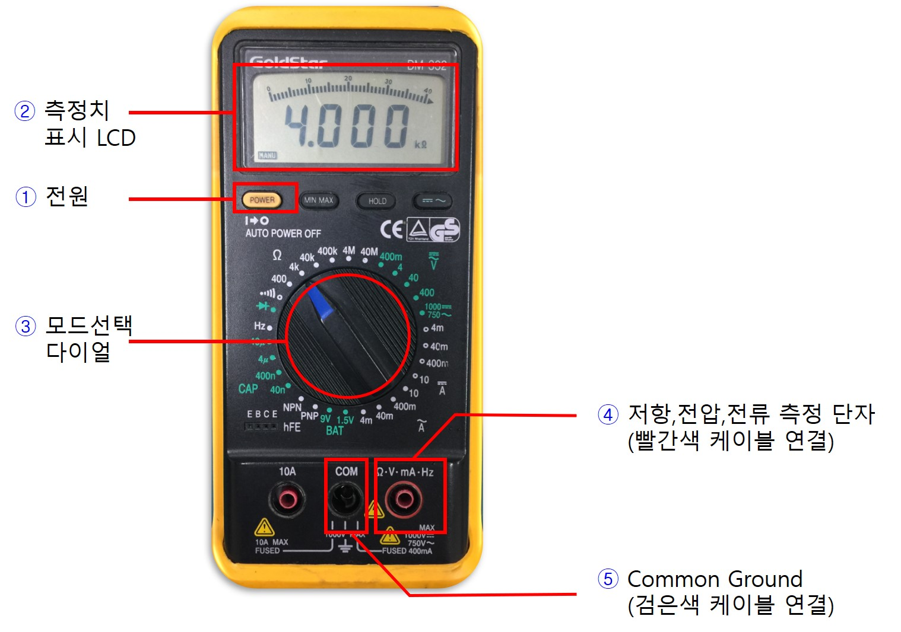
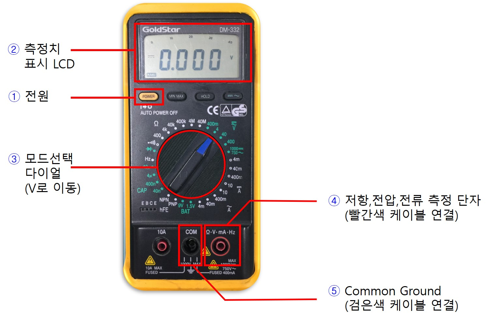
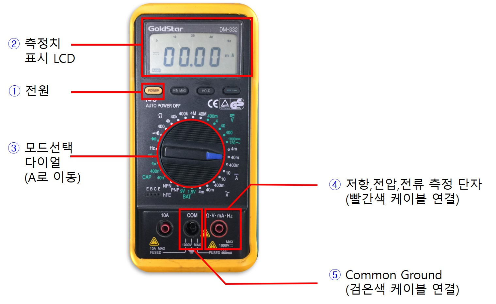

# Digital Multimeter (디지털 멀티미터) 기본 사용법

### 저항 측정 모드

멀티미터를 저항 측정모드로 사용하기 위한 각 단자에 대해 살펴보자.

1. 전원 스위치 버튼을 눌러 전원을 켜본다.
2. 화면이 켜지는지 확인한다. 만약 켜지지 않는다면 배터리를 확인하거나 여분의 멀티미터를 사용한다.
3. 모드선택 다이얼을 돌려서 그림과 같이 저항 측정 모드로 이동한다. 저항 측정 범위에 따라 세부적으로 조절할 수 있다.
4. 멀티미터 케이블의 빨간색 단자를 그림에 표시된 포트에 정확히 연결한다.
5. 멀티미터 케이블의 검은색 단자를 그림에 표시된 포트에 정확히 연결한다.

------------------
### 전압 측정 모드

멀티미터를 이용하여 전압을 측정하기 위해 각 단자에 대해 살펴본다.

1. 전원 스위치 버튼을 눌러 전원을 켠다.
2. 화면이 켜지는지 확인한다. 만약 켜지지 않는다면 배터리를 확인하거나 여분의 멀티미터를 사용한다.
3. 모드선택 다이얼을 돌려서 그림과 같이 전압 측정 모드로 이동한다. 전압 측정 범위에 따라 세부적으로 조절할 수 있다.
4. 멀티미터 케이블의 빨간색 단자를 그림에 표시된 포트에 정확히 연결한다.
5. 멀티미터 케이블의 검은색 단자를 그림에 표시된 포트에 정확히 연결한다.
6. 측정신호에 대해 직류, 교류를 구분하여 따로 선택할 수 있다. 버튼을 누를 때마다 토글된다.
7. 현재 직류신호 혹은, 교류신호 측정 모드인지 표시된다. 6번의 버튼을 눌러서 토글할 수 있다.

------------------
### 전류 측정 모드

멀티미터를 이용하여 회로의 전류를 측정하기 위해 먼저 각 포트의 기능에 대해 살펴보자.

1. 전원 스위치 버튼을 눌러 전원을 켠다.
2. 화면이 켜지는지 확인한다. 만약 켜지지 않는다면 배터리를 확인하거나 여분의 멀티미터를 사용한다.
3. 모드선택 다이얼을 돌려서 그림과 같이 전류 측정 모드로 이동한다. 전류 측정 범위에 따라 세부적으로 조절할 수 있다.
4. 멀티미터 케이블의 빨간색 단자를 그림에 표시된 포트에 정확히 연결한다.
5. 멀티미터 케이블의 검은색 단자를 그림에 표시된 포트에 정확히 연결한다.
6. 측정신호에 대해 직류, 교류를 구분하여 따로 선택할 수 있다. 버튼을 누를 때마다 토글된다.
7. 현재 직류신호 혹은, 교류신호 측정 모드인지 표시된다. 6번의 버튼을 눌러서 토글할 수 있다.

