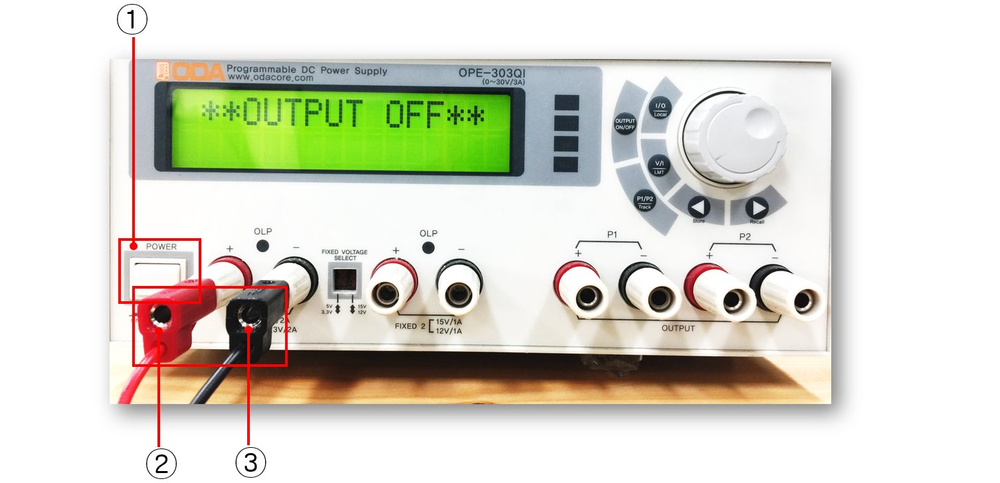
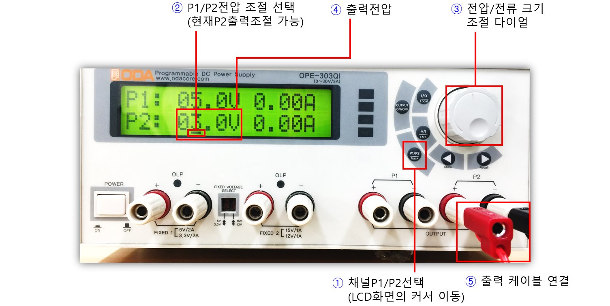
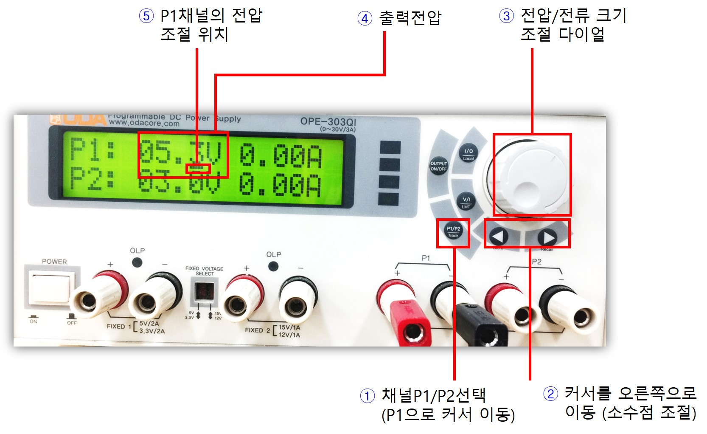

# Power Supply (전원공급기) 기본 사용법

### 전원 On 및 고정전압 5V출력 

전원공급기의 전원을 ON한 뒤 고정전압 5V 출력을 생성해보자.

1. 표시의 스위치를 눌러 전원을 켠다.
2. 표시된 위치는 고정전압 5V가 생성되는 출력 포트이다. +단자에 빨간색 케이블 연결한다. 케이블 반대쪽 클립을 회로에 연결하여 전압을 공급한다.
3. -단자에 검은색 케이블 연결 (GND). 케이블 반대쪽 클립을 회로의 GND에 연결한다.

------------------------
### 가변전압 출력 On/Off

전원공급기의 가변전압을 생성하고 출력포트에 케이블을 연결해본다. 그림과 같이 가변출력 포트 2채널에 케이블을 연결하여 회로에 전압을 공급할 수 있다.

1. 그림의 표시된 위치는 P1출력 포트이며 +/- 단자로 구분되어 있으므로 색깔에 맞추어 전원공급기 케이블 단자를 연결한다.
2. 그림의 표시된 위치는 P2출력 포트이며 +/- 단자로 구분되어 있으므로 색깔에 맞추어 전원공급기 케이블 단자를 연결한다.
3. 다이얼 왼쪽에 위치한 가변전압 출력 On/Off 버튼을 눌러 출력 전압을 생성한다. (On되면 LCD창에 채널별 전압/전류 표시됨)
4. 화면에 출력 채널 P1, P2가 구분되어 표시된다.
5. 현재 채널별 출력 전압/전류가 표시된다. 다이얼을 돌려 전압, 전류를 조절할 수 있다. 

----------------------------------
### 가변전압 출력 포트에 케이블 연결

가변전압 출력포트에 케이블을 연결해보자.

1. P1채널의 +단자에 빨간색 케이블을 연결하고 -단자에 검은색 케이블을 연결한다. 반대편 클립을 회로에 연결하여 전압을 공급할 수 있다.

----------------------------------
### 가변전압 값 조절해보기 (P1 채널)

P1채널의 가변 출력 전압의 크기를 다이얼로 조절해보자. 실시간으로 조절되는 전압, 전류가 LCD화면에 표시되므로 값을 확인하면서 조절하도록 한다.

1. 먼저 출력 전압을 조절하기 전에 채널선택을 위한 P1/P2 버튼을 눌러서 커서가 원하는 채널 (현재 P1)으로 이동시킨다.
2. 현재 커서가 P1에 위치에 있는지 확인한다. P2에 있다면 1번 항목의 버튼을 한번 더 누른다. 커서가 전류쪽에 있다면 V/I 버튼을 눌러서 전압 위치로 커서를 이동시킨다.
3. 다이얼을 돌려 원하는 만큼의 전압을 설정한다. (5V)
4. 현재 출력 전압값이 표시된다.

___________________________________
### 가변전압 값 조절해보기 (P2 채널)

P2채널의 가변 출력 전압의 크기를 다이얼로 조절해보자. 실시간으로 조절되는 전압, 전류가 LCD화면에 표시되므로 값을 확인하면서 조절하도록 한다.

1. 채널선택 P1/P2 버튼을 눌러 커서가 원하는 채널 (현재 P2)로 이동시킨다.
2. 현재 커서가 P2에 위치에 있는지 확인한다. P1에 있다면 1번 항목의 버튼을 한번 더 누른다. 커서가 전류쪽에 있다면 V/I 버튼을 눌러서 전압 위치로 이동시킨다.
3. 다이얼을 돌려 원하는 만큼의 전압을 설정한다. (3V)
4. 현재 출력 전압값이 표시된다.
5. 전원공급기 케이블을 본체에 연결하고 반대쪽 클립을 브레드보드의 회로에 연결하여 전압을 공급한다.

___________________________________
### 가변전압 소수점 이하 조절해보기 (P1 채널)

P1채널의 가변출력전압의 소수점 이하값을 다이얼로 조절해본다.

1. 채널선택 P1/P2 버튼을 눌러서 원하는 채널 (현재 P1)로 커서를 이동시킨다.
2. 현재 커서가 P1에 위치에 있는지 확인한다. P2에 있다면 1번 항목의 버튼을 한번 더 누른다. 커서가 전류쪽에 있다면 V/I 버튼을 눌러서 전압 위치로 이동시킨다. 이후에 그림에 표시된 화살표 버튼을 이용하여 원하는 소수점 위치로 커서를 이동시킨다.
3. 다이얼을 돌려 원하는 만큼의 전압을 설정한다. (5.3V)
4. 값을 조절할 수 있는 현재 위치가 그림과 같이 커서로 표시된다.
5. 현재 출력 전압값이 표시된다.

