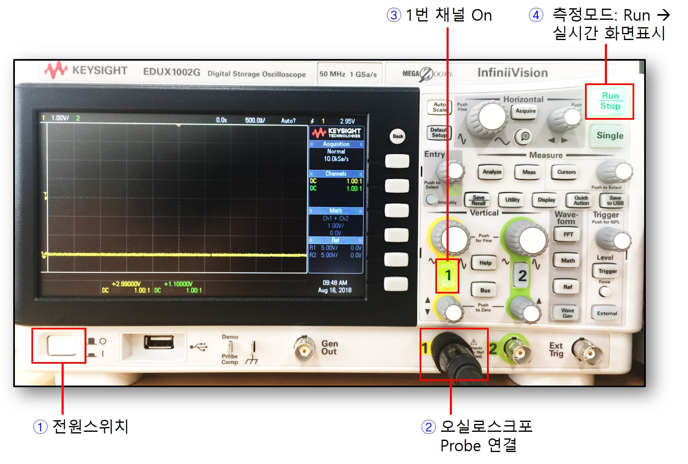
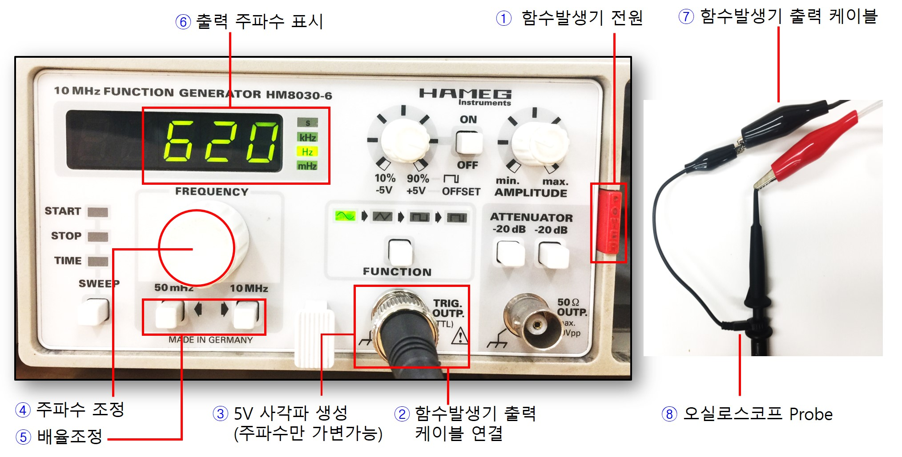
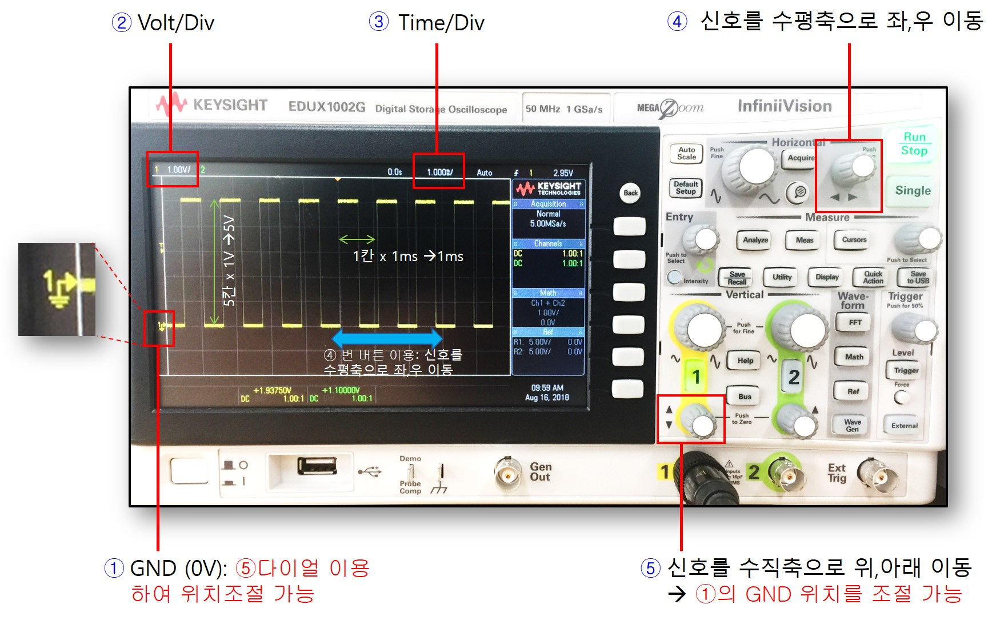
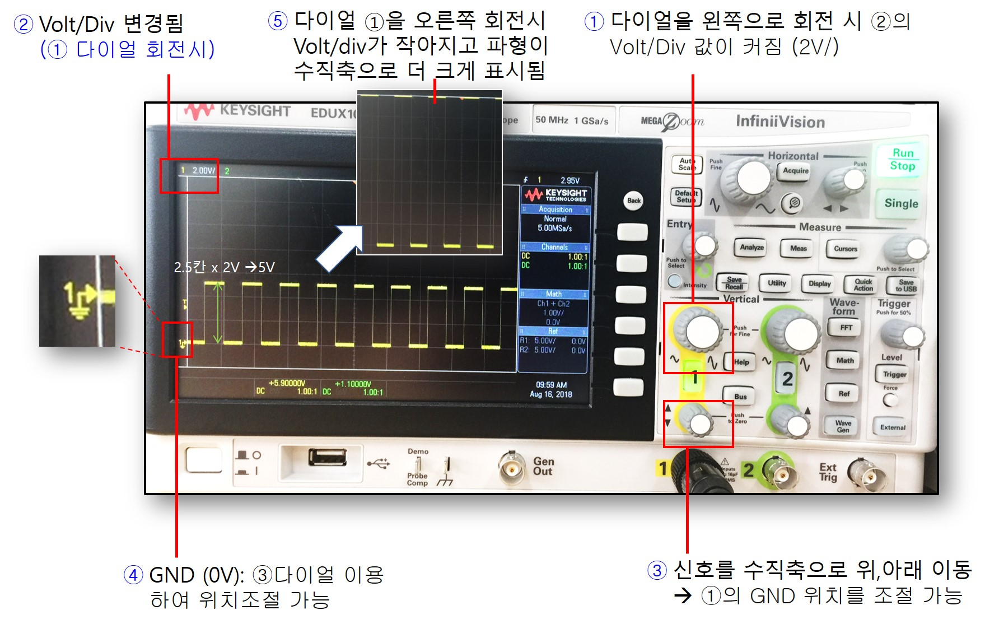
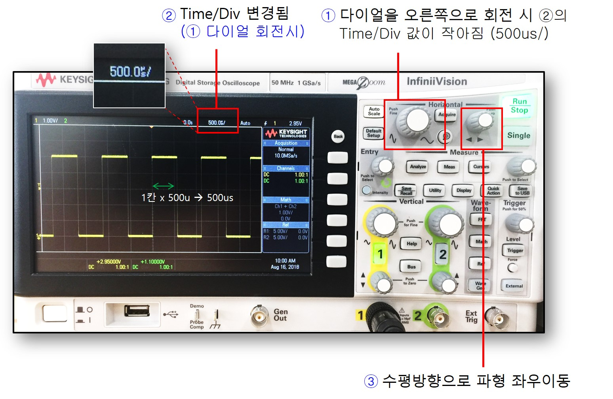
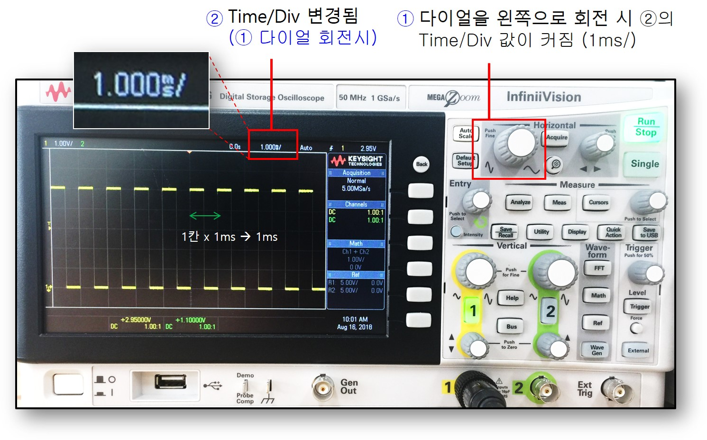

# Oscillosope 오실로스코프 장비 활용

오실로스코프를 이용하여 회로의 시간에 따른 동작을 실시간 파형으로 관찰해볼 수 있다.

--------------------
### 사용준비 (전원 On, 1번 채널 On, 케이블 연결)

1. 왼쪽 하단의 전원 스위치를 눌러 전원을 켠다.
2. 오실로스코프 케이블을 채널 1에 연결한다.
3. 1번 채널 LED에 불이 켜져 있는지 확인한다. 꺼져 있다면 버튼을 누른다.
4. 기본 측정모든 Run 상태로 실시간 파형을 화면에 표시힌다. 버튼을 한번 더 누르면 Stop이 되고 빨간색으로 색깔이 바뀐다. STOP되는 시점의 전압 파형을 캡쳐해서 정지화면으로 보여준다.

------------------
### 오실로스코프 케이블

실험준비실로 이동하여 그림과 같은 오실로스코프 연결 케이블을 수령한다. 본체 연결부가 함수 발생기 케이블과 유사하므로 주의한다.

1. 오실로스코프의 신호 입력포트를 확인한다. (채널1번, 채널 2번) 
2. 연결잭을 본체의 입력 포트에 연결한 뒤 회전하여 정확하게 결착한다. (현재 그림은 채널 1번에 연결)
3. 측정하고자 하는 회로(브레드보드)의 한 지점에 오실로스크프 케이블의 반대쪽 Probe를 정확하게 연결한다. 
4. 스프링으로 조절되는 Probe 캡을 당기면 연결 클립이 드러나며 이것을 회로의 측정 지점에 연결한다. 
5. 나머지 악어클립은 GND에 연결한다.
6. 신호 측정 배율을 선택한다. (기본은 1x, 정밀 측정시 10x로 선택, 대부분 1x모드를 사용한다.)

------------------
### 함수발생기 케이블

실험준비실로 이동하여 위의 그림과 같은 형태의 함수발생기 연결 케이블을 수령한다. 함수 발생기 본체에 연결하는 포트의 모양이 오실로스크포 케이블과 유사하므로 주의한다. 

1. 함수발생기의 출력 포트를 먼저 확인한다. 고정 주파수 출력 포트와 가변주파수 출력포트가 존재한다. 자세한 내용은 함수발생기 섹션을 참고한다.
2. 연결 케이블을 본체의 출력포트에 정확하게 삽입하고 회전하여 정확하게 결착한다.
3. 연결 케이블의 반대쪽 클립을 회로(브레드보드)에 연결하여 신호를 공급해본다. 이때 회로에 신호를 공급할 노드에는 빨간색 클립을 연결하고 검은색은 GND에 연결한다.

--------------------
### 함수발생기를 이용한 테스트 파형 준비

1. 그림에 표시된 위치의 버튼을 눌러 함수발생기의 전원을 켠다. 
2. 함수발생기 출력 포트가 2개 있는데 먼저 왼쪽 포트에 함수발생기 케이블 단자를 연결한다. (TRIG OUTP라고 표시된 포트)
3. 이 포트에는 5V로 진폭이 고정된 사각파만 생성된다. 즉 다른 형태로 파형을 조절할 수 없다.
4. 다이얼을 돌려 출력 주파수를 조절할 수 있다.
5. 다이얼 아래쪽에의 버튼을 이용하여 주파수를 큰 단위로 조절할 수 있다. 왼쪽 버튼은 1/10, 오른쪽 방향 버튼은 10x 배율로 조절할 때 사용된다. 버튼을 누를 때마다 6번의 LCD창에 현재 선택된 주파수가 가변되어 표시된다.
6. 화면에 현재 설정된 파형의 주파수를 보여준다. 숫자의 digit값과 오른쪽의 단위를 잘 구분하여 현재 출력 주파수 값을 적절히 해석해야 한다.
7. 함수발생기 케이블의 반대쪽 클립을 확인한다. 
8. 오실로스코프 케이블의 Probe에 그림과 같이 연결한다. (색깔에 주의하여 연결한다.)

--------------------
### 전면 버튼 다이얼 기본 사용법

함수발생기로부터 사각파를 오실로스코프로 관찰해보고, 각 단자를 이용하여 표시 방법을 조절해본다.

1. 그림과 같이 표시된 아이콘은 접지 (GND, 0V)의 위치를 표시한다. 이 지점을 기준으로 현재 측정되는 전압의 +/-및 크기를 해석할 수 있다.
2. 화면 상단에 현재 설정된 Volt/Div, 즉 수직방향 Grid로 표시된 한칸 당 전압 크기가 표시된다. 그림에서는 한칸에 1V를 의미한다.
3. 현재 설정된 Time/Div, 즉 수평방향 Grid로 표시된 한칸당 시간이 표시된다. 그림에서는 한칸에 1ms를 의미한다.
4. 표시의 다이얼을 돌려서 현재 관찰되는 신호의 수평방향 위치를 좌우로 조절할 수 있다.
5. 다이얼을 돌려서 현재 관찰되는 신호의 수직방향 위치를 위,아래로 조절할 수 있다. 이때는 단지 화면에 표시되는 위치만 바뀔 뿐이다. 즉 1번에서 표시되는 GND위치도 같이 이동함에 주의한다.

--------------------
### 수직축 Volt/Div 해상도 조정

1. 다이얼을 왼쪽으로 회전 하면 Volt/Div값이 커지고, 파형은 수직방향으로 좀더 축소되어 표시된다. 실제 파형의 진폭이 줄어든 것이 아니므로 주의하자.
2. 다이얼을 돌리면 Volt/Div값이 실시간 업데이트 되어서 표시된다. 왼쪽으로 돌리면 Volt/Div값이 커진다. 그림에서는 2V/Div로 설정되었다. 그림의 파형을 해석해보면 높이로 2.5칸을 차지하므로 2.5칸 x 2V/Div = 5V로 해석될 수 있다. 실제 입력 파형의 진폭이 작아진게 아니라 화면상에 표한한 크기만 달라졌을 뿐임에 유의하자.
3. Volt/Div을 조절하다보면 신호가 화면에 표시되는 위치가 아래나 위쪽으로 치우쳐질 수 있다. 이때 수직축 위치 조정 다이얼을 돌려서 적절한 위치로 이동시다. 이때 GND위치도 같이 움직이므로 신호의 진폭과 전압의 절대값이 바뀐 것은 아님에 유의한다.
4. GND의 위치를 표시한다. 이 지점을 기준으로 Volt/Div 값을 이용하여 신호의 전압 크기를 해석할 수 있다.
5. 만약 1번에서 다이얼을 오른쪽으로 회전하면 Volt/Div값이 작아지고 파형이 더 크게 표시된다. 역시 파형의 진폭이 커진 것이 아니라 화면에 좀더 크게 표시되었을 뿐임에 유의하자.

--------------------
### 수평방향 Time/Div 해상도 조정

1. 표시의 다이얼을 오른쪽으로 회전하면 Time/Div이 작아진다. 현재 그림은 1ms에서 500us로 작아졌다. 한칸에 더 작은 시간 영역을 표시한다. 따라서 파형의 좁은 시간 영역을 화면에 크게 표시하므로 파형의 Zoom in 효과를 얻게 된다. 
2. 현재 선택된 Time/Div값을 보여준다. 1번의 다이얼을 돌릴때마다 실시간 Time/Div값이 표시된다. 
3. 표시된 다이얼을 조절하여 파형의 수평축 방향의 위치를 적절히 이동시킬 수 있다.

-------------------------

1. 표시의 다이얼을 왼쪽으로 회전하면 Time/Div 값이 커진다. 현재 그림은 500us에서 1ms로 커진 상태이다. Grid 한칸에 더 긴 시간 영역을 표시하게 된다. 따라서 파형의 넓은 구간을 한 화면에 표시하므로 파형의 Zoom out 효과를 얻게 된다. 
2. 현재 선택된 Time/Div값을 보여준다. 1번의 다이얼을 돌릴 때마다 실시간 Time/Div값이 표시된다. 

