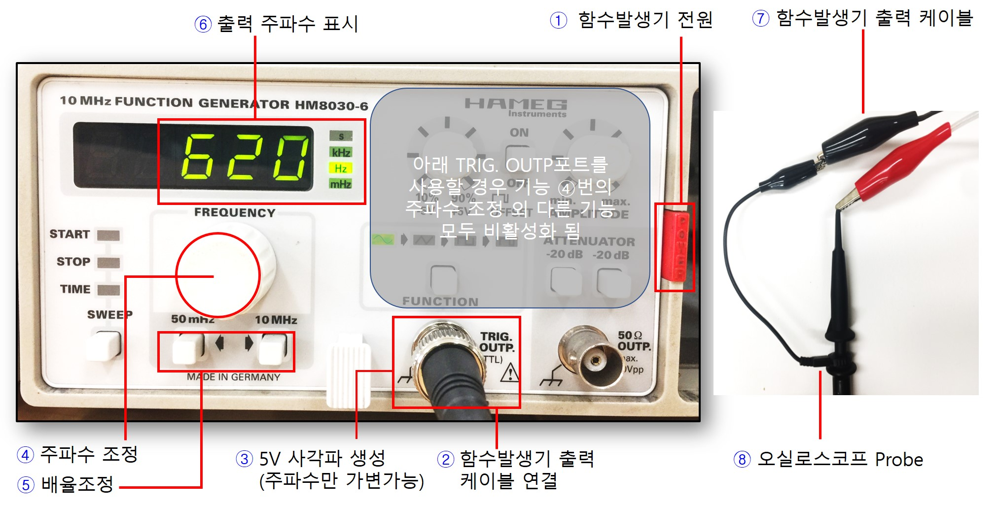
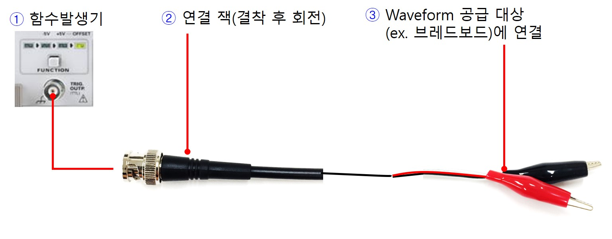
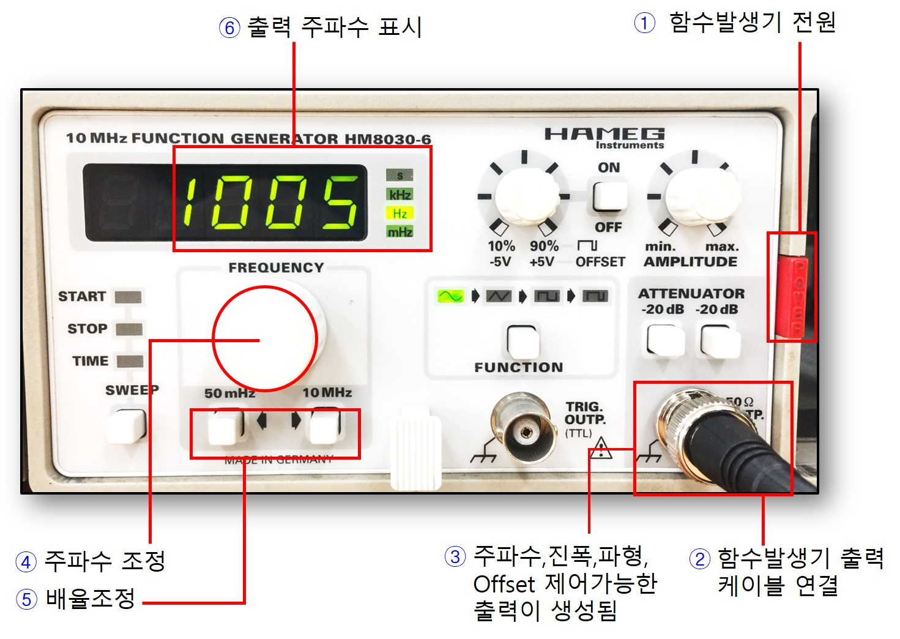
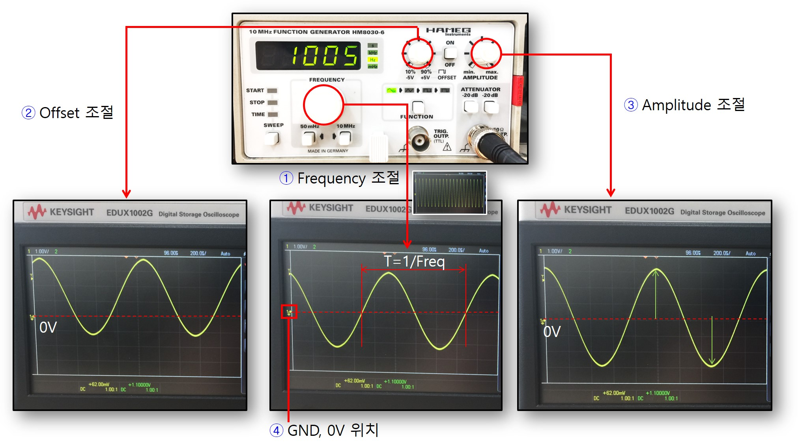
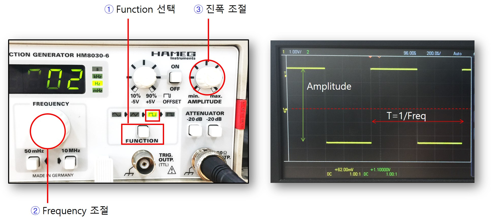
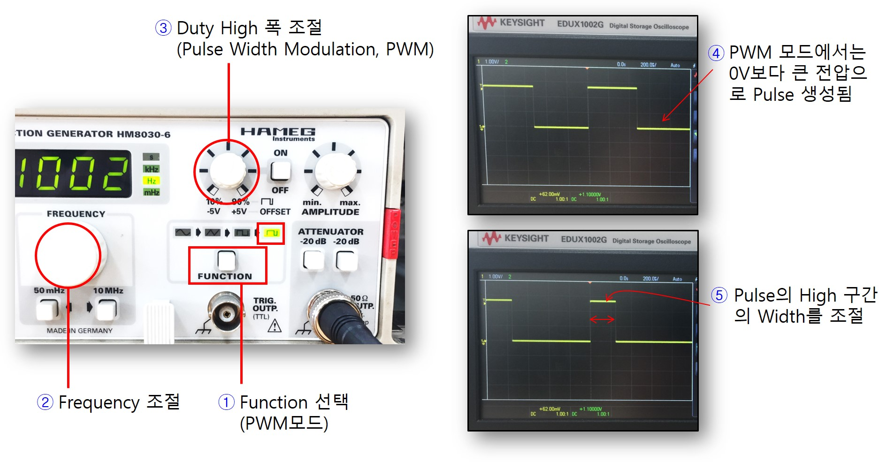

# Function Generator 함수 발생기 활용

함수 발생기를 이용하여 다양한 형태의 신호를 생성해보자.

--------------------
### 함수발생기 TRIG OUT 출력신호 생성

1. 그림에 표시된 버튼을 눌러 함수발생기의 전원을 켠다.
2. 하단에 위치한 출력 포트를 확인한다. 포트 2개가 존재하는데 왼쪽에 함수발생기 케이블의 단자를 연결한다. (TRIG OUTP라고 표시된 포트)
3. 이 포트에는 5V 고정 진폭의 사각파만 출력된다. (상단의 다이얼, 버튼등을 조작하여도 출력 파형의 모양을 조절할 수 없음에 주의한다.)
4. LCD 창 아래에 위치한 다이얼을 돌려 출력 주파수를 조절할 수 있다.
5. 다이얼 아래에 위치한 버튼 2개를 이용하여 출력 배율을 조절할 수 있다. 왼쪽 버튼을 누를때마다 주파수가 1/10x가 되고, 오른쪽 버튼을 누를때마다 10x 로 주파수 값이 조절된다. 버튼을 누를때마다 6번의 LCD창에 해당 선택된 주파수가 가변되어 표시된다.
6. 화면에 현재 설정된 출력 주파수를 보여준다. 숫자의 digit값과 오른쪽의 단위를 잘 구분하여 주파수를 해석해야 한다.
7. 함수발생기 케이블 단자를 본체 하단 출력포트에 연결하고 반대쪽 클립을 오실로스코프에 연결할 준비를 한다.
8. 오실로스코프 Probe 케이블을 그림과 같이 함수발생기 출력 케이블의 클립에 연결한다. 이때 색깔에 주의하여 연결한다.

------------------
### 함수발생기 케이블

실험준비실로 이동하여 위의 그림과 같은 형태의 함수발생기 연결 케이블을 수령한다. 함수 발생기 본체에 연결하는 포트의 모양이 오실로스크포 케이블과 유사하므로 주의한다. 

1. 함수발생기의 출력 포트를 먼저 확인한다. 고정 주파수 출력 포트와 가변주파수 출력포트가 존재한다. 자세한 내용은 함수발생기 섹션을 참고한다.
2. 연결 케이블을 본체의 출력포트에 정확하게 삽입하고 회전하여 정확하게 결착한다.
3. 연결 케이블의 반대쪽 클립을 회로(브레드보드)에 연결하여 신호를 공급해본다. 이때 회로에 신호를 공급할 노드에는 빨간색 클립을 연결하고 검은색은 GND에 연결한다.

------------------
### 오실로스코프 케이블

실험준비실로 이동하여 그림과 같은 오실로스코프 연결 케이블을 수령한다. 본체 연결부가 함수 발생기 케이블과 유사하므로 주의한다.

1. 오실로스코프의 신호 입력포트를 확인한다. (채널1번, 채널 2번) 
2. 연결잭을 본체의 입력 포트에 연결한 뒤 회전하여 정확하게 결착한다. (현재 그림은 채널 1번에 연결)
3. 측정하고자 하는 회로(브레드보드)의 한 지점에 오실로스크프 케이블의 반대쪽 Probe를 정확하게 연결한다. 
4. 스프링으로 조절되는 Probe 캡을 당기면 연결 클립이 드러나며 이것을 회로의 측정 지점에 연결한다. 
5. 나머지 악어클립은 GND에 연결한다.
6. 신호 측정 배율을 선택한다. (기본은 1x, 정밀 측정시 10x로 선택, 대부분 1x모드를 사용한다.)

--------------------
### 함수발생기 가변신호 출력

1. 그림에 표시된 빨간색 버튼을 눌러 전원을 켠다.
2. 함수발생기 하단에 출력포트가 2개 존재하는데 오른쪽이 가변신호 출력 포트이다. 함수발생기 케이블의 단자를 이곳에 연결한다. 
3. 해당 포트에는 주파수, 진폭, 오프셋, 파형 모양등을 제어할 수 있는 신호가 생성되며 함수발생기 케이블의 반대쪽 클립을 브레드보드의 회로에 연결하여 신호를 전달할 수 있다.
4. 화면 아래에 위치한 다이얼을 돌려 주파수를 설정할 수 있다.
5. 다이얼 아래쪽에의 버튼을 이용하여 주파수를 큰 단위로 조절할 수 있다. 왼쪽 버튼은 1/10x, 오른쪽 방향 버튼은 10x 배율로 조절할 때 사용된다. 버튼을 누를 때마다 6번의 LCD창에 현재 선택된 주파수가 가변되어 표시된다.
6. 현재 선택된 출력 주파수가 화면에 표시된다. 

--------------------
### 사인파 출력 생성 및 조절

함수발생기의 Function 버튼을 이용하여 사인파 출력을 생성하도록 모드를 선택하고 출력 신호의 주파수, 진폭, 오프셋 등을 조절해보자.

1. 그림에 표시한 다이얼을 돌려서 사인파의 주파수를 적절히 조절해본다. 이때 함수발생기 출력을 오실로스코프 입력으로 연결하여 오실로스코프 화면에 현재 선택된 신호 파형이 표시되도록 한다. 오실로스크포 전면 다이얼 중에 Volt/Div, Time/Div를 적절히 설정하여 화면에 적절히 표시되도록 조절해본다. 오실로스코프 사용방법은 해당 섹션을 참고하도록 한다.
2. 그림의 오프셋 다이얼을 이용하여 사인파의 DC 레벨을 조절할 수 있다. 이 다이얼을 조절하여도 오실로스코프 면에 표시된 신호에서 GND가 고정되어 있음에 주의하자. 이는 신호의 DC 레벨이 직접 조절되는 것을 의미한다. 
3. Amplitude 다이얼을 돌려서 생성되는 출력 신호의 진폭을 조절해보고 오실로스코프 화면에서 현재 선택된 신호를 관찰해본다.
4. GND 위치를 염두에 두고 신호의 진폭의 크기를 정확히 판단해본다.

--------------------
### 다양한 파형 모드 선택

1. Function 버튼을 누를때마다 현재 선택된 파형에 표시등이 켜진다. 그림에서는 사각파가 선택되었을때의 모습이다.
2. 주파수 조절 다이얼을 돌려서 사각파의 주파수를 조절할 수 있다. 
3. 그림의 다이얼을 돌려서 사각파의 진폭을 조절할 수 있다. 오실로스코프 화면에 표시된 GND위치를 기준으로 현재 선택된 신호 파형의 +/- 진폭 및 전압값을 파악할 수 있다. 

--------------------
### PWM 모드의 활용

1. Function 모드를 눌러서 그림과 같이 PWM모드를 선택한다.
2. 다이얼을 이용하여 사각파의 주파수를 설정한다.
3. 그림에 표시된 다이얼을 이용하여 사각파의 High 구간의 폭을 조절할 수 있다. 이때 사각파의 한 주기의 크기는 고정되어 있으며 Pulse의 High 구간의 폭만 조절됨에 유의하자.
4. PWM 모드에서는 출력전압의 최소값은 0V이며 Amplitude 다이얼을 이용하여 Pulse의 high 구간의 높이만 조절된다.
5. 3번의 다이얼을 이용하여 Pulse High 구간의 Width가 조절된 모습이다. 이렇게 신호의 주파수를 고정시킨 상태에서 Pulse High 구간의 Width를 제어하는 것을 Pulse Width Modulation (PWM)이라고 한다.

