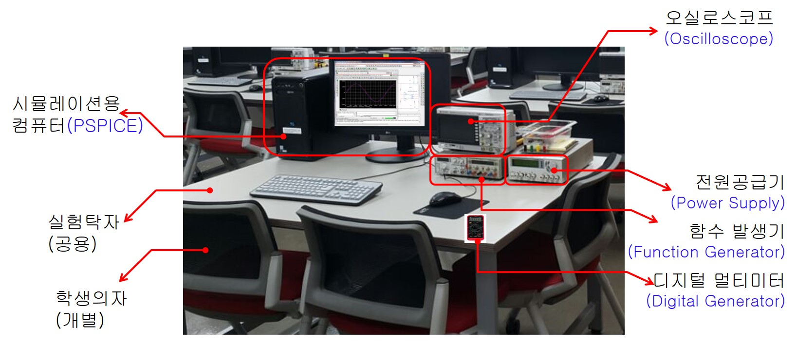
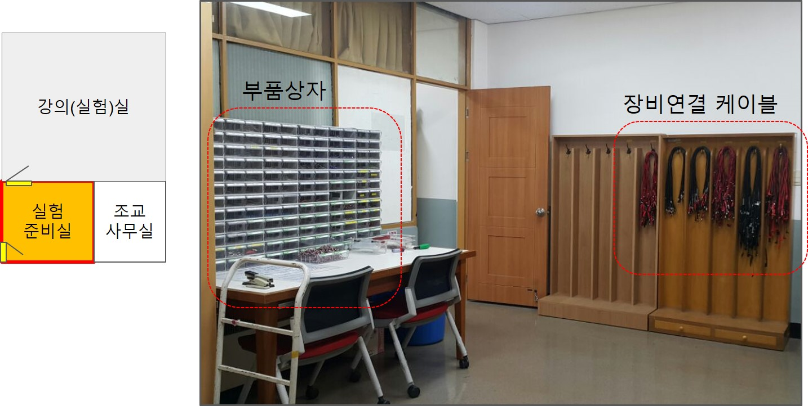

# 실험 장비, 계측기 및 각종 케이블류

1. [00_cable](./00_cable): 장비,계측기 등에 연결하여 사용할 케이블류에 대한 설명
2. [01_multimeter](./01_multimeter): 전압,전류,저항 측정용 멀티미터의 활용 절차
3. [02_power_supply](./02_power_supply): 전원공급기 사용법 및 활용 튜토리얼
4. [03_oscilloscope](./03_oscilloscope): 오실로스코프 기초 및 활용에 관한 튜토리얼
5. [04_function_generator](./04_function_generator): 함수발생기 기초 및 활용에 관한 튜토리얼

----------------------------
## 실험별 사용장비, 계측기 목록
실험별로 사용할 장비, 계측기들은 다음과 같다.

----------------------------
## 실험 테이블
실험 테이블에 준비된 장비, 계측기는 다음과 같다.

------------------------------
## 실험 준비실
실험준비실로 이동하여 실험에 사용할 부품과 케이블류를 수령할 수 있다.

-------------------------------
## 부품함 및 케이블 거치대 
계측기, 장비등에서 사용할 각종 케이블류가 준비되어 있으며 조별로 필요한 수량만큼 정확한 케이블을 수령.

