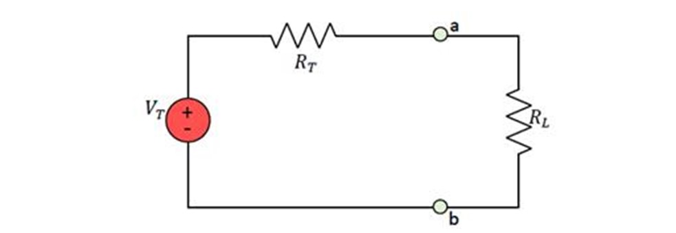
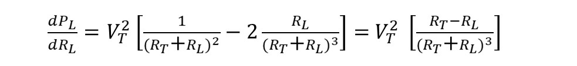
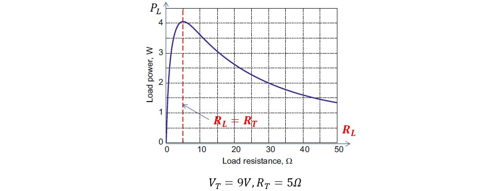

# 기초실험5: 최대전력전달조건

본 실험에서는 부하저항의 크기에 따라 부하에 인가되는 전압과 전류의 상호관계를 실험으로 관찰하고 전압과 전류의 곱으로 계산되는 전력을 최대로 전달하기 위한 조건을 결정해본다.

이번 실험에 사용할 주요 부품과 이를 브레드보드에 구현한 주요 회로도는 아래 그림과 같다. 

## 실험목표
1. 부하(Load)저항에 전달되는 전압과 전류, 최종적으로 전력 전달의 원리를 이해.
2. 부하저항의 크기에 비례하여 더 큰 전압이 부하에 인가될 수 있지만 저항 증가로 인해 전체 전류가 줄어들기 때문에 최종적으로 부하에 걸리는 전압이 줄어들 수 있음을 이해.
3. 전력을 공급하는 공급기도 회로로 구성되어 있으며 이 회로의 내부 저항값과 부하저항의 크기의 비로 인해 부하로 전달되는 전압과 전류에 영향을 줄 수 있음을 관찰.
4. 부하 저항 값을 바꾸면서 부하에 걸리는 전압과 전류의 곱이 가장 크게 되는 지점을 실험적으로 찾아보고 전력을 공급하는 회로의 내부저항크기와의 연관성을 파악.

### 예비보고서

1. 본 실험 자료를 읽고 실험 목차, 절차, 예상 결과에 대해 요약해본다. 
2. 추가로 담당교수의 지시사항을 숙지하여 사전 조사한 내용을 예비 리포트에 작성해 온다.

### 기초이론

본 실험고 관련하여 자세한 이론적 내용은 2학년 회로이론 수업에서 배우기로 하고 여기서는 아주 간략한 수학만을 사용하여 최대전력전달 원리를 이해해보도록 하자. 아래 그림과 같이 내부저항과 로드저항이 직렬로 연결된 회로를 생각해보자.

로드저항 RL로 많은 전력을 전달하기 위해서는 전압뿐만 아니라 전류도 같이 증가해야 한다. 따라서 단순히 부하저항 크기를 증가시키는 것으로 전력전달을 증가시킬 수 없다. (전류가 감소하므로) 입력전원 VT가 고정되어 있다면 RT와 RL의 비가 중요하다는 것을 알 수 있다. 아래 식을 통해 RL에 전달되는 전력량을 수식으로 전개해보자.

부하저항 크기 변화에 따른 전력변화량을 계산하기 위해 이 수식에 대해 RL에 대해 미분해보자. 그러면 아래와 같은 식을 얻게 된다.

이 수식으로부터 다음을 알 수 있다.

따라서 가로축을 RL로 하고 세로축을 PL로 할 때 곡선을 다음과 같이 예측할 수 있으며 특히 RL=RT 되는 지점에서 PL값 즉 부하저항으로 전달되는 전력이 최대가 됨을 알 수 있다. 

------------------------
## 세부실험 5-1: 부하저항에 전달되는 전압

내부저항과 직렬로 연결된 부하저항에 전달되는 전압의 크기를 측정해보고 부하저항의 크기와의 관계를 실험으로 관찰하자. 부하저항을 제외한 내부 회로는 테브난 등가회로 변환 원리를 이용하여 내부전원과 내부저항으로 변환되었다고 가정한다.

### 내부저항과 부하저항으로 회로구성

내부저항 R1과 부하저항 R2를 직렬로 연결할 경우 두 저항의 상대적 크기에 따라 부하저항에 전압이 인가될 것이다. 즉 부하저항에 큰 전압이 전달되기 위해서는 내부저항 R1보다 상대적으로 큰 저항을 부하저항으로 사용해야 할 것이다. 반대로 상대적으로 내부저항이 부하저항보다 작아야 더 큰 전압이 부하로 전달될 것이다.

1. 그림과 같이 전원과 내부저항, 부하저항을 직렬로 연결한다. 이때 부하저항에는 가변저항(최대 10kΩ)을 사용한다. 가변저항 값을 바꾸면서 부하에 전달되는 전압의 크기를 측정해본다.
2. 이를 위해 브레드보드에 그림과 같이 회로를 구성해본다. 내부저항으로 1kΩ을 사용한다. 
3. 가변저항 양단 전압을 측정할 수 있도록 그림과 같이 점퍼를 연결해둔다.

위 그림과 같이 저항 1개와 가변저항 1개를 직렬로 연결하고 가변저항의 크기에 따른 전압강하를 측정할 수 있도록 브레드보드에 회로를 구성해보자. 먼저 가변저항 양단 전압을 측정할 수 있도록 점퍼 선을 아래 그림과 같이 뽑아둔다. 전압 측정을 위해서는 직렬이 아닌 저항 양단에 병렬로 측정해야 함을 다시 한 번 더 주의한다.

### 부하저항 크기에 따른 전압측정

부하저항을 조절하면서 전달되는 전압을 측정해본다. 부하에 더 전압을 크게 전달하기 위해서 단순히 부하저항 크기를 키우면 되는지 관찰한다. (저항을 증가했을때 저항양단 전압이 선형적으로 증가하는지 확인)

가변저항의 크기를 조절하여 저항 값이 커질수록 더 전압이 크게 걸리는 현상을 관찰해보자. 가변저항 양단 전압이 커지는 만큼 고정 저항 1kΩ 양단의 전압이 작아지는 것도 관찰한다. 저항 각각에 인가되는 전압의 합은 전원공급기로부터 공급되는 전압과 같음을 확인한다.

1. 멀티미터를 전압측정모드로 전환한다.
2. 전원공급기 출력 5V를 브레드보드에 연결한다.
3. 내부저항으로 1kΩ을 사용한다.
4. 가변저항 값을 조절하면서 부하 저항 양단 전압을 측정해본다. 
5. 그림에서는 가변저항 값이 1kΩ로 조정되었고 따라서 양단전압이 2.5V로 측정된 모습이다. 가변저항 크기에 비례하여 전압이 선형적으로 증가되는가?

## 세부실험 5-2: 부하저항에 전달되는 전류

내부저항과 직렬로 연결된 부하저항에 전달되는 전류를 측정해보고 부하저항 크기와의 관계를 생각해본다. 부하저항을 제외한 임의의 회로는 테브난 등가회로 변환 원리를 이용하여 내부전원과 내부저항으로 변환되었다고 가정한다.

### 전류측정 준비

내부저항 R1과 부하저항 R2이 합쳐져 회로 전체로 흐르는 전류를 제한한다. 부하저항에 전압을 많이 전달하기 위해서는 부하저항 값을 크게 하면 되지만 반대로 전체 전류량이 줄어들게 된다. 그로 인해 부하저항 양단 전압이 감소될 수 있음을 관찰하자.

1. 브레드보드에 그림과 같이 회로를 구성해본다. 내부저항으로 1kΩ을 사용하고 부하저항으로는 가변저항(최대 10kΩ)을 사용한다. 가변저항 값을 조절하면서 전체회로로 흐르는 전류를 측정해본다.
2. 그림과 같이 저항을 통해 흐르는 전류를 측정할 수 있도록 점퍼를 미리 연결해둔다.

가변저항의 상단 다이얼을 가장 왼쪽으로 돌리지 않도록 주의하며 이를 방지하기 위해 가변저항에 적당한 저항을 직렬로 연결해두는 것도 좋다.

### 부하저항 크기에 따른 전류측정

부하저항의 크기를 조절하면서 부하저항으로 흐르는 전류를 측정해본다. 부하저항에 더 큰 전류를 전달하기 위해서는 부하저항의 크기를 줄여야 하지만 부하저항 양단에 인가되는 전압이 줄어들게 된다. 따라서 전류와 전압의 곱을 극대화하기 위해서 내부저항과 부하저항 크기의 비가 중요하며 어떻게 조절해야 하는지 생각해보고 실험을 통해 최적 값을 찾아본다.

1. 멀티미터를 전류측정모드로 전환한다.
2. 전원공급기 출력 5V를 브레드보드에 공급한다.
3. 내부저항으로 1kΩ을 사용한다. 부하저항 값을 조절하면서 저항을 통해 흐르는 전류를 측정해본다. 
4. 그림에서는 부하저항 값이 1kΩ로 설정되어 전체 저항을 통해 흐르는 전류가 5V/2kΩ=2.5mA로 측정된다. 부하저항 크기와 전류 및 전압과의 관계에 대해 생각해보고 전압x전류 값이 극대화되기 위한 부하저항의 크기를 실험을 통해 찾아본다.

부하 저항이 커질수록 전체 전류는 작아진다. 하지만 부하저항이 커지는 양보다 전류 감소폭이 더 작기 때문에 최종적으로 V=I x R을 통한 부하저항 양단 전압이 커진다. 그리고 최종적으로 V x I 곱이 최대로 되기 위해서는 RL을 가변시킴에 따라 전압 증가와 전류 감소가 되며  V x I가 가장 큰 값을 결정하는 RL값을 정할 수 있을 것이다. 즉 전력 값이 최대가 되기 위한 부하저항 값의 조건을 내부저항 값과의 관계로 해석해보자.

## 결과보고서

1. 담당교수의 지시사항을 숙지하여 해당 내용에 대한 실험을 실시한다. 실험과정, 측정 데이타를 결과 보고서에 작성하여 제출한다.
2. 본 실험 자료에서 제시된 기본적인 실험 과정, 장비사용방법, 측정 결과들을 충실히 요약 정리한다. 
3. 실험과 관련된 이론과 실측치를 비교하여 회로의 전기적 동작 원리에 대한 결론을 내려본다. (Optional) 
4. 내부저항과 로드저항의 크기를 일치시키지 못했다고 가정해보자. 만약 이러한 회로에서 이론적인 최대전력 전달치 만큼 전력을 로드에 공급하기 위해서는 전원소스의 전압을 더욱 높이면 되는가? 가능한 이유에 대해서 생각해보고, 만약 단점이 있다면 그 내용에 대해서도 보고서에 작성한다. (Optional)

