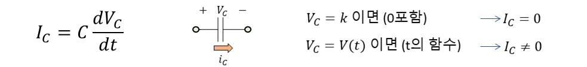
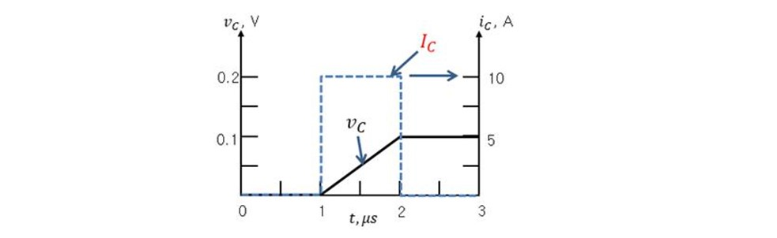

# 기초실험6: 커패시터

본 실험에서는 커패시터의 직류, 교류 특성에 대해 알아본 뒤 저항-커패시터 직렬회로의 동작 특성을 관찰해본다. 저항-커패시터 직렬회로에 사인파를 인가했을 때 커패시터 양단 전압의 시간지연, 전압감쇄 효과를 오실로스코프로 관찰하면서 커패시터의 주파수 응답 특성에 대해 알아보자.

## 실험목표
1. 커패시터에 고정 전압을 인가하여 전압, 전류 값을 측정해본 뒤 직류 특성을 이해한다.
2. 커패시터에 교류 전압을 인가한 뒤 전압, 전류의 직류, 교류 측정값을 서로 비교해본다.
3. 저항-커패시터 직렬회로를 구성한 뒤 사인파를 입력으로 인가하였을 때 커패시터 양단 전압의 지연, 전압감쇄 특징을 오실로스코프로 직접 확인한다. 입력 주파수, 회로의 저항, 커패시터 값을 각각 변화시키면서 커패시터 양단 전압 변화를 측정하여 커패시터의 주파수 특성을 실험을 통해 확인한다.

이번 실험에 사용할 주요 부품과 이를 브레드보드에 구현한 주요 회로도는 다음과 같다.

### 예비보고서

1. 본 실험 자료를 읽고 실험 절차, 실험 방법, 예상 결과에 대해 요약해본다. 
2. 추가로 담당교수의 지시사항을 숙지하여 사전 조사한 내용을 예비 리포트에 작성해 온다.

### 기초이론

자세한 이론은 2학년 회로이론 시간에 배우기로 하고 본 실험에 필요한 기초적인 원리만 알고 넘어가도록 하자. 커패시터는 아래 심벌모양에서도 알 수 있듯이 전류가 흐를 수 없도록 절연체로 끊어진 소자이며 전압과 전류와의 관계식은 아래와 같이 미분 식으로 표현된다.

수식으로 알 수 있듯이 커패시터 양단 전압이 시간에 따라 변할 경우 즉 AC 전압이 인가될 경우 그 전압 변화량에 비례하여 전류가 유도된다. 주어진 전압변화에 대해 얼마나 큰 전류를 발생시킬지는 비례상수 C로부터 결정된다. 주의할 점은 전압이 0V가 아닌 일정한 상수 전압 k가 인가되어도 전류가 흐르지 않는다는 것이다. 즉 시간에 따라 전압변화가 없다면 아무리 큰 전압이 인가되어도 정상상태에서는 커패시터로 전류가 흐를 수 없다. C값에 따라 유도되는 전류 계산 예는 아래와 같다.

커패시터 양단 전압이 위의 그림과 같이 시간에 따라 변할 경우에만 점선과 같이 커패시터로 전류가 흐르게 된다.

위 식을 적분하게 되면 커패시터 양단 전압의 관점에서 식을 표현할 수 있다. 즉 커패시터로 들어오는 전류를 적분하여 커패시터 전압이 증가되며 전류가 클수록 전압이 빠르게 상승하나 커패시터 용량 C가 클수록 전압 증가속도가 둔화된다.

------------------------
## 세부실험 6-1: 커패시터 직류 (DC) 특성

저항-커패시터 직렬회로를 구성한 뒤 전원공급기를 이용하여 5V 고정 전압을 회로에 인가한다. 이때 커패시터 양단 전압, 전류 값을 측정해보고 커패시터의 직류 특성을 실험을 통해 이해한다.

### 저항-커패시터 직렬 회로구성

브레드보드에 그림과 같이 저항, 커패시터의 직렬회로를 구성한 뒤 커패시터 양단 전압 및 커패시터를 통해 흐르는 전류를 측정할 수 있도록 점퍼를 미리 연결해둔다.

1. 커패시터의 심볼은 그림과 같다. 
2. 세라믹 커패시터의 모습이다. 2개 단자의 길이가 같으며 극성이 없다. 전면에 표기된 숫자를 통해 용량을 확인할 수 있다. pF단위의 작은 크기의 커패시터는 주로 세라믹 커패시터이다.
3. 전해 커패시터의 모습은 그림과 같이 극성이 있으며 다리가 긴 쪽이 (+)에 해당된다. 표면에 용량 값이 표기되어 있다. 현재 실험에 사용한 커패시터는 1uF이다.
4. 저항 100옴을 직렬로 연결하였다.
5. 저항과 커패시터를 통해 직렬로 흐르는 전류를 측정하기 위해 그림과 같이 점퍼선을 뽑아두었다.
6. 전해커패시터 1uF을 사용하였으며 극성을 고려하여 그림과 같이 연결해야 한다. 
7. 커패시터 양단의 두 지점에 멀티미터를 병렬로 연결하여 전압을 측정한다. 

### 고정전압 인가시 커패시터 전압, 전류 측정

전원공급기의 출력을 5V로 조정한 뒤 회로에 공급하여 커패시터로 흐르는 전류를 측정해보자.

1. 전원공급기의 출력 DC 5V 전압을 회로에 인가한다. 
2. 점퍼선으로 미리 뽑아둔 전류 측정지점에 멀티미터를 직렬로 연결한다. 병렬로 연결하지 않도록 주의한다.
3. 멀티미터의 측정모드를 전류 측정모드로 전환한다.
4. 현재 측정된 전류가 표시된다. 전압이 공급되었음에도 불구하고 0A가 관찰된다.

전원공급기의 출력을 5V로 조정한 뒤 회로에 인가하여 커패시터 양단 전압을 측정해보자.

1. 전원공급기의 출력 DC 5V전압을 회로에 인가한다. 
2. 전압 측정지점에 그림과 같이 멀티미터를 병렬로 연결한다. 직렬로 연결하지 않도록 주의한다.
3. 멀티미터의 측정모드를 전압측정모드로 전환한다.
4. 직류/교류 측정모드 버튼을 눌러 직류 측정을 선택한다. 화면 왼쪽에 직류 아이콘을 확인한다.
5. 측정된 전압이 표시된다. 입력전압 5V가 모두 커패시터에 인가됨을 확인한다.

----------------------
## 세부실험 6-2: 커패시터 교류 (AC) 특성

저항-커패시터 직렬회로를 구성한 뒤 함수발생기를 이용하여 교류 전압(사인파)를 회로에 인가하여 커패시터 전압, 전류 값을 측정해보고 커패시터의 교류 특성을 실험을 통해 이해한다.

### 교류 전원 인가시 커패시터 전압, 전류 측정

먼저 함수발생기 출력으로 사인파를 선택하고 주파수를 10kHz로 설정한 뒤 아래 회로에 인가한다.

1. 함수발생기 출력을 사인파로 설정하고 회로에 신호를 공급한다.

2. 전류 측정지점으로 미리 뽑아둔 점퍼선에 멀티미터를 직렬로 연결한다. 병렬로 연결하지 않도록 주의한다.

3. 멀티미터의 측정모드를 전류 측정모드로 전환한다.

4. 직류/교류 토글버튼을 눌러서 교류측정모드로 설정한다. (화면 왼쪽 물결 무늬일대 교류 측정상태임)

5. 측정된 전류가 표시된다. DC 전원 인가 때와는 다르게 전류가 측정되기 시작한다. 

6. 함수발생기의 출력주파수를 증가/감소시키면서 측정되는 전류의 변화를 관찰해본다.

   

1. 함수발생기 출력을 사인파로 설정하고 회로에 신호를 공급한다.
2. 전압 측정지점으로 미리 뽑아둔 점퍼선에 멀티미터를 병렬로 연결한다. 직렬로 연결하지 않도록 주의한다.
3. 멀티미터의 측정모드를 전압측정모드로 전환한다.
4. 직류/교류 토글버튼을 눌러서 교류측정모드로 설정한다. (화면 왼쪽 물결 무늬일대 교류 측정상태임)
5. 현재 측정된 전압이 표시된다. DC 전압 인가때와는 다르게 작은 전압이 관찰됨에 유의하자. 함수발생기의 출력주파수를 증가 시키면서 측정되는 커패시터 양단 전압의 변화를 관찰해본다.
6. 입력 주파수를 조절하면서 커패시터 양단 전압이 어떻게 변하는지 관찰하여 커패시터의 주파수 특성이 어떻게 되는지 생각해본다.

1. 함수발생기 출력을 사인파로 설정하고 출력 케이블을 회로에 연결한다. 
2. 전압 측정지점에 그림과 같이 멀티미터를 병렬로 연결한다. 직렬로 연결하지 않도록 주의한다.
3. 멀티미터의 측정모드를 전압측정모드로 전환한다.
4. 직류/교류 토글버튼을 눌러서 교류측정모드로 설정한다. (화면 왼쪽 물결 무늬일대 교류 측정상태임)
5. 측정된 전압이 표시된다. 주파수를 감소시키면서 커패시터 양단 전압변화를 관찰한다. 
6. 입력 주파수를 매우 느리게 조정할 경우 커패시터 양단 전압을 관찰한 뒤 커패시터의 DC특성과 비교해서 생각해본다.

----------------------
## 세부실험 6-3: 커패시터의 주파수 특성

본 실험에서는 저항-커패시터 직렬회로에 사인파를 공급했을 때 커패시터에 인가되는 파형을 오실로스코프로 확인해보고 커패시터 전압 시간지연 및 전압 감쇄효과를 실험으로 관찰해본다.

### 함수발생기를 이용한 사인파 파형 생성

먼저 함수발생기를 이용하여 교류 신호를 준비해야 한다. 함수발생기의 기본적인 사용법은 장비 설명 섹션을 참고하도록 한다. 

1. 다이얼을 이용하여 원하는 출력 주파수를 조정한다. 화면에 현재 선택된 주파수가 표시된다. 다이얼 하단에 주파수 배율을 조절하여 빠르게 주파수를 변경해본다.
2. 사인파는 기본적으로 +/- 전압이 Swing되는 형태이며 DC level은 0V이다. Offset 조절 버튼을 이용하여 사인파의 DC level을 위, 아래로 조절할 수 있다. 실험을 위해서 Offset이 0이 되도록 조절하자. 이를 위해 오실로스코프에 표시된 GND를 기준으로 +/-로 swing하는 형태가 되도록 offset을 조절해본다. (중간 그림)
3. 표시의 다이얼을 돌려서 사인파의 진폭을 조절할 수 있다. +5, -5V로 swing하도록 사인파의 진폭을 오실로스코프로 관찰하면서 상대적으로 조절해보자. 다이얼을 이용하여 신호의 최대 변화 값이 +5V, -5V가 되도록 진폭을 조절한다.
4. GND아이콘을 기준으로 실험을 위해 생성하고자 하는 신호의 진폭, offset이 적절하게 설정되었는지 확인하자.

### 오실로스코프 Probe를 이용한 파형관찰

함수발생기의 출력을 회로에 공급한 뒤 입력신호의 파형과 커패시터 양단 전압의 파형을 오실로스코프로 비교 확인할 수 있도록 Probe를 그림과 같이 연결해본다.

1. 함수발생기 출력을 2kHz, +5V/-5V 사인파로 설정하고 그림과 같이 함수발생기 출력 신호를 회로의 입력부에 연결한다.
2. 오실로스코프 1번 채널에 연결된 프로브를 그림과 같이 전원전압 공급 지점에 연결한다.
3. 오실로스코프 2번 채널에 연결된 프로브를 그림과 같이 커패시터 양단 전압 관찰 지점에 연결한다. 

### 오실로스코프를 이용하여 입,출력 파형을 관찰

1. 오실로스코프 Probe 2개를 하단 채널 포트에 연결한다. 회로에서 전원전압을 1번 채널에 연결한다.
2. 커패시터 양단 전압은 오실로스코프 2번 채널 포트에 연결하여 관찰해본다.
3. 채널의 On/Off표시등이 켜져 있는지 확인한다. 꺼져 있으면 한 번 더 눌러서 불빛이 들어오도록 한다. 
4. 화면의 표시된 신호 파형의 GND 위치를 확인한다. 수직 위치 조절 다이얼을 돌려서 파형의 GND위치를 적절히 조절한다. 2개 신호의 위치를 일치시킨다.
5. 입력 신호의 GND 위치를 4번의 다이얼을 이용하여 조절한다. 신호 자체의 GND가 0V 아닌 경우에는 함수발생기의 Offset 단자를 이용하여 조절한다. 
6. 현재 선택된 수직방향 해상도로 Volt/Div가 표시된다. 다이얼을 조절하여 2V/Div가 되도록 설정한다. 
7. 현재 설정된 수평방향 해상도가 표시된다. Time/Div값이 200us/Div가 되도록 그림에 표시된 Horizontal 다이얼을 조절한다.
8. 회로에 인가한 사인파는 1번 채널을 통해 관찰된다. Volt/Div, Time/Div값과 화면에 표시된 Grid를 기준으로 신호를 관찰하여 전압변화의 실측값을 예상해본다.
9. 2번 채널은 초록색이며 커패시터 양단 전압 파형을 관찰하는데 본 채널을 사용한다. 입력 파형대비 시간지연이 발생하며 전압 진폭도 감쇄되는 현상을 관찰해보자.

### 입력신호의 주파수에 따른 커패시터 시간지연, 전압감쇄 효과 관찰

함수 발생기의 출력 주파수를 조절하면서 커패시터 양단 전압의 시간지연과 전압감쇄 현상을 자세히 관찰해보자.

1. 함수발생기의 출력 주파수를 2kHz보다 좀더 느리게 조절하면서 입력신호 대비 커패시터 양단 전압의 시간지연과 전압감쇄 현상의 변화를 관찰해본다. 시간지연과 전압감쇄 효과가 줄어드는가? 커패시터는 저주파 신호를 잘 통과한다고 볼 수 있는가?
2. 함수발생기의 출력 주파수를 2kHz보다 더 빠른 신호로 설정한 뒤 입력신호 대비 커패시터 양단 전압의 시간지연과 전압감쇄 현상의 변화를 관찰해본다. 시간지연과 전압감쇄 현상이 더 심해지는가? 커패시터는 고주파 신호를 잘 통과시키지 못한다고 볼 수 있는가?

### 저항, 커패시터 값 변화에 따른 커패시터 전압 시간지연, 감쇄 효과 관찰

입력 신호의 주파수, 진폭을 고정시킨 상태에서 회로의 저항 값, 커패시터 용량을 바꾸어가면서 인가한 입력신호 대비 커패시터 양단 전압의 주파수 특성을 관찰해본다.

1. 함수발생기 출력을 2kHz, +5V/-5V 사인파로 설정하고 그림과 같이 회로에 연결한다.
2. 오실로스코프 Probe 1번 채널 케이블을 그림과 같이 전원전압 관찰 지점에 연결한다.
3. 오실로스코프 Probe 2번 채널 케이블을 그림과 같이 커패시터 양단 전압 관찰 지점에 연결한다. 
4. 기존 100옴 저항보다 더 작은 저항, 더 큰 저항으로 순차적으로 교체하면서 입력 파형 대비 커패시터 양단 전압의 시간지연, 전압감쇄 효과가 어떻게 변하는지 관찰한다. 저항이 크면 커패시터로 공급되는 전류 크기가 줄어들어 커패시터로 공급할 수 있는 전류가 제한되고 결과적으로 전압 상승 속도를 줄인다고 할 수 있는가?
5. 기존 1uF 커패시터보다 더 큰 용량의 커패시터로 대치한 뒤 입력전원 파형 대비 커패시터 양단 전압의 시간지연, 전압감쇄 효과가 어떻게 변하는지 관찰한다. 커패시터 용량이 크면 전압 상승에 더 많은 시간이 걸린다고 할 수 있는가?

---------------------------
## 결과보고서

1. 담당교수의 지시사항을 숙지하여 해당 내용에 대한 실험을 실시한다. 실험과정, 측정 데이터를 결과 보고서에 작성하여 제출한다.
2. 본 실험 자료에서 제시된 기본적인 실험 과정, 장비사용방법, 측정 결과들을 충실히 요약 정리한다. 
3. 실험과 관련된 이론과 실측치를 비교하여 회로의 전기적 동작 원리에 대한 결론을 내려본다. (Optional) 
4. 함수발생기의 출력신호를 사각파로 설정한 뒤 저항-커패시터 직렬회로에 입력으로 인가하여 실험을 반복하라. 
5. 신호에 포함된 빠른 주파수 성분을 제거하기 위해서 R, C값을 어떻게 조절하면 되는지 생각해본다. 고주파 성분을 제거하면서도 출력응답 지연현상을 완화할 수 있는 방법이 있는지 조사해본다. (Optional)
