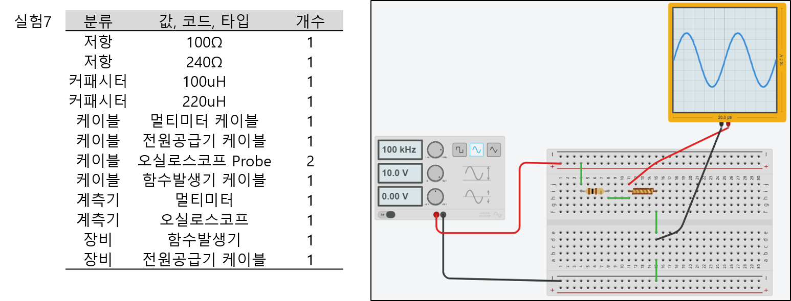
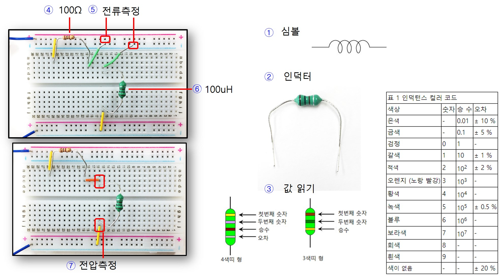
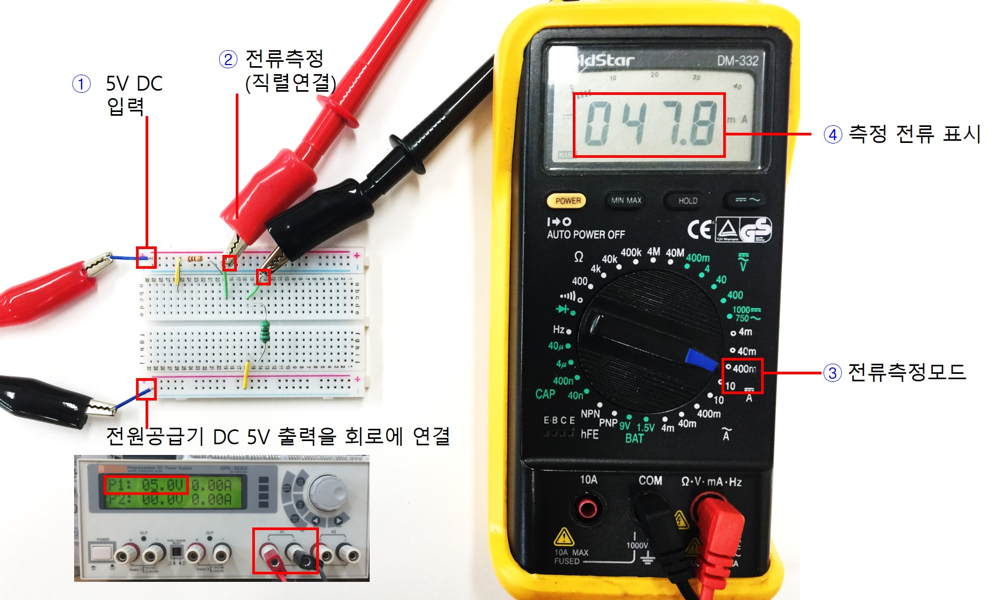
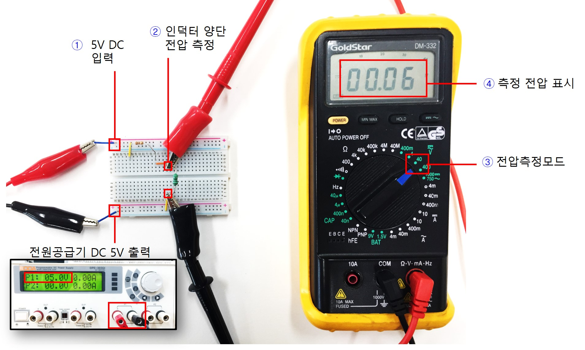
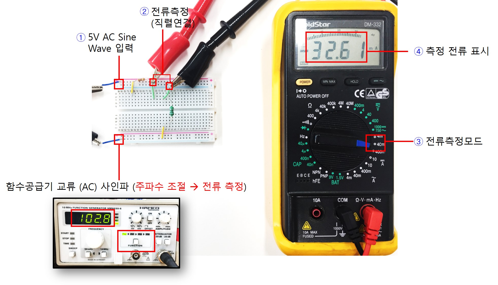
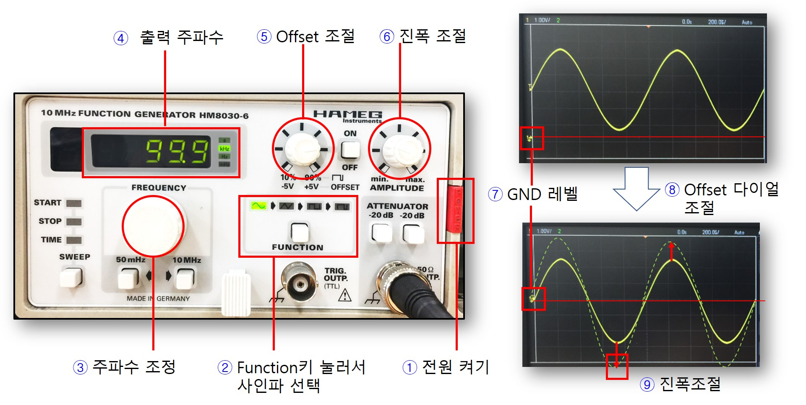
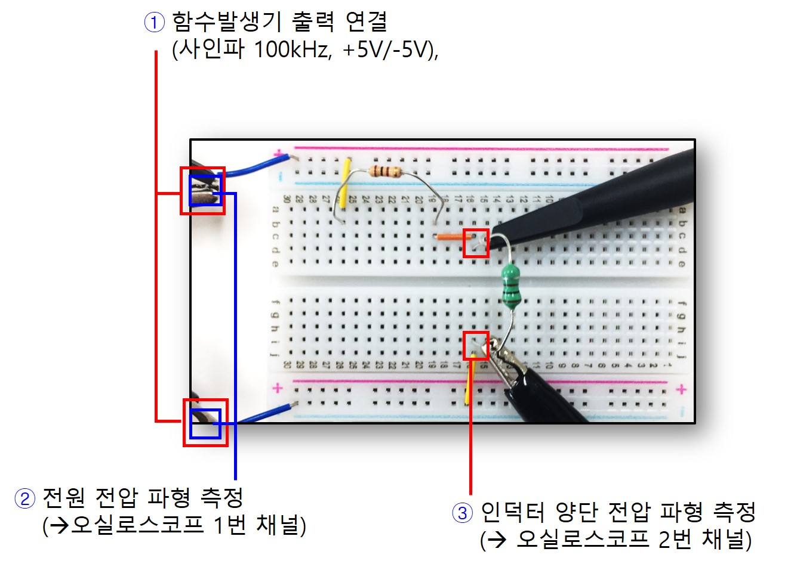
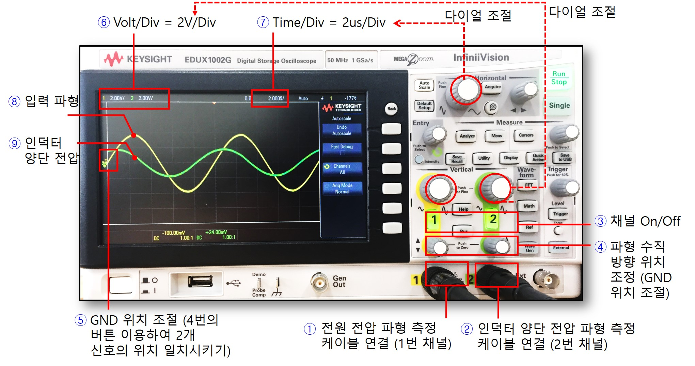
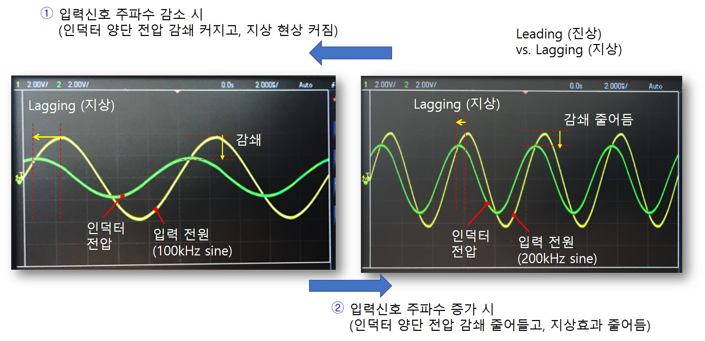
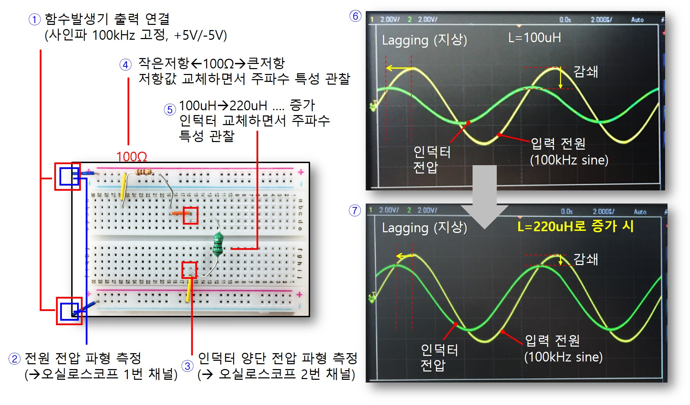

# 기초실험 7: 인덕터

본 실험에서는 먼저 인덕터의 직류, 교류 특성에 대해 살펴본 뒤 사인파를 입력으로 인가했을 때 인덕터 전압의 위상변화, 전압감쇄 효과를 오실로스코프로 관찰하면서 주파수 응답 특성에 대해 실험으로 이해한다.

## 실험목표
1. 인덕터에 고정 전압을 인가하여 전압, 전류 값을 측정해보고 직류 특성을 이해한다.
2. 인덕터에 교류 전압을 인가하여 전압, 전류 값을 측정해보고 교류 특성을 이해한다.
3. 사인파를 입력으로 인가한 뒤 인덕터 양단 전압 변화의 위상변화, 전압감쇄 특징을 오실로스코프로 확인한다. 특히 입력 신호의 주파수를 가변, 회로의 저항, 인덕터 값을 변화시키면서 출력 특성변화를 측정하여 인덕터의 주파수 특성을 실험을 통해 실제적으로 이해한다.

-------------------------
이번 실험에 사용할 주요 부품과 이를 브레드보드에 구현한 주요 회로도는 다음과 같다.

------------------------
## 세부실험 7-1: 인덕터의 직류 (DC) 특성

저항-인덕터의 직렬회로를 구성한 뒤 전원공급기를 이용하여 5V 고정 전압을 회로에 인가하여 인덕터에 인가되는 전압, 전류 값을 측정해보고 인덕터의 직류 특성을 실험을 통해 이해한다.

------------------------
### 저항-인덕터 직렬 회로구성

브레드보드에 그림과 같이 저항, 인덕터의 직렬회로를 구성한 뒤 인덕터 양단 전압 및 인덕터를 통해 흐르는 전류를 측정할 수 있도록 점퍼를 미리 연결해둔다.

1. 인덕터의 심볼은 그림과 같다. 
2. 흔히 사용되는 인덕터의 패지지 모습은 그림과 같다. 
3. 표면 띠의 종류를 통해 인덕터의 크기를 계산할 수 있다. 표를 참고하여 인덕터 용량을 계산해보자. 현재 그림은 100uH이다.
4. 저항 100옴을 사용하였다.
5. 저항과 인덕터를 통해 직렬로 흐르는 전류를 측정하기 위해 그림과 같이 점퍼선을 뽑아두었다.
6. 본 회로에서는 100uH을 사용하여 그림과 같이 연결하였다.
7. 인덕터 양단에 병렬로 멀티미터를 연결하여 전압을 측정할 수 있다. 

------------------------
### 직류 전원 인가시 인덕터 전압, 전류 측정

전원공급기의 출력을 5V로 조정한 뒤 브레드보드의 회로에 공급하고 인덕터로 흐르는 전류를 측정해보자.

1. 전원공급기의 출력 DC 5V를 회로에 연결한다. 
2. 전류 측정지점에 그림과 같이 멀티미터를 직렬로 연결한다. 병렬로 연결하지 않도록 주의한다.
3. 멀티미터의 측정모드를 전류측정모드로 전환한다.
4. 측정된 전류가 표시된다. 저항 100옴과 인덕터가 있음에도 불구하고 5V/100=50mA의 전류가 흐르는 것을 관찰한다. 인덕터 양단에 전압이 0V 걸린다고 할 수 있는가? 그렇다면 인덕터의 저항성은 0이라고 할 수 있는가?

------------------------
전원공급기의 출력을 5V로 설정하고 이를 브레드보드의 회로에 공급한 뒤 인덕터 양단 전압을 측정해보자.

1. 전원공급기의 출력 DC 5V를 회로에 연결한다. 
2. 전압 측정지점에 그림과 같이 멀티미터를 병렬로 연결한다. 직렬로 연결하지 않도록 주의한다.
3. 멀티미터의 측정모드를 전압측정모드로 전환한다.
4. 측정된 전압이 표시된다. 인덕터에 0V가 인가되는 것을 확인한다.

----------------------
## 세부실험 7-2: 인덕터의 교류 (AC) 특성

저항-인덕터의 직렬회로를 구성한 뒤 함수발생기를 이용하여 교류 전압(사인파)를 회로에 인가하여 인덕터에 인가되는 전압, 전류 값을 측정해보고 인덕터의 교류 특성을 실험을 통해 이해한다.

----------------------
### 교류 전원 인가시 인덕터 전압, 전류 측정

먼저 함수발생기를 그림과 같이 사인파모드로 선택하고 주파수를 DC 전원에 가까운 아주 느린 주파수를 설정한다. 그림에서는 100mHz=0.1Hz이다.

----------------------

1. 함수발생기 출력 사인파를 회로에 연결한다. 
2. 전류 측정지점에 그림과 같이 멀티미터를 직렬로 연결한다. 병렬로 연결하지 않도록 주의한다.
3. 멀티미터의 측정모드를 전류측정모드로 전환한다.
4. 측정된 전류가 표시된다. DC 전원 인가할 때와 비슷한 수준의 큰 전류가 흐름을 관찰한다. 인덕터에서 전압강하가 거의 일어나지 않음을 예상할 수 있는가? 즉 직렬로 연결된 저항에 입력전원이 대부분 인가된다고 생각할 수 있는가? 함수발생기의 출력주파수를 증가/감소시키면서 측정되는 전류의 변화를 관찰해본다.

----------------------
## 세부실험 7-3: 인덕터 주파수 특성

본 실험에서는 저항-인덕터 직렬회로에 사인파를 인가했을 때 인덕터에 인가되는 파형을 오실로스코프로 확인해보고 신호의 위상변화 및 전압 감쇄효과를 이해한다.

----------------------
### 함수발생기를 이용한 사인파 파형 생성

먼저 함수발생기를 이용하여 교류 신호를 준비해야 한다. 함수발생기의 기본적인 사용법은 장비 설명 섹션을 참고하도록 한다. 

1. 먼저 함수발생기의 전원을 켠다. 표시한 위치가 전원 스위치이다. 
2. 출력 모드를 선택한다. 사인파를 생성할 수 있도록 Function 키를 눌러서 사인파 아이콘에 불빛이 들어오도록 한다.
3. 다이얼을 이용하여 원하는 출력 주파수를 조정한다. 
4. 화면에 현재 선택된 주파수가 표시된다. 다이얼 하단에 배율을 이용하여 주파수 크기를 한번에 크게 변경해본다.
5. 사인파는 기본적으로 +/- 전압이 Swing되는 형태이며 DC level은 0V이다. Offset 조절 버튼을 이용하여 사인파의 DC level을 위,아래로 조절할 수 있다. 실험을 위해서 Offset이 0이 되도록 조절하자. 이를 위해서 오실로스코프의 화면에 GND표시를 중심으로 +/-로 swing하는 형태가 되도록 offset을 조절해본다. 
6. 표시된 다이얼을 돌려서 사인파의 진폭을 조절할 수 있다. +5, -5V로 swing하도록 사인파의 진폭을 조절해보자.
7. 5번의 다이얼을 돌려서 오실로스코프에 표시되는 GND위치를 중심으로 +5V, -5V가 스윙하도록 조절해본다. 
8. 사인파가 0V를 중심으로 스윙하도록 offset, 진폭 다이얼을 조절하여 설정해본다.
9. 6번의 진폭조절 다이얼을 이용하여 신호 진폭을 +5V, -5V로 조절한다.

----------------------
### 오실로스코프 Probe를 회로의 파형 관찰 지점에 연결

함수발생기의 출력을 회로에 공급하고 입력파형과 인덕터 양단 전압의 파형을 오실로스코프로 확인할 수 있도록 Probe를 그림과 같이 연결해본다.

1. 함수발생기 출력을 100kHz, +/-5V 사인파로 설정하고 그림과 같이 회로에 연결한다.
2. 오실로스코프 Probe 1번 채널 케이블을 그림과 같이 전원전압 관찰 지점에 연결한다.
3. 오실로스코프 Probe 2번 채널 케이블을 그림과 같이 인덕터 양단 전압 관찰 지점에 연결한다. 

----------------------
### 오실로스코프를 이용하여 입,출력 파형을 관찰

1. 오실로스코프 Probe 2개를 각각의 해당 채널 포트에 연결한다. 회로에서 전원전압 양단에 연결한 케이블은 1번 채널에 연결한다.
2. 인덕터 양단에 연결한 Probe 케이블을 그림과 같이 2번 채널 포트에 연결한다.
3. 채널의 On/Off표시등이 켜져 있는지 확인한다. 꺼져 있으면 한번 더 눌러서 불빛이 들어오도록 한다. 
4. 화면의 파형에서 5번의 GND 위치를 확인한다. 수직 위치 조절 다이얼을 돌려서 파형의 수직 위치를 적절히 조절한다. 2개 신호의 위치를 일치시킨다.
5. 입력 신호의 GND 위치를 4번의 다이얼을 이용하여 조절한다. 신호 자체의 GND가 0V 아닌 경우에는 함수발생기의 Offset 단자를 이용하여 조절한다. 
6. 현재 수직방향 해상도로 Volt/Div가 표시된다. 다이얼을 조절하여 2V/Div가 되도록 설정한다. 
7. 현재 설정된 수평방향 해상도가 표시된다. Time/Div값이 2us/Div가 되도록 그림에 표시된 Horizontal 다이얼을 조절한다.
8. 회로에 입력으로 공급된 사인파가 1번 채널을 통해 관찰되는 모습이다. Volt/Div, Time/Div를 통해 화면의 Grid 영역을 이용하여 실측값을 예상해본다.
9. 2번 채널은 초록색이며 인덕터 양단 전압 파형을 표시한다. 입력 파형대비 위상 변화가 발생하며 전압 진폭도 감쇄되는 현상을 관찰할 수 있다.

----------------------
### 입력신호의 주파수에 따른 인덕터의 전압 위상, 전압감쇄 효과 관찰

함수 발생기의 출력 주파수를 조절하면서 인덕터 양단 전압의 위상변화 및 전압감쇄 현상의 변화를 자세히 관찰해보자.

1. 함수발생기의 출력 주파수를 100kHz에서 더 빠른 주파수로 조절하면서 입력신호 대비 인덕터 양단 전압의 위상변화와 전압감쇄 현상의 변화를 관찰해본다. 위상변화와 전압감쇄 효과가 줄어드는가? 인덕터는 고주파 성분 신호를 잘 통과시킨다고 볼 수 있는가?
2. 함수발생기의 출력 주파수를 100kHz보다 더 느린 주파수로 설정한 뒤 입력신호 대비 인덕터 양단 전압의 위상변화와 전압감쇄 현상의 변화를 관찰해본다. 위상변화와 전압감쇄 현상이 더 심해지는가? 인덕터는 저주파 신호 성분을 잘 통과시키지 못한다고 볼 수 있는가?

----------------------
### 회로의 저항, 인덕터 값 변화에 따른 전압 위상, 전압감쇄 효과 관찰

입력 신호를 고정시킨 뒤 회로의 저항값, 인덕터 용량을 바꾸어가면서 입,출력 주파수 특성을 관찰해본다.

1. 함수발생기 출력을 100kHz, +/-5V 사인파로 설정하고 그림과 같이 회로에 연결한다.
2. 오실로스코프 Probe 1번 채널 케이블을 그림과 같이 전원전압 관찰 지점에 연결한다.
3. 오실로스코프 Probe 2번 채널 케이블을 그림과 같이 인덕터 양단 전압 관찰 지점에 연결한다. 
4. 기존 100옴 저항에서 더 작은저항, 더 큰저항으로 교하면서 입력 전원 파형 대비 인덕터 양단 전압의 위상변화, 전압감쇄 효과가 어떻게 변하는지 관찰한다. 
5. 기존 100uH 인덕터 대신에 더 큰 용량의 인덕터로 대치한 뒤 입력전원 파형 대비 인덕터 양단 전압의 위상, 전압감쇄 효과가 어떻게 변하는지 관찰한다. 인덕터 용량이 크면 같은 전류 변화에 대해 더 큰 전압이 형성된다고 볼 수 있는가?
