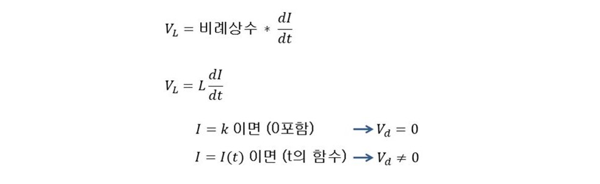
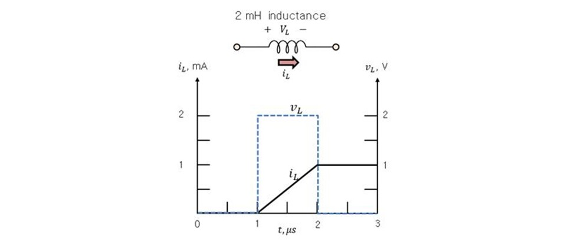

# 기초실험7: 인덕터

본 실험을 통해 인덕터의 직류, 교류 특성을 알아보자. 저항-인덕터 직렬회로를 구성한 뒤 사인파를 입력으로 인가했을 때 인덕터 전압의 위상변화, 전압감쇠 효과를 오실로스코프로 관찰하면서 인덕터의 주파수 응답 특성에 대해 이해한다.

## 실험목표
1. 인덕터에 고정 전압을 인가하였을 때 전압, 전류 값을 측정해보고 인덕터의 직류 특성을 관찰한다.
2. 인덕터에 교류 전압을 인가하였을 때 전압, 전류를 측정해보고 인덕터의 교류 특성을 파악한다.
3. 저항-인덕터 직렬회로를 구성한 뒤 사인파를 인가한 뒤 인덕터 양단 전압 감쇠, 위상 변화, 전압감쇠 특징을 오실로스코프로 확인한다. 입력 신호의 주파수를 가변해보고, 회로의 저항크기 변화, 인덕터 값을 변화시키면서 인덕터의 전기적 특성변화를 관찰해봄으로써 인덕터의 주파수 특성을 실제적으로 파악해본다.

이번 실험에 사용할 주요 부품과 이를 브레드보드에 구현한 주요 회로도는 다음과 같다.

### 예비보고서

1. 본 실험 자료를 읽고 실험 절차, 방법, 예상 결과에 대해 요약해본다. 
2. 추가로 담당교수의 지시사항을 숙지하여 사전 조사한 내용을 예비 리포트에 작성해 온다.

### 기초이론

자세한 회로 이론은 2학년 이론수업에서 배우기로 하고 여기서는 간략하게 인덕터의 전기적 특성을 미분식으로 간단히 소개한다. 인덕터는 기본적으로 전류의 변화를 방해하는 소자이다. 즉, 전류의 변화가 커질수록 인덕터에 의해 발생하는 전압의 강하가 더 커진다고 할 수 있다. 전류의 변화를 방해하므로, 전류 값이 아무리 커도 시간에 따른 전류의 변화가 없다면 인덕터 양단 전압은 0이 된다. 따라서 그 관계를 아래 수식으로 풀어쓸 수 있다. 

인덕터의 용량은 전류의 변화를 방해하는 정도라고 볼 수 있다.  그러므로 주어진 전류변화에 대해 인덕터 용량이 클수록 인덕터에 더 큰 전압이 유도된다. 교류 전류의 관점에서, 주파수가 크다는 것은 전류의 변화가 크다는 것을 의미한다. 그러므로 인덕터는 커패시터와는 다르게 입력 전원의 주파수가 커질수록 인덕터에 유도되는 전압이 더 커진다. 아래 그림과 같이 2mH 인덕터가 주어졌을 때 시간에 따른 전류 변화를 인가할 경우 유도되는 전압을 표시하였다. 

------------------------
## 세부실험 7-1: 인덕터의 직류 (DC) 특성

저항-인덕터 직렬회로를 구성한 뒤 전원공급기를 이용하여 5V 고정 전압을 회로에 인가하였을 때 인덕터 전압, 전류 값을 측정해보고 인덕터의 직류 특성을 실험을 통해 파악한다.

### 저항-인덕터 직렬 회로구성

브레드보드에 그림과 같이 저항, 인덕터를 직렬로 연결한 회로를 구성한 뒤 인덕터 양단 전압 및 인덕터를 통해 흐르는 전류를 측정할 수 있도록 아래와 같이 점퍼를 미리 연결해둔다.

1. 인덕터의 심볼은 그림과 같다. 
2. 본 실험에서 사용할 인덕터의 외관은 그림과 같다. 
3. 표면에 표기된 띠의 종류를 통해 인덕터의 크기를 계산할 수 있다. 표를 참고하여 인덕터 용량을 계산해보자. 그림에 있는 인덕터의 용량은 100uH이다.
4. 저항 100옴을 사용하였다.
5. 저항과 인덕터를 거쳐 직렬로 흐르는 전류를 측정하기 위해 그림과 같이 점퍼선을 뽑아두었다.
6. 본 회로에서는 100uH을 사용하였다.
7. 인덕터 양단에 멀티미터를 연결하여 전압을 측정할 수 있도록 병렬로 점퍼선을 뽑아둔다. 

### 직류 전원 인가시 인덕터 전압, 전류 측정

전원공급기의 출력을 DC 5V로 조정한 뒤 회로에 전압을 공급하고 나서 멀티미터를 이용하여 인덕터로 흐르는 전류를 아래와 같이 측정해보자.

1. 전원공급기의 출력 DC 5V를 회로에 연결한다. 
2. 전류 측정지점에 그림과 같이 멀티미터를 직렬로 연결한다. 병렬로 연결하지 않도록 주의한다.
3. 멀티미터의 측정모드를 전류 측정모드로 전환한다.
4. 측정된 전류가 화면에 표시된다. 저항 100옴과 인덕터가 있음에도 불구하고 5V/100=50mA의 전류가 흐르는 것을 관찰한다. 그렇다면 인덕터 양단에 전압이 0V라고 할 수 있는가? 그렇다면 인덕터의 저항값이 0옴 이라고 할 수 있는가?

전원공급기의 출력을 DC 5V로 설정하고 이를 브레드보드에 구현한 회로에 공급한 뒤 멀티미터를 이용하여 인덕터 양단 전압을 아래와 같이 측정해보자.

1. 전원공급기의 출력 DC 5V를 회로에 공급한다.
2. 전압 측정지점에 그림과 같이 멀티미터를 병렬로 연결한다. 직렬로 연결하지 않도록 주의한다.
3. 멀티미터의 측정모드를 전압 측정모드로 전환한다.
4. 직류/교류 선택 버튼을 눌러서 직류측정 상태인지 다시 한 번 확인한다.
5. 인덕터 양단의 전압이 화면에 표시된다. 인덕터 전압이 0V인지 확인한다.

----------------------
## 세부실험 7-2: 인덕터의 교류 (AC) 특성

저항-인덕터의 직렬회로를 구성한 뒤 함수발생기를 이용하여 교류 전압(사인파)를 회로에 인가한다. 이때 인덕터에 양단 전압 및 인덕터를 통해 흐르는 전류 값을 측정해보고 인덕터의 교류 특성을 실험을 통해 이해한다.

### 교류 전원 인가시 인덕터 전압, 전류 측정

먼저 함수발생기 출력 모드를 사인파로 선택한 뒤 출력 주파수를 DC 전원에 가까운 아주 느린 주파수를 설정한다. 본 실험에서는 100mHz=0.1Hz까지 주파수를 낮추어 회로에 공급해보자.

1. 함수발생기에서 출력되는 사인파를 회로에 공급한다. 
2. 전류 측정지점에 그림과 같이 멀티미터를 직렬로 연결한다. 병렬로 연결하지 않도록 주의한다.
3. 멀티미터의 측정모드를 전류 측정모드로 전환한다.
4. 직류/교류 측정모드를 눌러서 교류측정모드로 전환한다. 화면 왼쪽에 사인파 모양이 되도록 한다.
5. 현재 측정된 전류가 화면에 표시된다. DC 전원 인가할 때 전류값과 비교해보자. 인덕터에서 전압강하가 거의 일어나지 않음을 예상할 수 있는가? 함수발생기의 출력주파수를 증가/감소시키면서 인덕터로 흐르는 전류의 변화를 관찰해본다.

----------------------
## 세부실험 7-3: 인덕터 주파수 특성

본 실험에서는 저항-인덕터 직렬회로에 사인파를 인가했을 때 인덕터에 인가되는 신호의 전압 파형을 오실로스코프로 확인해보고 신호의 위상변화 및 전압 감쇠효과를 관찰해보자.

### 함수발생기를 이용한 사인파 생성 및 파형 조절

먼저 함수발생기를 이용하여 교류 신호를 준비해야 한다. 함수발생기의 기본적인 사용법은 장비 설명 섹션을 참고하도록 한다. 

먼저 함수발생기의 전원을 켠다. 본체 전면의 중간에 위치한 빨간색 버튼이 바로 전원 스위치이다. 전면 Function으로 표기된 버튼을 연속적으로 눌러서 사인파 아이콘에 불빛이 들어오도록 한다. 이때 OUTPUT 포트로 사인파가 생성된다.

1. LCD화면 아래 전면 다이얼을 이용하여 원하는 출력 주파수를 조정한다. 다이얼을 돌릴 때마다 현재 출력 주파수가 화면에 표시된다. 다이얼 하단에 배율 버튼을 이용하여 주파수 조절 scale를 변경할 수 있다.
2. 사인파는 기본적으로 +/- 전압이 Swing되는 형태이며 DC level은 0V이다. Offset 조절 버튼을 이용하여 사인파의 DC level을 위, 아래로 조절할 수 있다. 본 실험에서는 Offset이 0이 되도록 조절하자. 이를 위해서 오실로스코프로 함수발생기 출력을 측정하여 화면에 GND표시를 중심으로 +/-로 swing하는 형태가 되도록 offset을 적절하게 조절해본다. 
3. Amplitude 다이얼을 돌려서 사인파의 진폭을 조절할 수 있다. 오실로스코프를 이용하여 눈으로 확인하면서 실제 파형의 진폭을 상대적으로 조절할 수 있다. 본 실험을 위해서 +5, -5V로 swing하도록 사인파의 진폭을 조절해보자.
4. 본 실험을 위해서는  GND를 중심으로 +5V/-5V로 swing하도록 수직축 offset을 그림과 같이 조절하자.

### 오실로스코프를 이용하여 2개의 전압 측정 지점에 연결

함수발생기의 출력을 회로에 공급하고 입력파형 대비 인덕터 양단 전압의 파형을 오실로스코프로 확인할 수 있도록 Probe를 그림과 같이 연결해본다.

1. 함수발생기 출력을 100kHz, +/-5V 사인파로 설정하고 그림과 같이 회로에 공급한다.
2. 오실로스코프 케이블 잭을 본체의 채널1에 삽입하고 리드선 반대쪽 끝 Probe를 회로의 입력에 연결하자.
3. 오실로스코프 케이블 잭을 본체의 채널2에 삽입하고 리드선 반대쪽 끝 Probe를 인덕터 양단에 그림과 같이 병렬로 연결한다. 

----------------------
### 오실로스코프를 이용하여 입,출력 파형을 관찰

1. 오실로스코프 프로브 2개를 준비하여 본체 전면 패널 오른쪽 아래에 있는 1번 채널 2번 채널의 각 포트에 연결한다. 1번 채널에 연결한 케이블의 프로브를 회로의 입력단에 연결하고 
2. 2번 채널 프로브를 인덕터 양단에 연결한다. 오실로스코프 LCD창에 노란색 파형은 1번 채널로 들어오는 신호 (입력신호)이고, 초록색 파형은 2번 채널로 들어오는 신호 (인덕터 양단전압)이다.
3. 채널의 On/Off표시등이 켜져 있는지 확인한다. 꺼져 있으면 한 번 더 눌러서 불빛이 들어오도록 한다. 
4. 화면에는 현재 프로브를 통해 샘플링 되는 신호를 표시한다. 5번 항목에서 설명하는 GND 위치가 화면에 어디에 있는지 확인한다. 수직 위치 조절 다이얼을 돌려서 파형의 위치를 적절히 조절한다. 2개 신호의 GND 위치를 일치시키도록 한다.
5. 입력 신호의 GND 위치를 나타내는 아이콘이다. 4번 항목에서 설명한 다이얼을 이용하여 파형의 수직방향 위치를 조절한다. 
6. 현재 화면에 표시되는 파형의 세로로 한칸 당 전압크기를 나타낸다. 다이얼을 조절하여 2V/Div가 되도록 설정한다. 
7. 현재 화면에 표시되는 파형의 가로축으로 한칸 당 시간을 나타낸다. Time/Div값이 2us/Div가 되도록 그림에 표시된 Horizontal 다이얼을 이용하여 조절한다.
8. 저항-인덕터 회로에 사인파를 인가하였으며 오실로스코프 1번 채널을 통해 관찰되는 모습이다. Volt/Div, Time/Div를 통해 진폭과 한주기의 시간을 계산할 수 있다.
9. 2번 채널에는 인덕터 양단 전압 파형을 표시한다. 입력 파형대비 위상 변화가 발생하는 현상과 함께 진폭도 동시에 감쇠되는 현상을 관찰할 수 있다.

### 주파수에 따른 인덕터 양단 전압의 위상변화, 전압감쇠 효과 관찰

함수 발생기의 출력 주파수를 조절하면서 인덕터 양단에 걸리는 전압의 위상변화 및 전압감쇠 현상의 변화를 자세히 살펴보자.

1. 함수발생기의 출력을 100kHz보다 더 느린 주파수로 설정한 뒤 입력신호 대비 인덕터 양단 전압의 위상변화와 전압감쇠 현상의 변화를 관찰해본다. 신호 지상현상과 전압감쇠 현상이 더욱 심해지는가? 인덕터는 저주파 신호 성분을 잘 통과시키지 못한다고 볼 수 있는가?
2. 함수발생기의 출력 주파수를 100kHz보다 더 빠른 주파수로 조절하면서 입력신호 대비 인덕터 양단 전압의 위상변화와 전압감쇠 현상의 변화를 관찰해본다. 신호가 앞당겨지는 지상 효과와 전압감쇠 효과가 줄어드는가? 그렇다면 인덕터는 고주파 성분 신호를 잘 통과시킨다고 볼 수 있는가? 주파수 크기에 비례하여 인덕터의 저항성이 커진다고 할 수 있는가?

### 저항크기, 인덕터 크기 변화에 따른 위상변화, 전압감쇠 효과 관찰

입력 신호의 주파수를 고정시킨 후에 회로의 저항값, 인덕터 용량을 바꾸어가면서 입, 출력 주파수 특성 변화를 관찰해본다.

1. 함수발생기 출력을 100kHz, +/-5V 사인파로 설정하고 저항-인덕터 직렬회로에 공급한다.
2. 기존 100uH 크기의 인덕터 대신에 더 큰 용량의 인덕터 (예, 220uH)로 대치한 뒤 입력신호 대비 인덕터 양단 전압의 지상효과, 전압감쇠 효과가 어떻게 변하는지 관찰한다. 인덕터 용량이 크면 같은 전류 변화에 대해 더 큰 전압이 유도된다고 볼 수 있는가? 그렇다면 인덕터의 저항성은 인턱터의 크기에 비례한다고 할 수 있는가?

기존 100옴 저항보다 더 작은 저항, 그리고 더 큰 저항으로 교체하면서 입력 신호 대비 인덕터 양단 전압의 위상변화, 전압감쇠 효과가 어떻게 변하는지 동일한 형태의 반복실험을 실시한다.

## 결과보고서

1. 담당교수의 지시사항을 숙지하여 해당 내용에 대한 실험을 실시한다. 실험과정, 측정 데이터를 결과 보고서에 작성하여 제출한다.
2. 본 실험 자료에서 제시된 기본적인 실험 과정, 장비사용방법, 측정 결과들을 충실히 요약 정리한다. 
3. 실험과 관련된 이론과 실측치를 비교하여 회로의 전기적 동작 원리에 대한 결론을 내려 본다. (Optional) 
4. R-C, R-L을 조합하여 특정 저주파 이하의 성분도 제거하면서, 특정 주파수 이상의 고주파 성분도 제거할 수 있는 Band Pass Filter를 구성하는 것이 가능한지 관련 자료를 조사해보거나 본인의 생각을 정리하여 보고서에 작성한다.(Optional)
