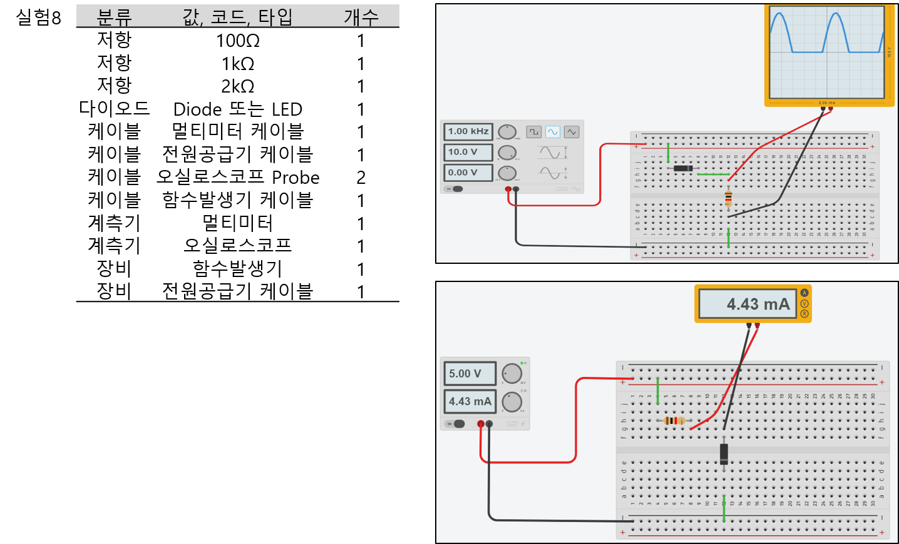
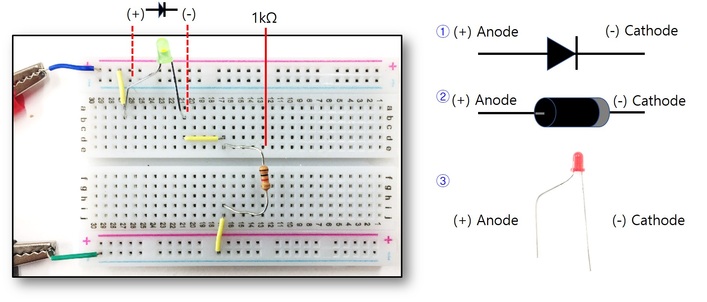
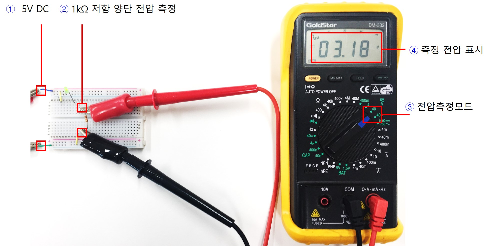
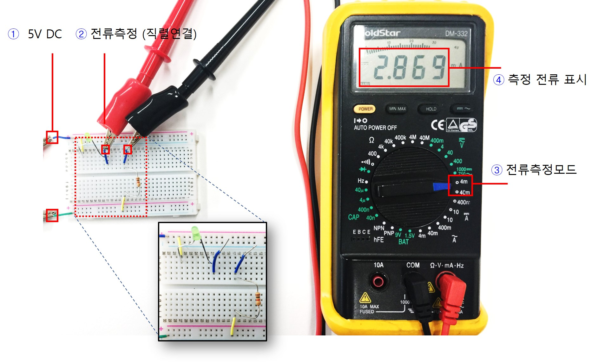
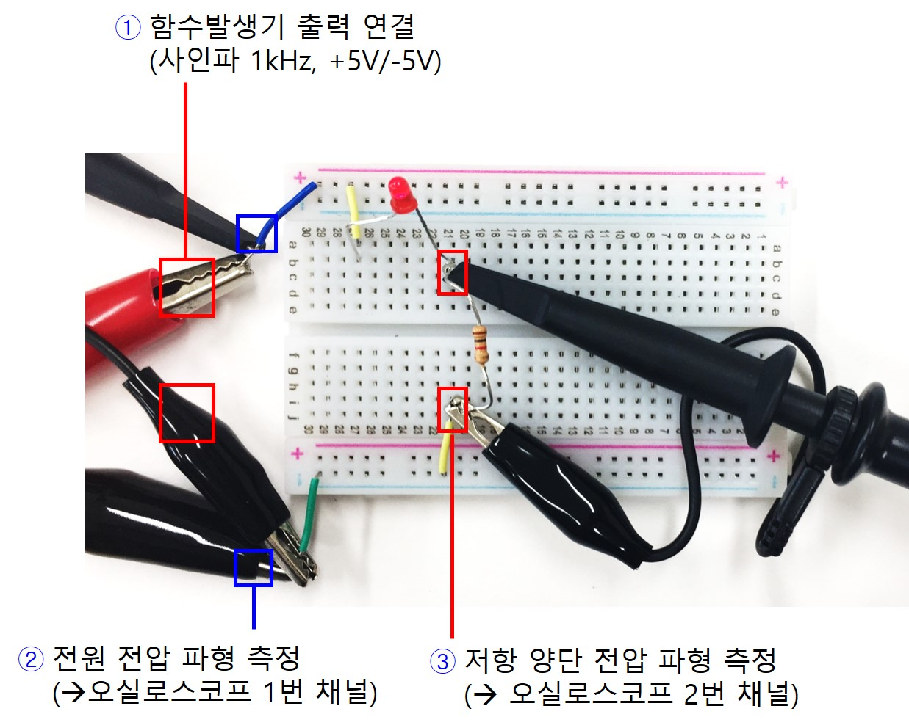
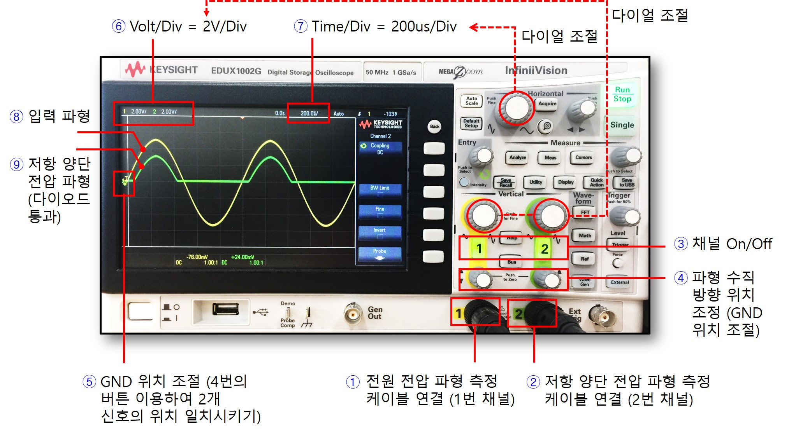
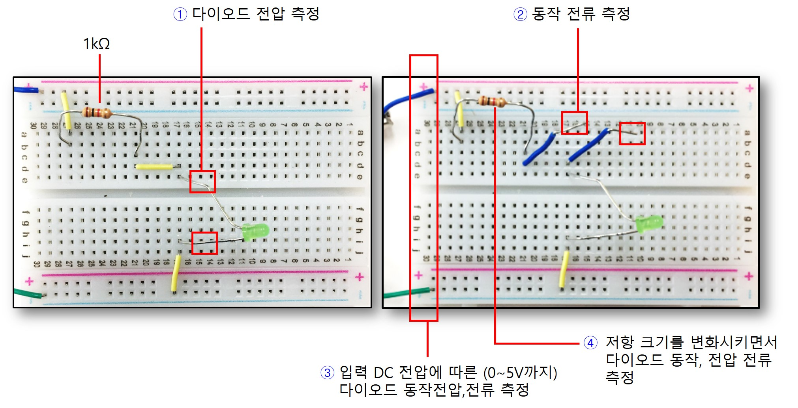
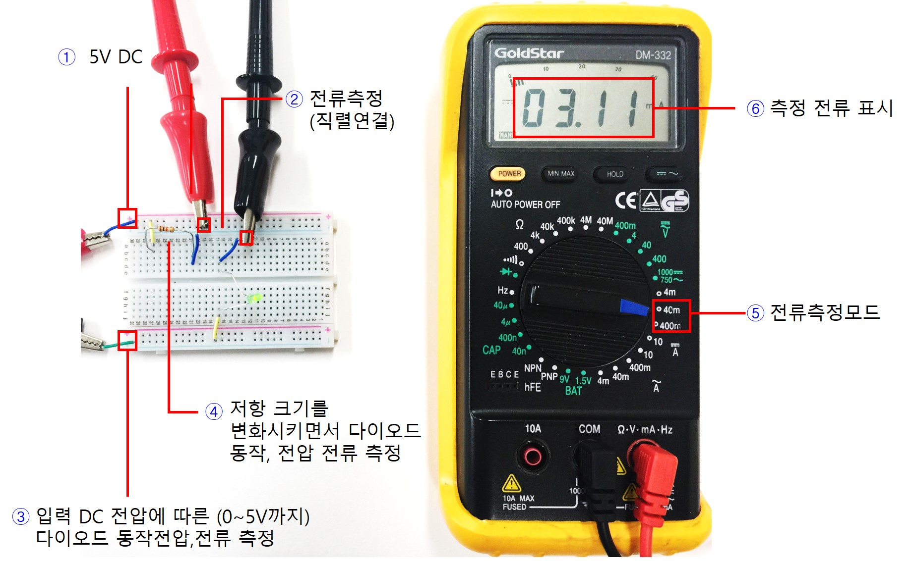

# 기초실험8: 다이오드

본 실험에서는 저항과 다이오드의 직렬회로에 대한 직류,교류 특성과 전압,전류 동작점 원리를 실험으로 이해한다. 

## 실험목표
1. 다이오드의 동작 전압, 전류의 DC 특성에 대해 이해한다.
2. 다이오드-저항 직렬회로의 교류 특성에 대해 살펴보고 사인파 입력에 대한 출력 신호를 관찰해본다.
3. 다이오드의 동작전압과 동작전류에 대한 동작점을 실험으로 확인한다.

-------------------------
이번 실험에 사용할 주요 부품과 이를 브레드보드에 구현한 주요 회로도는 다음과 같다.

--------------------------
### 예비보고서

1. 본 실험 자료를 읽고 실험 목차, 절차, 예상 결과에 대해 요약해본다. 
2. 추가로 담당교수의 지시사항을 숙지하여 사전조사한 내용을 예비 리포트에 작성해 온다.

------------------------
## 세부실험 8-1: 다이오드, 저항 직렬회로에서 DC 특성 (전압, 전류측정) 

먼저 다이오드에 DC 전원 입력을 인가하여 동작 특성을 관찰해본다. 

------------------------
### 다이오드-저항 직렬 회로구성

브레드보드에 그림과 같이 전원입력부, 다이오드, 저항을 배치한다. 전원공급기로부터 DC 전압 출력을 회로에 연결하여 회로의 각 노드의 전압, 전류를 측정해본다.

1. 다이오드의 심볼은 그림과 같으며 (+) Anote와 (-) Cathode 포트로 구성되어 있다. 방향에 주의해야 한다.
2. 일반 다이오드의 대표적인 패키지 형태는 그림과 같으며 띠가 있는 쪽이 (-)에 해당됨에 주의하자.
3. 발광 다이오드 (LED)는 On이 되면 불빛이 발생하므로 눈으로 동작특성을 확인하기 용이하다. 다리가 긴쪽이 (+)임에 주의한다.

------------------------
### 동작 전압 전류 측정

발광다이오드 (LED)의 불빛이 ON되도록 전원공급기 전원 출력값을 증가시킨다. 이때 회로의 각 노드의 전압을 측정해보자. 전압을 증가시킴에 따라 다이오드 양단 전압과 저항 양단 전압의 변화를 관찰한다.

1. 전원공급기 출력을 회로에 연결하여 DC 전압을 공급한다.
2. 저항 양단 전압을 측정한다. 다이오드 양단 전압은 입력전원 전압에서 저항 양단 전압을 빼면된다.
3. 멀티미터의 측정모드를 전압 측정모드로 전환한다.
4. 현재 측정되는 전압이 화면에 표시된다. 공급전압을 바꾸어가면서 실험을 반복한다. 저항양단에 걸리는 전압변화와 다이오드 양단 전압의 변화를 비교해본다.

------------------------
그림과 같이 회로의 동작 전류를 측정할 수 있도록 점퍼선을 뽑아두고 멀티미터를 직렬로 연결한다. 입력 전원을 증가시키면서 전류 변화를 관찰해보고 전압대비 전류변화의 그래프를 그리고 기울기를 계산해본다. 기울기 값과 직렬저항값과의 관계에 대해 생각해본다.

1. 전원공급기 출력을 회로에 연결하여 DC 전압을 공급한다.
2. 저항, 다이오드를 통해 흐르는 전류를 측정한다. (직렬연결)
3. 멀티미터의 측정모드를 전류 측정모드로 전환한다.
4. 현재 측정되는 전류가 화면에 표시된다. 전원공급기의 출력 전압을 조절하면서 전류측정을 반복한다. 입력 전원을 증가시키면서 전류 변화를 관찰해보고 전압대비 전류변화의 그래프를 그리고 기울기를 계산해본다. 기울기 값과 직렬저항값과의 관계에 대해 생각해본다.

----------------------
## 세부실험 8-2: 다이오드의 교류 특성

본 실험에서는 다이오드-저항의 직렬회로에 대해 사인파를 입력으로 인가한 뒤 회로의 동작 특성에 대해 관찰해본다. 다이오드에 의해 + 전압만 통과시키는 정류기 효과를 관찰해본다.

----------------------
### 함수발생기를 이용한 사인파 신호 준비

먼저 함수발생기를 이용하여 교류 신호를 준비해야 한다. 함수발생기의 기본적인 사용법은 장비 설명 섹션을 참고하도록 한다. 

1. 먼저 함수발생기의 전원을 켠다. 표시한 위치가 전원 스위치이다. 
2. 출력 모드를 선택한다. 사인파를 생성할 수 있도록 Function 키를 눌러서 사인파 아이콘에 불빛이 들어오도록 한다.
3. 다이얼을 이용하여 원하는 출력 주파수를 조정한다. 
4. 화면에 현재 선택된 주파수가 표시된다. 다이얼 하단에 배율을 이용하여 더 큰 주파수, 더 작은 주파수를 빠르게 변경해본다.
5. 사인파는 기본적으로 +/- 전압이 Swing되는 형태이며 DC level은 0V이다. Offset 조절 버튼을 이용하여 사인파의 DC level을 위,아래로 조절할 수 있다. 실험을 위해서 Offset이 0이 되도록 조절하자. 오실로스코프 화면의 GND 표시를 중심으로 +/-로 swing하는 형태가 되도록 offset을 조절해본다.
6. 표시된 다이얼을 돌려서 사인파의 진폭을 조절할 수 있다. +5, -5V로 swing하도록 사인파의 진폭을 조절해보자.
7. 5번의 다이얼을 돌려서 오실로스코프에 표시되는 GND위치가 신호의 중간에 위치하도록 조절해본다. 
8. 사인파가 0V를 중심으로 스윙하도록 offset, 진폭 다이얼을 이용하여 설정해본다.
9. 6번의 진폭조절 다이얼을 이용하여 신호의 최대 변화값이 +5V, -5V가 되도록 진폭을 조절한다.

----------------------
### 다이오드-저항 직렬회로에서 정류 신호 측정

그림과 같이 함수발생기로부터 생성된 사인파를 다이오드-저항 직렬회로에 인가하여 입,출력 파형을 오실로스코프로 관찰해본다.

1. 함수발생기 출력을 사인파 1kHz로 설정하고 Offset을 0V, 진폭을 +5/-5V로 조절한다. 생성된 신호를 그림과 같이 회로에 인가한다.
2. 함수발생기의 출력을 오실로스코프로 관찰하기 위해 1번 채널 Probe을 그림과 같이 전원 입력부에 연결한다.
3. 저항 양단 전압을 관찰하기 위해 오실로스코프의 2번 채널 Probe를 그림과 같이 저항 양단에 연결한다.

----------------------
### 오실로스코프를 이용한 정류기 동작 파형 관찰

1. 오실로스코프 Probe 2개를 각각의 해당 채널 포트에 연결한다. 회로에서 전원전압 양단에 연결한 케이블은 1번 채널에 연결한다.
2. 저항양단에 Probe를 연결한 케이블은 그림과 같이 2번 채널 포트에 연결한다.
3. 채널의 On/Off표시등이 켜져 있는지 확인한다. 꺼져 있으면 한번 더 눌러서 불빛이 들어오도록 한다. 
4. 화면의 파형에서 5번의 GND 위치를 확인한다. 수직 위치 조절 다이얼을 돌려서 파형의 수직 위치를 적절히 조절한다. 2개 신호의 위치를 일치시킨다.
5. 입력 신호의 GND 위치를 4번의 다이얼을 이용하여 조절한다. 신호 자체의 GND가 0V 아닌 경우에는 함수발생기의 Offset 단자를 이용하여 조절한다. 
6. 현재 수직방향 해상도로 Volt/Div가 표시된다. 다이얼을 조절하여 2V/Div가 되도록 설정한다. 
7. 현재 설정된 수평방향 해상도가 표시된다. Time/Div값이 200us/Div가 되도록 그림에 표시된 Horizontal 다이얼을 조절한다.
8. 회로에 입력으로 공급된 사인파가 1번 채널을 통해 관찰되는 모습이다. Volt/Div, Time/Div를 통해 화면의 Grid 영역을 이용하여 실측값을 예상해본다.
9. 2번 채널은 초록색이며 현재는 저항양단의 전압 파형을 표시한다. 다이오드를 통해 +전압만 통과되어 정류기 특성이 관찰된다.

----------------------
## 세부실험 8-3: 저항, 다이오드 직렬회로의 전압,전류의 동작점

본 실험에서는 다이오드와 저항으로 구성된 회로의 전류, 전압의 동작점을 실험을 통해 관찰해본다.

----------------------
### 동작점 측정을 위한 회로 구성

다이오드를 통해 흐르는 전류, 양단 전압을 측정할 수 있도록 그림과 같이 브레드보드에 회로를 구성한다.

1. 다이오드 양단 전압을 멀티미터를 이용하여 측정해본다. 
2. 동작 전류를 측정하기 위해 그림과 같이 직렬로 멀티미터에 연결할 수 있도록 점퍼를 뽑아둔다.
3. 입력 전원 전압의 크기를 바꾸어 가면서 동작 전압, 전류를 측정한다. 그래프로 표시해본다.
4. 저항크기를 조절하면서 위의 동작전류, 전압을 측정해본다.

----------------------
### 입력전압, 저항크기 변화에 따른 동작전류 측정

멀티미터를 이용하여 전류를 측정하는 모습을 보여준다.

1. 전원공급기 DC 출력 전압을 회로에 공급한다. 
2. 다이오드의 동작 전류를 측정한다. 
3. 입력 전원 전압의 크기를 바꾸어 가면서 동작 전압, 전류를 측정한다. 그래프로 표시해본다.
4. 저항크기를 조절하면서 위의 동작전류, 전압을 측정해본다.
5. 멀티미터의 측정모드를 전류 측정모드로 전환한다.
6. 화면에 표시된 측정 전류를 기록한다. 저항크기에 따른 전압,전류 측정지점의 적을 그래프로 표시해본다. 

---------------------------
## 결과보고서

1. 담당교수의 지시사항을 숙지하여 해당 내용에 대한 실험을 실시한다. 실험과정, 측정데이타를 결과 보고서에 작성하여 제출한다.
2. 본 실험자료에서 제시된 기본적인 실험 과정, 장비사용방법, 측정 결과들을 충실히 요약 정리한다. 
3. 실험과 관련된 이론과 실측치를 비교하여 회로의 전기적 동작 원리에 대한 결론을 내려본다. (Optional) 
4. 전압,전류의 동작점을 조절하여 LED 밝기를 조절해본다. 동작점과 LED의 밝기의 관계에 대해 생각해본다. (Optional)
5. 함수발생기의 PWM모드를 이용하여 Pulse High 구간을 조절하여 LED의 밝기를 조절해본다. 전류,전압의 동작점 조절방식보다 PWM을 이용한 밝기 조절 방식의 장점에 대해서 생각해본다. (Optional)

