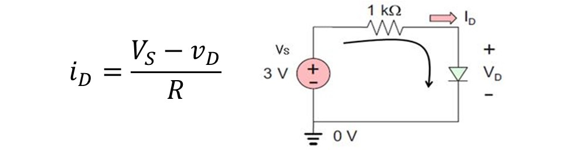
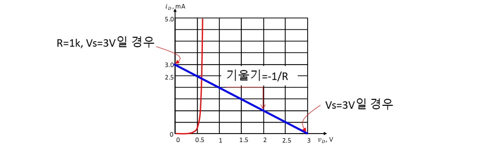

# 기초실험8: 다이오드

본 실험에서는 저항과 다이오드 직렬회로에 대한 직류, 교류 특성과 다이오드의 동작점 결정 원리를 실험을 통해 이해하는 것을 목표로 한다. 

## 실험목표
1. DC입력에 대한 다이오드 동작 전압, 전류 결정원리를 이해한다.
2. 다이오드-저항 직렬회로에 사인파를 인가했을 때 마이너스 전압을 제거하는 정류기 특성을 관찰한다.
3. 저항-다이오드 회로에서 다이오드의 전압, 전류 (동작점) 결정원리를 실험을 통해 이해한다.

이번 실험에 사용할 주요 부품과 이를 브레드보드에 구현한 주요 회로도는 다음과 같다.

### 예비보고서

1. 본 실험 자료를 읽고 실험 절차, 방법, 예상 결과에 대해 요약해본다. 
2. 추가로 담당교수의 지시사항을 숙지하여 사전 조사한 내용을 예비 리포트에 작성해 온다.

### 기초이론

다이오드의 특성 및 관련 회로이론은 2학년 회로이론 시간에 자세히 배우므로 본 실험에서는 간략한 원리만 살펴보기로 하자. 

다이오드는 아래 그림과 같이 다이오드 양단 전입이 일정이상 (Vth)보다 커질 경우 저항이 0옴이 되고 (short), Vth보다 전압이 낮을 저항값이 아주 큰 (open) 특성을 가지는 소자이다. Vth는 다이오드 종류마다 편차를 가지는데 일반적인 다이오드는 0.6~0.7V이지만 LED (Light-emitting diode)의 경우 1.2V 정도 큰 값을 가질 수도 있다. 정확한 값은 아래 2번처럼 다이오드를 turn on 시킬 정도로 큰 전압을 넣었을 때 다이오드 양단 전압을 측정해보면 알 수 있다.

다이오드에 인가되는 전압대비 전류 특성을 V-I 그래프로 Plot해보면 아래 그림과 같다.

즉 다이오드 양단에 전압을 일정이상 높이기 전까지 다이오드를 통해 전류가 흐르지 않다가 일정 이상 임계점을 넘게 되면 급격하게 큰 전류가 흐르기 시작한다. 이러한 특성을 다른 관점에서 보면 큰 전류변화에도 불구하고 다이오드 양단 전압은 크게 변하지 않는다고 생각할 수 있다.

이제 아래 그림과 같이 저항과 다이오드를 직렬로 연결했을 때 회로 동작을 해석해보자. 다이오드로 흐르는 전류는 다음 수식으로 표현될 수 있다.

위 수식에서 빨간색 박스로 표기한 변수는 상수 값이 아니라 회로 구성 형태, 입력 전압, 온도 등으로 인해 변할 수 있는 가변 값이며 회로가 동작할 때는 바이어스 되어 하나의 값으로 결정되는 동작점이 된다. Vd의 변화 대비 Id값의 변화를 그래프로 표현해보기 전에 고등학교 때 배웠던 x, y 평면에 1차 함수를 그리는 과정을 다음과 같이 상기해보자.

즉 Id와 Vd 평면에서 보면 직선의 기울기는 -1/R이 된다. Vd=Vs에서 전류 Id가 0이 되고, Vd=0일 때 전류는 Vs/R가 된다. 만약 저항이 1K옴이고, 입력전원이 3V일 경우 Vd의 변화대비 Id의 값은 아래 그림의 파란색 선으로 표현될 수 있으며, 다이오드의 전압대비 전류 특성곡선인 빨간색 선과 만나는 지점이 최종 동작점이 된다. 

저항 R의 크기를 조정하면 아래 같이 기울기 값이 변할 것이다. y 절편도 마찬가지 원리로 Vs/R 식으로부터 값이 변하게 됨을 알 수 있다. 다음 예에서 R=1k옴에서 2k옴으로 커질 경우 파란색 선이 이동하게 되며 다이오드의 전압, 전류 동작점도 아래로 조금 더 이동하게 된다. 재미있는 사실은 동작점이 이동하여도 전류는 크게 변하지만 다이오드 양단전압은 크게 변화하지 않음을 알 수 있다.

이번엔 저항 R의 크기는 그대로 두고 입력 전압 Vs만 변경하였을 경우에는 아래와 같이 동작점이 이동하게 된다. 그렇다면 입력전원크기, 저항크기를 조절하여 다이오드 동작점을 이동시킴으로써 다이오드를 통해 흐르는 전류를 조정할 수 있음을 알 수 있다.

------------------------
## 세부실험 8-1: 다이오드, 저항 직렬회로에서 DC 특성 (전압, 전류측정) 

먼저 다이오드에 DC 전원 입력을 인가하여 동작 특성 (전류, 전압)을 측정해보자. 

### 다이오드-저항 직렬 회로구성

브레드보드에 그림과 같이 전원 입력부, 다이오드, 저항을 배치한다. 전원공급기로부터 DC 전압 출력을 준비하여 회로에 공급한 뒤 회로에서 각 노드의 전압, 전류를 측정해본다.

1. 다이오드의 심볼은 그림과 같으며 (+) Anote와 (-) Cathode 포트로 구성되어 있다. 방향에 주의해야 한다.
2. 일반 다이오드의 대표적인 패키지 형태는 그림과 같으며 띠가 있는 쪽이 (-)에 해당된다.
3. 발광 다이오드 (LED)는 Turn-On 되면 불빛이 발생하므로 동작특성을 눈으로 확인하기 용이하다. 다리가 긴 쪽이 (+)임에 주의한다.

다이오드를 브레드보드에 배치할 때 방향에 항상 신경 쓰도록 한다. 다이오드 마다 Turn-On 전압이 약간씩 다르므로 완전히 켜지도록 임계점 이상의 전압을 인가하도록 한다.

### 동작 전압 측정

발광다이오드 (LED)의 불빛이 ON되도록 전원공급기 전원 출력 값을 점차 증가시킨다. 이때 회로에서 각 노드의 전압을 측정해보자. 전압을 증가시킴에 따라 다이오드 양단 전압과 저항 양단 전압의 변화를 관찰한다. 입력전원 변화 대비 다이오드 전압 변화를 Plot해보도록 한다.

1. 전원공급기 출력을 회로에 연결하여 DC 전압을 공급한다. (5V에서 점차 낮추어보고, 다시 높여보기를 반복한다. 입력 전원의 크기 대비 다이오드 양단 전압의 변화를 Plot해본다)
2. 저항 양단 전압을 측정한다. 다이오드 양단 전압은 입력전원 전압에서 저항 양단 전압을 뺀 값이다.
3. 멀티미터의 측정모드를 전압 측정모드로 전환한다.
4. 직류 측정을 선택한다.
5. 현재 측정되는 전압이 화면에 표시된다. 공급전압을 바꾸어가면서 실험을 반복한다. 저항양단에 걸리는 전압변화와 다이오드 양단 전압의 변화를 비교해본다.

이때 반드시 다이오드가 turn-on될 때의 저항 양단 전압을 측정하여야 한다. 다이오드가 off상태일 때는 전류가 흐르지 않으므로 저항 양단 전압도 0이 되다.

### 동작 전류 측정

아래 그림과 같이 다이오드 회로에 대해 동작 전류를 측정할 수 있도록 점퍼 선을 뽑아두고 멀티미터를 직렬로 연결한다. 입력 전원을 증가시키면서 다이오드를 통해 흐르는 전류 변화를 관찰해보고 입력전원 전압 변화 대비 전류변화의 그래프를 그리고 기울기를 계산해본다. 기울기 값과 직렬 저항 값과의 관계에 대해 생각해본다. (기울기를 크게 할려면 저항값을 높여야 하는가 낮추어야 하는가?)

1. 전원공급기 출력을 회로에 연결하여 DC 전압을 공급한다.
2. 저항, 다이오드를 통해 흐르는 전류를 측정한다. (직렬연결)
3. 멀티미터의 측정모드를 전류 측정모드로 전환한다.
4. 현재 측정되는 전류가 화면에 표시된다. 전원공급기의 출력 전압을 조절하면서 전류측정을 반복한다. 입력 전원을 증가시키면서 전류 변화를 관찰해보고 전압대비 전류변화의 그래프를 그리고 기울기를 계산해본다. 기울기 값과 직렬 저항 값과의 관계에 대해 생각해본다.

저항 크기를 조절하면서 흐르는 전류 변화에 대해 생각해보자.

----------------------
## 세부실험 8-2: 다이오드의 교류 특성

본 실험에서는 다이오드-저항의 직렬회로에 대해 사인파를 인가한 뒤 회로의 동작 특성을 측정한다. 다이오드에 의해 + 전압만 통과시키는 정류기 효과를 관찰해본다.

### 함수발생기를 이용한 사인파 신호 준비

먼저 함수발생기를 이용하여 사인파 (교류 신호)를 준비해야 한다. 함수발생기의 기본적인 사용법은 장비 설명 섹션을 참고하도록 한다. 

먼저 함수발생기의 전원을 켠다. 본체 전면의 중간에 위치한 빨간색 버튼이 바로 전원 스위치이다. 전면 Function으로 표기된 버튼을 연속적으로 눌러서 사인파 아이콘에 불빛이 들어오도록 한다. 이때 OUTPUT 포트로 사인파가 생성된다.

1. LCD화면 아래 전면 다이얼을 이용하여 원하는 출력 주파수를 조정한다. 다이얼을 돌릴 때마다 현재 출력 주파수가 화면에 표시된다. 다이얼 하단에 배율 버튼을 이용하여 주파수 조절 scale를 변경할 수 있다.
2. 사인파는 기본적으로 +/- 전압이 Swing되는 형태이며 DC level은 0V이다. Offset 조절 버튼을 이용하여 사인파의 DC level을 위, 아래로 조절할 수 있다. 본 실험에서는 Offset이 0이 되도록 조절하자. 이를 위해서 오실로스코프로 함수발생기 출력을 측정하여 화면에 GND표시를 중심으로 +/-로 swing하는 형태가 되도록 offset을 적절하게 조절해본다. 
3. Amplitude 다이얼을 돌려서 사인파의 진폭을 조절할 수 있다. 오실로스코프를 이용하여 눈으로 확인하면서 실제 파형의 진폭을 상대적으로 조절할 수 있다. 본 실험을 위해서 +5, -5V로 swing하도록 사인파의 진폭을 조절해보자.

### 다이오드-저항 직렬회로에서 정류 신호 측정

그림과 같이 함수발생기로부터 생성된 사인파를 다이오드-저항 직렬회로에 인가한 뒤 입,출력 파형을 오실로스코프로 관찰해본다.

위의 그림과 같이 다이오드-저항 회로에 대해 오실로스코프의 2개 probe를 이용하여 입력, 출력 (저항양단전압) 을 동시에 관찰해보자. 이때 케이블이 복잡하게 연결되어 브레드보드 점퍼선에서 쉽게 빠질 수 있으므로 항상 주의하도록 한다. (파형이 관찰되지 않으면 점퍼선이 빠졌는지 확인하자)

1. 함수발생기 출력을 사인파 1kHz로 설정하고 Offset을 0V, 진폭을 +5/-5V로 조절한다. 생성된 신호를 그림과 같이 회로에 인가한다.
2. 오실로스코프 1번 채널 Probe을 그림과 같이 전원 입력부에 연결한다.
3. 저항 양단 전압을 관찰하기 위해 오실로스코프의 2번 채널 Probe를 그림과 같이 저항 양단에 연결한다.

2채널 신호를 한 번에 비교할 때는 오실로스코프에서 두 신호의 수직축을 일치시키도록 한다. (GND 위치를 맞춤)

### 오실로스코프를 이용한 정류기 동작 파형 관찰

2채널 신호를 동시에 측정하여 비교분석할 때는 위 그림처럼 먼저 수평/수직 방향의 위치를 일치시키도록 한다. 이를 위해서 Volt/Div 해상도를 2채널 각각에 대해 같은 값으로 설정해야 한다.

1. 오실로스코프 프로브 2개를 준비하여 본체 전면 패널 오른쪽 아래에 있는 1번 채널 2번 채널의 각 포트에 연결한다. 1번 채널에 연결한 케이블의 프로브를 회로의 입력단에 연결하고 
2. 2번 채널 프로브를 저항 양단에 연결한다. 오실로스코프 LCD창에 노란색 파형은 1번 채널로 들어오는 신호 (입력신호)이고, 초록색 파형은 2번 채널로 들어오는 신호 (저항 양단전압)이다.
3. 채널의 On/Off표시등이 켜져 있는지 확인한다. 꺼져 있으면 한 번 더 눌러서 불빛이 들어오도록 한다. 
4. 화면에는 현재 프로브를 통해 샘플링 되는 신호를 표시한다. 5번 항목에서 설명하는 GND 위치가 화면에 어디에 있는지 확인한다. 수직 위치 조절 다이얼을 돌려서 파형의 위치를 적절히 조절한다. 2개 신호의 GND 위치를 일치시키도록 한다.
5. 입력 신호의 GND 위치를 나타내는 아이콘이다. 4번 항목에서 설명한 다이얼을 이용하여 파형의 수직방향 위치를 조절한다. 
6. 현재 화면에 표시되는 파형의 세로로 한 칸 당 전압크기를 나타낸다. 다이얼을 조절하여 2V/Div가 되도록 설정한다. 
7. 현재 화면에 표시되는 파형의 가로축으로 한 칸 당 시간을 나타낸다. Time/Div값이 200us/Div가 되도록 그림에 표시된 Horizontal 다이얼을 이용하여 조절한다.
8. 다이오드-저항 회로에 사인파를 인가하였으며 오실로스코프 1번 채널을 통해 관찰되는 모습이다. Volt/Div, Time/Div를 통해 진폭과 한주기의 시간을 계산할 수 있다.
9. 2번 채널에는 저항 양단 전압 파형이 표시된다. 입력신호의 마이너스 전압은 제거되고 양의 전압만 통과되는 현상을 관찰할 수 있다.

추가로 입력 신호가 일정이상 커져야만 신호가 통과되어 저항에 전압이 걸리는 현상을 관찰하자. 그 차이 값이 다이오드 turn-on 전압과 같은지 오실로스코프 화면의 눈금으로 대략적으로 계산해본다. (멀티미터로 직접 측정한 다이오드 turn-on 전압과 비교해보자)

----------------------
## 세부실험 8-3: 저항, 다이오드 직렬회로의 동작점

본 실험에서는 다이오드와 저항으로 구성된 회로의 전류, 전압의 동작점을 실험을 통해 관찰해본다.

### 동작점 측정을 위한 회로 구성

다이오드를 통해 흐르는 전류, 전압을 측정할 수 있도록 그림과 같이 브레드보드에 회로를 구성한다.

1. 다이오드 양단 전압을 멀티미터를 이용하여 측정해본다. 
2. 동작 전류를 측정하기 위해 그림과 같이 직렬로 멀티미터에 연결할 수 있도록 점퍼를 뽑아둔다.
3. 입력 전원 전압의 크기를 바꾸어 가면서 다이오드 동작 전압, 전류를 측정한다. 입력전원의 크기를 변화시키면서 전압과 전류 변화를 그래프로 표시해본다.
4. 저항크기를 조절하면서 동작전류, 전압을 측정한 뒤 같은 방법으로 그래프로 표시해본다.

### 입력전압, 저항크기 변화에 따른 동작전류 측정

멀티미터를 이용하여 저항-다이오드 회로를 통해 흐르는 전류를 측정해보자.

1. 전원공급기로부터 DC 전압을 회로에 공급한다. 전압을 서서히 바꾸어본다.
2. 이때 다이오드의 동작 전류를 측정한다. 
3. 입력 전원 전압의 크기를 바꾸어 가면서 동작 전압, 전류를 측정한 뒤 그래프로 표시해본다.
4. 저항크기를 조절하면서 마찬가지로 동작전류, 전압을 측정해본 뒤 그래프로 표시한다.
5. 멀티미터의 측정모드를 전류 측정모드로 전환한다.
6. 화면에 표시된 측정 전류를 기록한다. 저항크기에 따른 전압, 전류를 그래프로 표시해본다. 

다이오드에 흐르는 전류가 클수록 다이오드의 불빛 세기가 밝아지는지 관찰하라. 즉 다이오드의 불빛을 밝게 하려면 다이오드를 통해 흐르는 전류 값을 증가시켜야 하고 이를 위해서 입력 전원의 크기를 증가시키거나 저항을 작게 하면 됨을 실험을 통해 관찰하고 2가지 방법의 장단점에 대해 생각해보도록 하자. 

입력전압, 저항크기를 변경하는 아날로그 적인 방법이 아니라 함수발생기의 PWM (Pulse Width Modulation)신호를 이용하여 pulse high 구간을 점진적으로 조절하여 다이오드의 turn-on되는 시간을 조절하는 방식으로 불빛의 밝기를 조절할 수 있다. 이러한 방법이 실제로 적용될 수 있는지 실험을 통해 시도해본다.

## 결과보고서

1. 담당교수의 지시사항을 숙지하여 해당 내용에 대한 실험을 실시한다. 실험과정, 측정데이타를 결과 보고서에 작성하여 제출한다.
2. 본 실험자료에서 제시된 기본적인 실험 과정, 장비사용방법, 측정 결과들을 충실히 요약 정리한다. 
3. 실험과 관련된 이론과 실측치를 비교하여 회로의 전기적 동작 원리에 대한 결론을 내려본다. (Optional) 
4. 전압,전류의 동작점을 조절하여 LED 밝기를 조절해본다. 동작점과 LED의 밝기의 관계에 대해 생각해본다. (Optional)
5. 함수발생기의 PWM모드를 이용하여 Pulse High 구간을 조절하여 LED의 밝기를 조절해본다. 전류,전압의 동작점 조절방식보다 PWM을 이용한 밝기 조절 방식의 장점에 대해서 생각해본다. (Optional)

