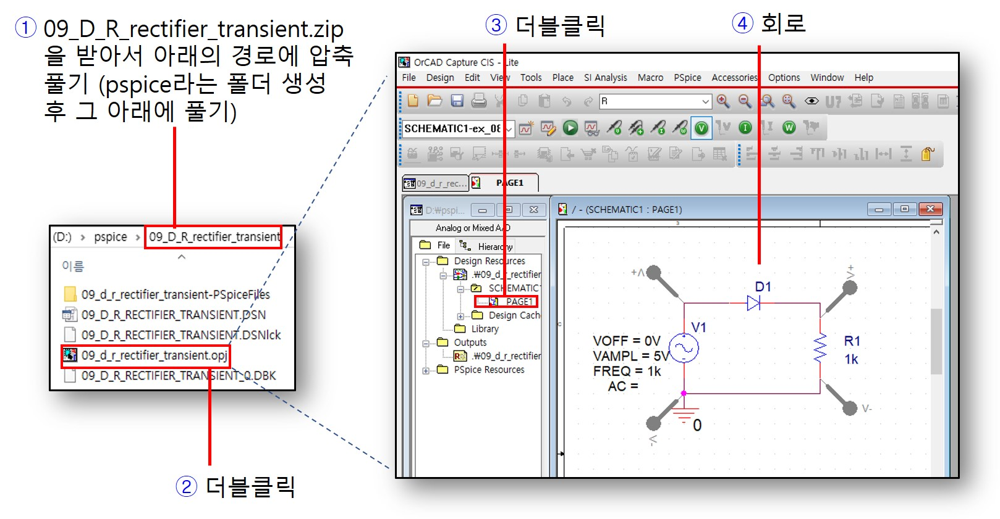
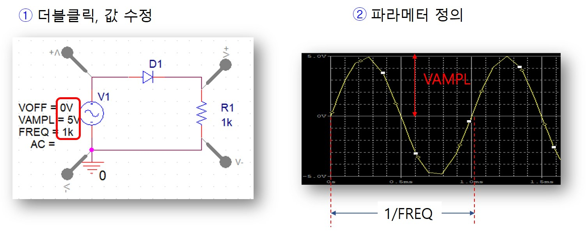
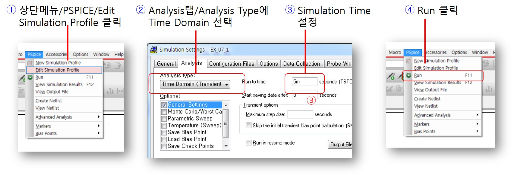
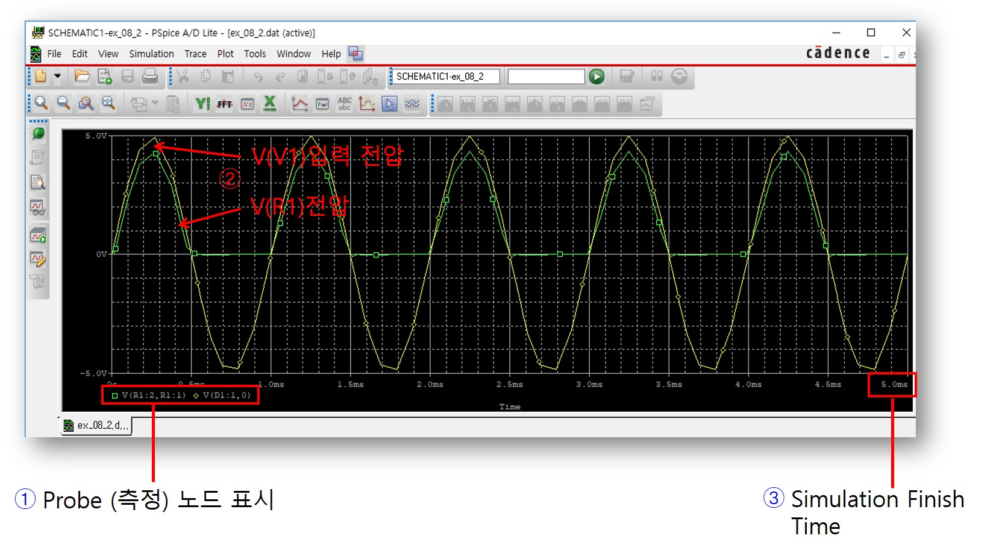
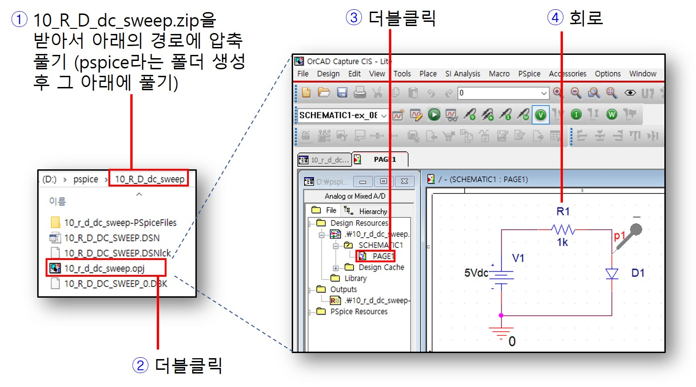
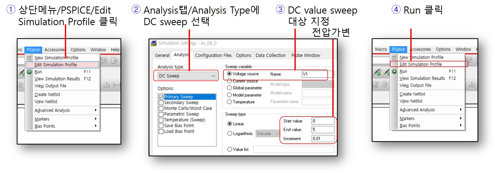
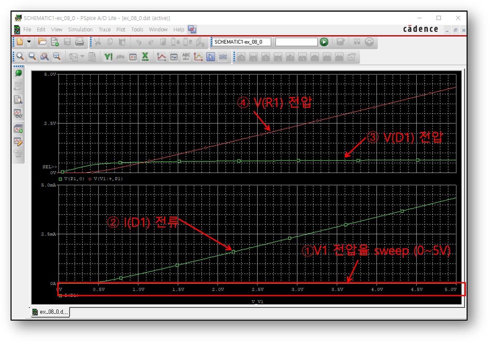

# PSPICE를 활용한 회로 시뮬레이션: R-Diode 회로

PSPICE를 이용하여 회로를 구성하고 원하는 입력을 설정한 뒤 시뮬레이션을 통해 회로 동작 특성을 파형으로 관찰해본다. 

## Diode-R 회로의 시간에 따른 응답특성 (Transient Analysis) 시뮬레이션 방법

Diode와 R의 직렬회로에 사인파를 인가하였을때 다이오드가 + 전압만 통과시키는 정류기 동작을 시뮬레이션으로 관찰해본다.

--------------------
### PSPICE 프로젝트 실행

1. 09_D_R_rectifier_transient.zip파일을 다운 받고 C나 D드라이브 아래 pspice라는 폴더를 만든 뒤 그 아래에서 압축을 해지한다. 압축파일이 풀리는 경로에 한글 이름이 포함되어 있으면 정상적인 실행이 되지 않으므로 주의한다.
2. 폴더안에 프로젝트 파일을 더블클릭한다.
3. 프로젝트 파일 목록에서 SCHEMETIC아래에 PAGE1을 더블클릭한다.
4. 준비된 회로가 열린다. 입력신호로 사인파가 인가되고, Diode와 R의 직렬회로로 구성되어 있음을 확인한다.

----------------------
### Diode-R 회로 구성 및 입력 신호 정의

1. 입력파형의 속성 파라메터값을 더블클릭하면 원하는 값으로 변경이 가능하다.
2. 각 파라메터의 의미는 그림과 같다. 원하는 파형을 생성하기 위해 값을 적절히 설정한다.

----------------------
### PSPICE 시뮬레이션 셋업 및 설정

시뮬레이션을 진행하기 전에 먼저 시뮬레이션 조건을 설정해야 한다.

1. 상단메뉴에서 PSPICE를 클릭하고 Edit Simulation을 클릭한다.
2. Analysis Tab을 클릭한 뒤 Analysis Type에 Time Domain을 선택한다. (이미 선택되어 있으면 무시), General Settings를 클릭한다.
3. Simulation Time을 5ms로 설정한다. 더 긴시간 동작을 측정하기 위해 값을 늘리면 된다.
4. 다시 실행메뉴로 돌아가서 Run을 실행한다.

-----------------------
### 시뮬레이션 결과 파형

입력파형이 회로로 인가되어 시간에 따른 회로의 동작을 파형으로 확인할 수 있다. 

1. 노란색 파형이 입력전압의 시간에 따른 파형이고, 초록색은 다이오드를 통과하여 정류된 저항 R 양단의 전압에 해당된다. 하단 Probe지점에 대해 표시되어 있음을 확인한다. 
2. 입력이 사안파로 인가되었다. 입력 전압이 일정한 레벨에 도달했을때 출력파형이 생성되기 시작함을 관찰한다. 출력파형이 입력신호보다 약간 작은 크기의 신호로 생성되는 것도 유심히 관찰하자. 
3. 시뮬레이션 설정에서 종료시간을 5ms로 설정하였다. 더 긴시간 파형을 관찰하고자 하면 이전으로 돌아가서 시뮬레이션 종료시간을 변경하면 된다.

------------------------
## 전원값 Sweep에 따른 DC Sweep 시뮬레이션 방법

회로에서 전원의 DC값을 변경하면서 (Sweep) 관찰하고자 하는 지점의 전압,전류 등의 DC값 변화를 시뮬레이션으로 관찰해보자.

------------------------
### PSPICE 프로젝트 실행

1. 10_R_D_dc_sweep.zip파일을 다운 받고 C나 D드라이브 아래 pspice라는 폴더를 만든 뒤 그 아래에서 압축을 해지한다. 압축파일이 풀리는 경로에 한글 이름이 포함되어 있으면 정상적인 실행이 되지 않으므로 주의한다.
2. 폴더안에 프로젝트 파일을 더블클릭한다.
3. 프로젝트 파일 목록에서 SCHEMETIC아래에 PAGE1을 더블클릭한다.
4. 준비된 회로가 열린다. 입력전원신호가 사각파나 사인파가 아닌 DC전원으로 설정되어 있음을 주의깊게 본다. 전원이름이 V1으로 지정되어 있다. R와 Diode의 직렬회로로 구성되어 있음을 확인한다. 

------------------------
### PSPICE 시뮬레이션 셋업 및 설정

시뮬레이션을 진행하기 전에 먼저 시뮬레이션 조건을 설정해야 한다.

1. 상단메뉴에서 PSPICE를 클릭하고 Edit Simulation을 클릭한다.
2. Analysis Tab을 클릭한 뒤 Analysis Type에 DC Sweep을 선택한다. (이미 선택되어 있으면 무시), General Settings를 클릭한다.
3. DC값 변경대상으로 Voltage source를 선택하고 이름에는 회로에서 정의한 DC입력전원의 V1값을 지정한다. 하단에 DC전압 가변값을 지정한다.
4. 다시 실행메뉴로 돌아가서 Run을 실행한다.

------------------------
### 시뮬레이션 결과 파형

DC 전원의 값을 변경하면서 관찰하고자 하는 지점의 전압과 전류의 DC값을 측정해본다.

1. Transient Analysis은 가로는 시간축, 세로는 측정하고자 하는 전압,전류 변화를 나타내며 시간에 따른 회로의 동작 특성을 보여주는 반면, DC sweep analysis 에서는 DC전원 소스의 값을 변화시키면서 관찰하고자 하는 지점의 전압,전류 변화를 관찰할 수 있다. 여기서는 V1입력전원을 0~5V로 가변하였다.
2. 입력전원 값의 변화에 따른 Diode D1을 통과하는 전류에 대한 시뮬레이션 결과를 보여준다.
3. 입력전원이 5V까지 변해도 Diode 양단전압은 대략 0.6V로 고정됨을 주의깊게 관찰한다.
4. 입력전원을 5V까지 상승함에 따라 비례하여 전류가 증가되므로 저항 R1에 인가되는 전압도 비례하여 증가됨을 알 수 있다. 입력전원이 대략 0.4V 이상이 될때 다이오드가  on이 되면서 전류흐름이 발생하고 그때부터 저항 양단에 전압이 형성됨을 관찰한다. 

