# 심화실험1: Operational Amplifier

본 실험은 신호 증폭에 관한 내용이며, 구체적인 이론은 2학년 3학년 수업에서 배우게 되므로 IC 칩 내부의 구체적인 회로 원리에 대한 설명은 배제하기로 한다.  본 실험에서는 직관적인 회로 해석 실험을 통해 증폭기를 간단히 구성해보고 증폭 원리를 실제적으로 체험해보는데 목적을 둔다.

## 실험목표
1. **Operational Amplifier (이하 Op-Amp)의 동작 원리 및 특성에 대해 간단한 이해**
2. **실험에 사용할 741 Op-Amp IC를 브레드보드에 배치하고 배선하기**
3. **Op-Amp를 이용한 증폭기 예제 활용: 반전 (Inverting) 증폭기, 비반전 (Non-Inverting) 증폭기, 비교기 (Comparator), Schmitt Trigger 구현 및 동작특성 측정**
-------------------------
### 예비보고서

#### <세부실험1 예비보고서>

전기, 전자 공학에서 빈번하게 다루는 기본소자가 Op-Amp 이다. 따라서 Op-Amp 의 동작 원리를 이해하는 것은 매우 중요한 일이다. Op-Amp는 일반적으로 입력 되어진 신호를 증폭하는 역할을 한다. 이때의 신호의 증폭 비율을 Gain 이라고 한다. 실험 전 Datasheet 을 통하여 실험에 필요한 OP amp 모델의 기본정보를 확인 할 수 있다. Google 또는 다른 Search Engine 을 사용하여 필요한 정보를 확인해보자.

1. **UA741CN OP amp 의 모델을 확인하고 Circuit Diagram를 그려본다.** 
2. **OP amp 는 능동 소자이기 때문에 회로에서 개별적인 Power 가 필요하다. Diagram 에서 Positive 및 Negative supply label 을 확인하고 핀 번호를 기록한다.**

```


```

Op-Amp 소자를 사용하여 반전증폭기(Inverting Amplifier)를 구현한 회로는 아래와 같다.  

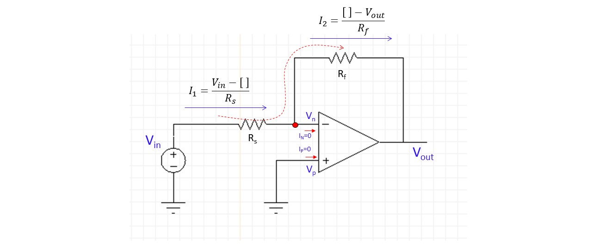

반전 증폭기는 입력된 신호를 Gain 배 만큼 신호를 증폭시키는 동시에, 입력된 신호의 극성을 전환시키는 역할을 한다. 이상적인 동작을 하는 OP amp 인 경우에 Vout 과 Vin 의 관계는 아래의 수식으로 나타낼 수 있다.

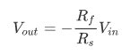

Op-Amp의 입력으로 인가되는 전류는 거의 0이라고 가정한다면, 위 그림에서 I1=I2라는 결론에 도달한다. 그리고 Op-Amp의 두 입력 Vn과 Vp가 거의 같다고 가정하자. (본 실험에서는 이러한 속성이 있다고 우선 가정. 자세한 원리는 강의시간 교수님 이론강의 참고하거나, 2~3학년때 회로 수업에서 정식으로 배우게 됨)

3. **I1=I2 및 Vp=Vn=0V 속성을 이용하여 위에서 정의한 공식(Vin, Rs, Rf 값에 따른 Vout)을 유도해본다.**
4. **3번에서 유도한 공식을 이용하여 Vout=-5Vin 가 될 수 있도록,  Rf, Rs값의 5개 조합을 제시하시오.**

```


```


------

#### <세부실험2 예비보고서>

Op-Amp 소자를 사용하여 비반전증폭기(Non-Inverting Amplifier)를 구성한 회로는 아래와 같다. 

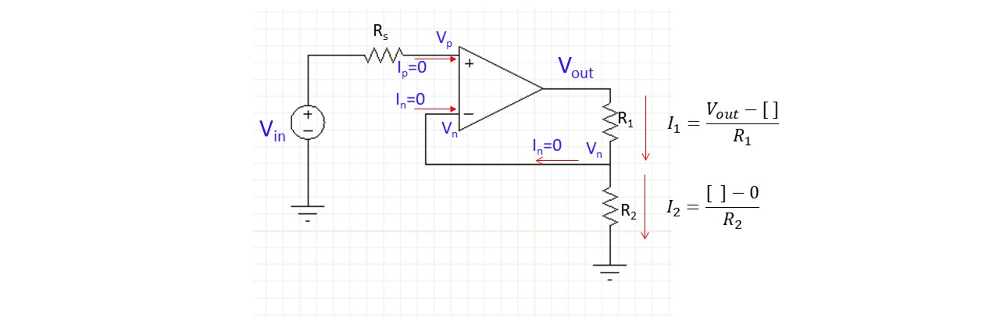

반전 증폭기와는 달리 입력된 신호를 Gain 배 만큼 신호를 증폭시키지만, 입력된 신호의 극성은 동일하게 유지하는 역할을 한다. 이상적인 동작을하는 OP amp 인 경우에 Vout 과 Vin 의 관계는 아래의 수식으로 나타낼 수 있다.


마찬가지로 Op-Amp의 입력으로 인가되는 전류는 거의 0이라고 가정한다면, 위 회로 그림에서 I1=I2라는 결론에 도달한다.

5. **I1=I2를 이용하여 위에서 정의한 공식(Vin, R1, R2 값에 따른 Vout)을 유도해본다.**
6. **5번에서 유도한 공식을 이용하여 Vout=5Vin 가 될 수 있도록,  R1, R2값의 5개 조합을 제시하시오.**

```


```


------

#### <세부실험3 예비보고서>

Op-Amp를 아래 그림과 같이 비교기 (Comparator) 역할로 사용할 수 있다. +/- 단자에 입력 되어진 전압을 비교하여 선택적으로 신호를 출력하는 회로를 구성 할 수 있다. 다양한 연속적인 입력신호를 Digitalize 화 시켜서 0/1의 신호로 변환시킨다. 입력에 따른 출력이 아래와 같음을 미리 숙지하도록 한다.

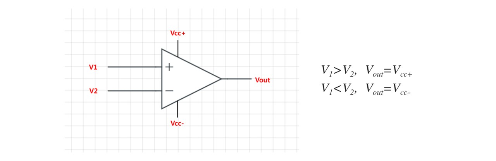

Op-Amp 소자를 사용하여 Schmitt Trigger를 구성한 회로는 아래와 같다. 반전증폭기와 유사하지만 자세히 보면 Op-Amp의 입력의 순서가 바뀌었음을 알 수 있다. 

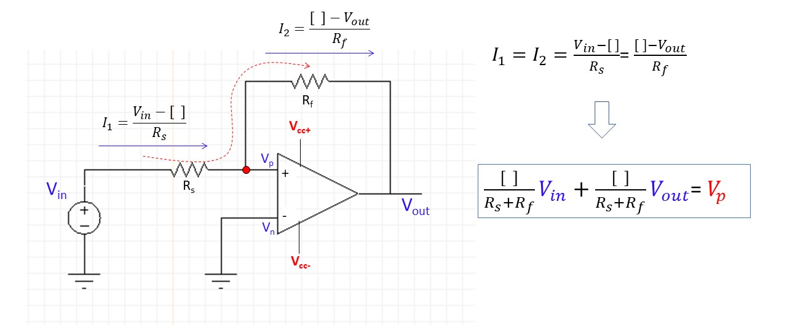

7. **Ip=In=0 의 속성을 활용하되 (즉 I1=I2), Vp=Vn이라는 가정을 미리 하지말고 Vp을 변수로 두고 Vout 출력을 Vin, Rs, Rf, Vp, Vn의 관계수식으로 유도해보아라 (위의 그림 오른쪽 하단 수식 유도).**
8. **7번에서 유도한 수식에 대해 Vp=Vn, Vp>Vn, Vp<Vn의 3가지 경우에 대해서 Vout이 어떻게 될지 결정해본다.**

```


```


## 세부실험 Lab1-1: 반전증폭기 (Inverting Amplifier)

본 실험에서는 반전 증폭기를 브레드보드에 구성해보고 입력에 대한 증폭 특성을 실험으로 확인해본다.


### Op-Amp IC를 이용한 회로 구성

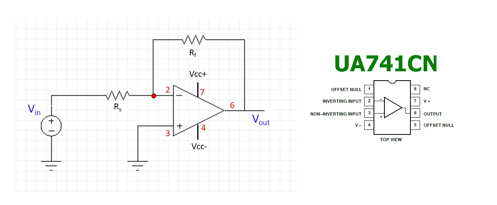

위의 그림의 왼쪽은 반전 증폭기의 회로도를 보여준다. 입력 Vin에 대해 Rs, Rf를 거쳐 증폭이 되어 Vout에 출력된다. 본 실험에서 사용할 741 Op-Amp에 대해 각 핀을 적절히 연결해야 한다.  (빨간색으로 2,3,4,6,7번 핀 표시되어 있음)

브레드보드로 구성한 모습은 아래와 같다.

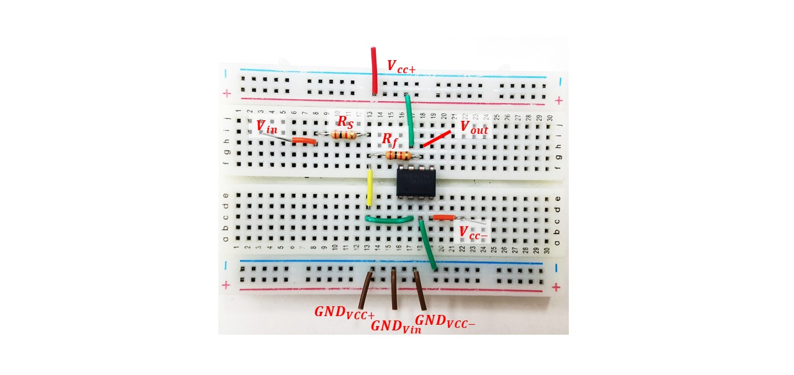

### 전원공급 및 입력(함수발생기), 출력측정(오실로스코프)

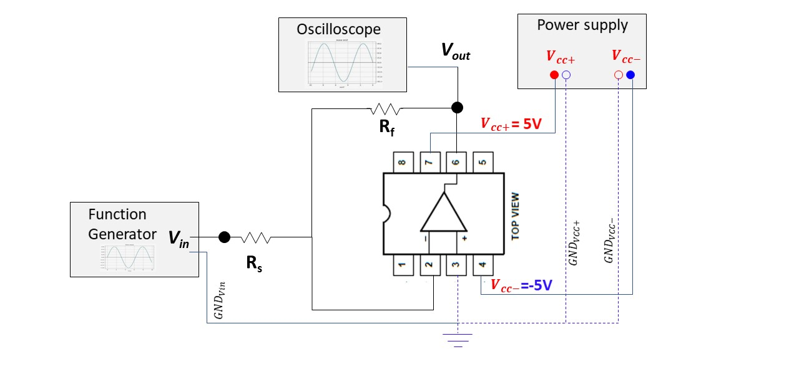

브레드보드에 구현한 반전 증폭기 회로에 대해 전원을 적절히 연결한 뒤, 함수발생기를 이용하여 입력을 생성하여 회로에 인가하고 출력을 오실로스코프를 이용하여 관찰한다. 

1. **전원공급기를 이용하여 2개의 전압을 Vcc+와 Vcc-핀에 연결한다. 주의할 점은 -5V를 인가하기 위해 전원공급기의 2번째 채널 출력의 마이너스 단자 (혹은 GND)를 Op-Amp의 4번 핀에 연결하고 전원공급기 출력의 +단자를 Op-Amp의 GND 3번 핀에 연결한다.**
2. **함수 발생기를 이용하여 적절한 주파수 (실험시간에 지도교수의 지시를 따르도록 한다)의 사인파를 생성한 뒤 위의 그림과 같이 Rs저항에 인가한다.**
3. **Vout 즉 Op-Amp의 6번 핀에 출력되는 파형을 오실로스코프를 이용하여 관찰한다. 파형의 형태가 계산한 결과 같은지 확인한다.** 

다음의 실험을 각 조별로 실시한다.

1. **Rs 가 1kΩ이고 Rf가 1 kΩ, 2 kΩ, 5 kΩ, 10 kΩ일때 증폭 Gain 값을 계산하여라.**
2. **Vin신호로 1V 진폭의 사인파를 회로에 인가시 Vout 을 측정하고 실제 Gain 값을 구하여라.**
3. **Rs 가 10kΩ이고 Rf가 1 kΩ, 2 kΩ, 5 kΩ, 10 kΩ일때 증폭 Gain 값을 계산하여라.**
4. **Vin신호로 2V 진폭의 사인파를 회로에 인가시 Vout 을 측정하고 실제 Gain 값을 구하여라.**


## 세부실험 Lab1-2: 비반전증폭기 (Non-Inverting Amplifier)

본 실험에서는 비반전 증폭기를 브레드보드에 구성해보고 입력에 대한 증폭 특성을 실험으로 확인해본다.

### Op-Amp IC를 이용한 회로 구성

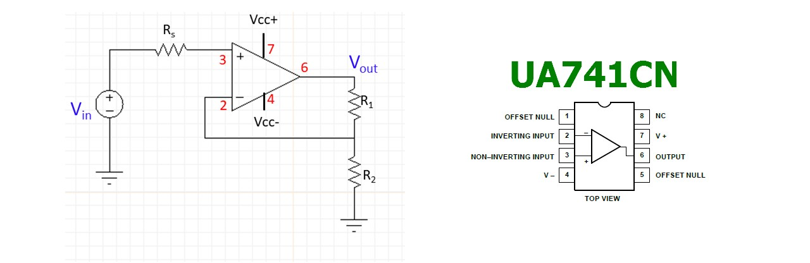

위의 그림의 왼쪽은 비반전 증폭기의 회로도를 보여준다. 입력 Vin에 대해 Rs, R1, R2를 거쳐 증폭이 되어 Vout에 출력된다. 본 실험에서 사용할 741 Op-Amp에 대해 각 핀을 적절히 연결해야 한다. (빨간색으로 2,3,4,6,7번 핀 표시되어 있음)

브레드보드로 구성한 모습은 아래와 같다.

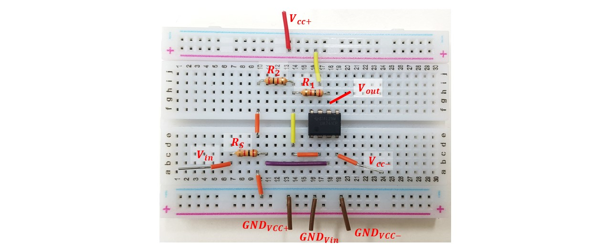

### 전원공급 및 입력(함수발생기), 출력측정(오실로스코프)

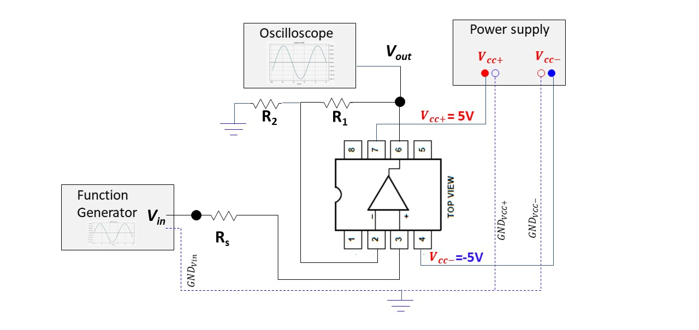

브레드보드에 구현한 비반전 증폭기 회로에 대해 전원을 적절히 연결한 뒤, 함수발생기를 이용하여 입력을 생성하여 회로에 인가하고 출력을 오실로스코프를 이용하여 관찰한다. 

1. **전원공급기를 이용하여 2개의 전압을 Vcc+와 Vcc-핀에 연결한다. 주의할 점은 -5V를 인가하기 위해 전원공급기의 2번째 채널 출력의 마이너스 단자 (혹은 GND)를 Op-Amp의 4번 핀에 연결하고 전원공급기 출력의 +단자를 Op-Amp의 GND 3번 핀에 연결한다.**
2. **함수 발생기를 이용하여 적절한 주파수 (실험시간에 지도교수의 지시를 따르도록 한다)의 사인파를 생성한 뒤 위의 그림과 같이 Rs저항에 인가한다.**
3. **Vout 즉 Op-Amp의 6번 핀에 출력되는 파형을 오실로스코프를 이용하여 관찰한다. 파형의 형태가 계산한 결과 같은지 확인한다.** 

다음의 실험을 각 조별로 실시한다.

1. **R2 가 1kΩ이고 R1가 1 kΩ, 2 kΩ, 5 kΩ, 10 kΩ일때 증폭 Gain 값을 계산하여라.**
2. **Vin신호로 1V 진폭의 사인파를 회로에 인가시 Vout 을 측정하고 실제 Gain 값을 구하여라.**
3. **R2 가 10kΩ이고 R1가 1 kΩ, 2 kΩ, 5 kΩ, 10 kΩ일때 증폭 Gain 값을 계산하여라.**
4. **Vin신호로 2V 진폭의 사인파를 인가하였을 때 Vout 을 측정하고 실제 Gain 값을 구하여라.**


## 세부실험 Lab1-3: 슈미트 트리거 (Schmitt Trigger)

본 실험에서는 슈미트 트리거 회로를 브레드보드에 구성해보고 입력의 변화에 대한 Digitizing된 출력 결과가 나오는 것을 실험으로 확인해본다.

### Op-Amp IC를 이용한 회로 구성

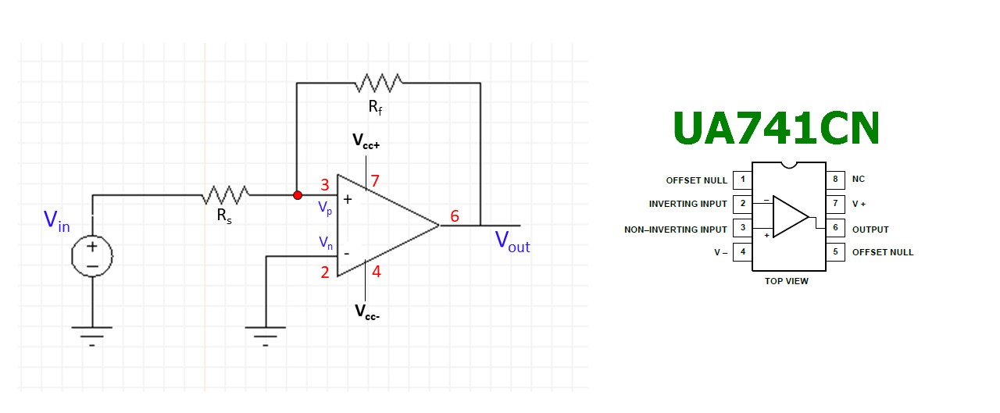

위의 그림의 왼쪽은 슈미트 트리거 회로도를 보여준다. 반전증폭기 회로와 유사해 보이나 Op-Amp 입력이 반대로 되어 입력전압이 비반전 입력 (3번핀)로 인가됨에 주의하자. 본 실험에서 사용할 741 Op-Amp에 대해 각 핀을 적절히 연결해야 한다. (빨간색으로 2,3,4,6,7번 핀 표시되어 있음)

Vp가 Vn과 같다는 virtual short 개념을 적용하지 않고 Vp를 그대로 둔 상태로 Vin과 Vout과의 관계를 식으로 정리하면 다음과 같다. (예비보고서 참고)


만약 Vin값을 바꾸게 되면 Vp값이 따라 변할 것이고 Vp=Vn같아질때 Vn=0이므로 Vp=0이 된다. Vp=0을 위 식에 대입하면 다음과 같은 식이 유도된다.


즉 Vin 입력 전압이 위의 식과 같아지면, 이때 Vp와 Vn이 같아지는 순간이라고 할 수 있다. Vin이 이 조건의 전압보다 조금 작아지면, Vp는 Vn보다 작게 된다고 추측할 수 있다. 따라서 Op-Amp는 기본적으로 두 입력에 대해 비교를 수행하므로, Vp가 Vn보다 작을 경우 출력값은 Vcc-가 될 것으로 예상할 수 있다.

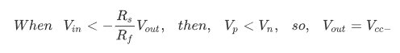

반대의 경우는 다음과 같은 수식으로 생각해볼 수 있다.

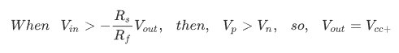

**이러한 원리를 바탕으로 아래 Vin과 같이 사인파를 인가할 경우 Vout 출력은 다음 그림의 파형이 생성될 것이다.**

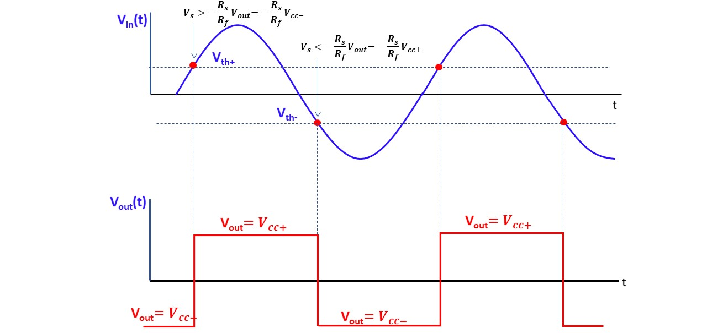


------

### 브레드보드에 슈미트 트리거 회로 구성

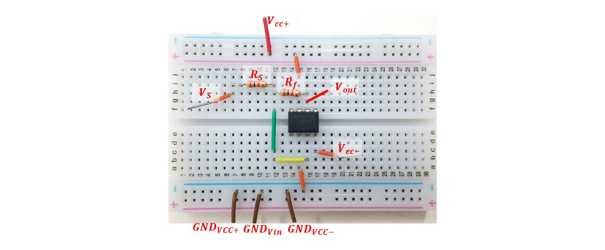

------

### 전원공급 및 입력(함수발생기), 출력측정(오실로스코프)

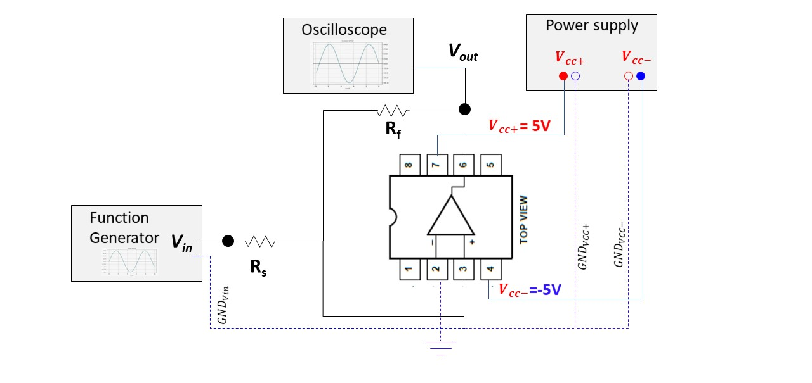

브레드보드에 구현한 슈미트 트리거 회로에 대해 전원을 적절히 연결한 뒤, 함수발생기를 이용하여 입력을 생성하여 회로에 인가하고 출력을 오실로스코프를 이용하여 관찰한다. 

1. **전원공급기를 이용하여 2개의 전압을 Vcc+와 Vcc-핀에 연결한다. 주의할 점은 -5V를 인가하기 위해 전원공급기의 2번째 채널 출력의 마이너스 단자 (혹은 GND)를 Op-Amp의 4번 핀에 연결하고 전원공급기 출력의 +단자를 Op-Amp의 GND 3번 핀에 연결한다.**
2. **함수 발생기를 이용하여 적절한 주파수 (실험시간의 지도교수의 지시를 따르도록 한다)의 사인파를 생성한 뒤 위의 그림과 같이 Rs저항에 인가한다.**
3. **Vout 즉 Op-Amp의 6번 핀에 출력되는 파형을 오실로스코프를 이용하여 관찰한다. 파형의 형태가 계산한 결과 같은지 확인한다.** 

다음의 실험을 각 조별로 실시한다. The Schmitt Trigger 를 이용하여 Sin 함수를 Digitalizing 하려고 한다. 입력신호가 1V 이상이면, +10V, 입력신호가 -1V 이하이면 -10V 출력하려고 한다. **(Rs = 1kΩ, Vin** **진폭 5+, 주파수 1khz))**

1. **예상되는 출력함수의 파형은 어떠한 모양을 가질것인가?**
2. **Vth+ 및 Vth- 를 각각 +1V/-1V 로 지정 해야 한다. Rs 및 Rf 를 결정하여라.**
3. **측정결과를 기록하여라.**


---------------------------
## 결과보고서

1. 담당교수의 지시사항을 숙지하여 해당 내용에 대한 실험을 실시한다. 실험과정, 측정데이타를 결과 보고서에 작성하여 제출한다.
2. 본 실험자료에서 제시된 기본적인 실험 과정, 장비사용방법, 측정 결과들을 충실히 요약 정리한다. 
3. 실험과 관련된 이론과 실측치를 비교하여 회로의 전기적 동작 원리에 대한 결론을 내려본다. (Optional) 
