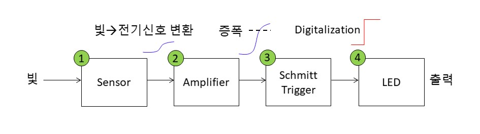
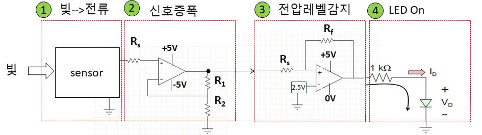
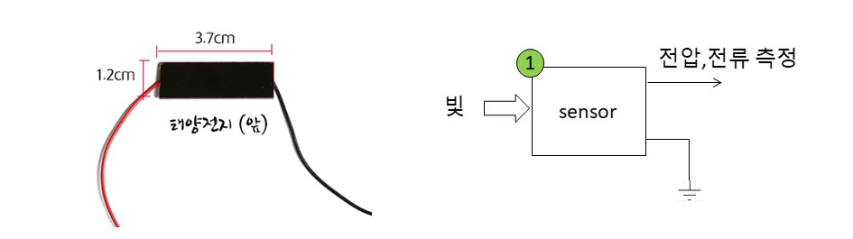
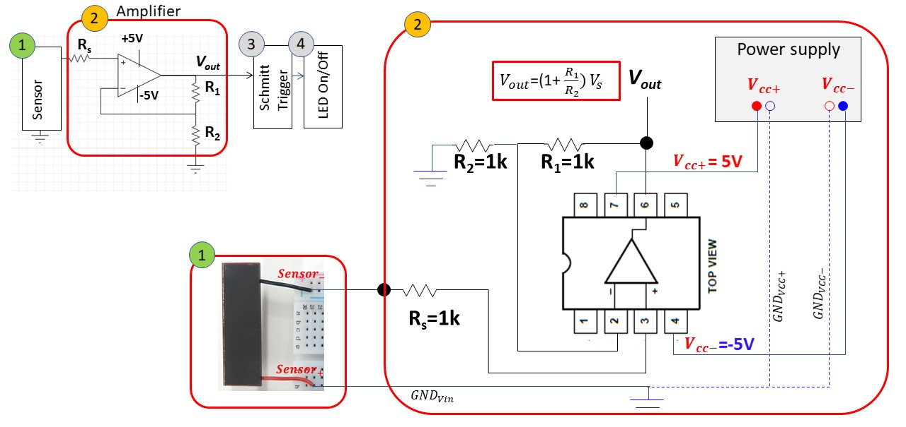
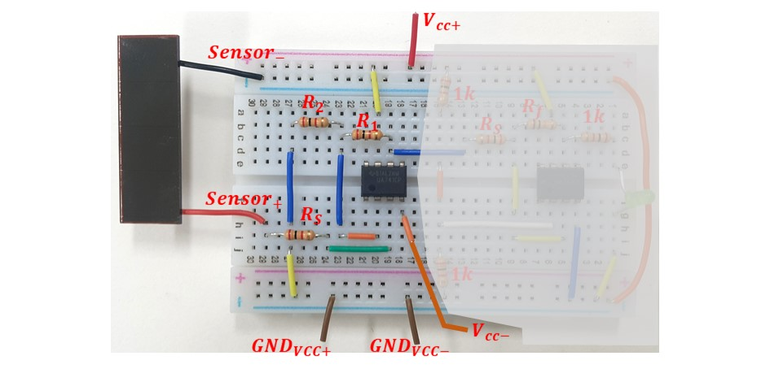
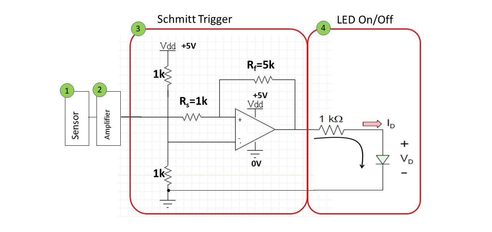
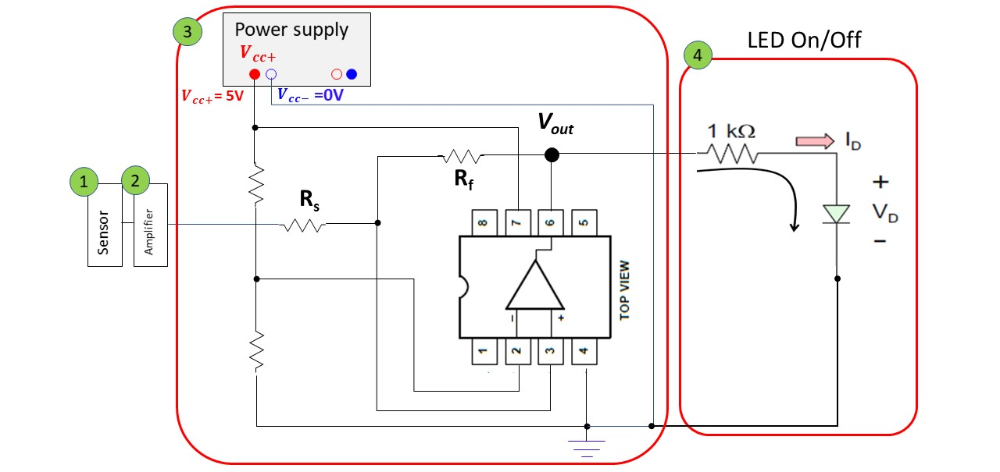
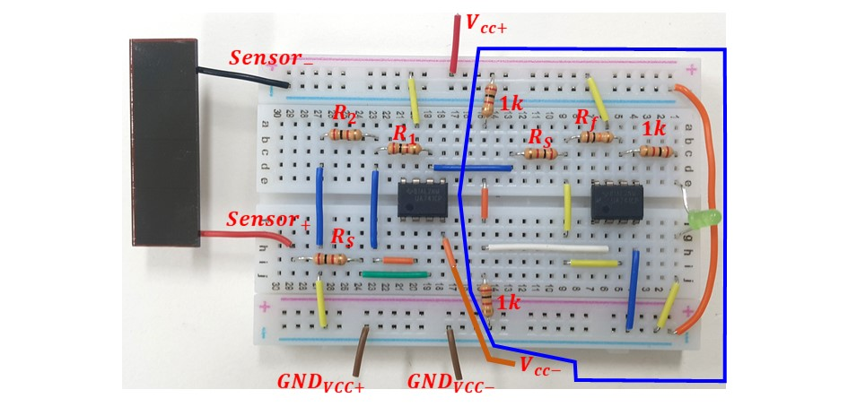

# 심화실험2: 광 감지 센서

본 실험에서는 광센서를 이용하여 회로 주변부의 광량에 따라 LED를 On/Off시키는 회로를 구성해본다. 심화실험1과 연계된 확장실험이므로 본 실험을 수행하기 위해서는 심화실험1을 먼저 수행하기를 추천한다. 

실험에 참여하는 학생들은 비반전증폭기와 슈미트 트리거 회로를 활용하여 광센서로부터 생성되는 작은 전기적 신호를 증폭하고 노이즈에 둔감한 디지털 신호를 생성하는 통합 회로를 구성해 봄으로써 센서를 이용한 전자회로 응용을 실제적으로 체험 해보도록 한다.

## 실험목표
1. **주변 밝기에 변화에 대한 광센서의 전기적 출력 특성 관찰 **
2. **비반전 증폭기를 구성하여 광센서 출력 전압을 증폭**
3. **슈미트 트리거를 이용하여 광센서 출력신호으로부터 노이즈에 둔감한 디지털 신호로 변환**
4. **디지털화 된 출력 전압을 이용하여 주변 밝기에 따른 LED On/Off 동작 구현**
-------------------------
### 예비보고서

본 실험에서는 광센서를 이용하여 주변 밝기에 따른 전압 변화를 관찰하여 LED를 구동하는 회로를 구현하고자 하며 다음의 4가지 회로를 구성하고자 한다. 

1. **위 그림 2번,3번,4번 회로에 대해 기초실험8번, 심화실험1번 자료를 복습하고 예상회로를 미리 작성해보도록 한다.** 
2. **1번, 2번, 3번, 4번 회로 사이의 예상되는 전압 파형을 그려보도록 한다.**
3. **2번의 증폭기 및 3번의 슈미트 회로가 필요한 이유에 대해서 생각해본다.** 

------

## 세부실험 Lab2-1: 광센서 특성

본 실험에서 구현할 회로는 아래 그림과 같이 크게 4가지로 구성된다. 먼저 1번에 해당하는 광센서에 대해 살펴보도록 하자.

### 광센서

본 실험을 위해 준비된 광센서는 아래 그림과 같다. 손으로 광센서 패널을 가려보면서 센서에 전달되는 빛을 조절해보자 (손으로 완전히 가렸다 뗏다를 반복)

### 실험

다음의 실험을 각 조별로 실시한다.

1. 광센서로 인가되는 빛의 양에 따른 센서 출력신호를 멀티미터로 관찰 (전압 및 전류를 기록)
2. **오실로스코프를 이용하여 센서 출력 파형을 관찰 (센서 출력 전압의 변화)**
3. +/- 단자를 바꾸어서 오실로스코프를 이용하여 전압관찰
4. 신호의 최대 진폭을 관찰해보고 증폭기의 필요성을 생각해보고 몇배로 증폭하면 될지 결정해본다.
5. 광센서 출력에 발생하는 노이즈 신호를 오실로스코프로 관찰해본다. 

## 세부실험 Lab2-2: 센서 출력신호 증폭

광센서의 출력신호가 작으므로 심화실험1에서 배운 비반전 증폭기를 이용하여 신호를 증폭해보자.

### 비반전 증폭기를 이용한 신호 증폭

아래 그림은 본 실험에서 구현할 4가지 회로중에 2번째에 해당한다. 본 실험에서는 비반전 증폭기의 동작원리 및 연결구조는 심화실험1을 통해 학습하였다고 가정한다. 

1. 센서의 출력을 Rs저항에 연결한다. 
2. 비반전 증폭기 (빨간색 박스)를 그림과 같이 구현한다.
3. 전원공급기를 이용하여 5V, -5V를 Op-Amp에 인가한다. 
4. 센서 출력신호의 크기를 관찰하여 적절한 Gain으로 증폭하도록 R1, R2를 설정한다 (아래 그림은 2배 증폭)
5. **광센서를 손으로 가렸다 뗏다 하면서 Vout신호를 오실로스코프로 관찰한다.**
6. 최종 Vout신호를 다음섹션 (Lab2-3)의 회로의 입력으로 연결한다.

### 브레드보드에 회로 구현

아래 그림과 같이 브레드보드에 광센서와 비반전 증폭기를 구현해보자. 

## 세부실험 Lab2-3: 슈미트 트리거 (Schmitt Trigger)

본 실험에서는 슈미트 트리거 회로를 브레드보드에 구성해보고 광센서의 신호로 부터 Digital 신호로 변환해보자.

### 슈미트 트리거와 LED구동회로 개념도

위의 그림의 3번 블록은 광센서 출력을 증폭한 신호를 받아서 0V 혹은 VDD(5V)의 디지털 값으로 변환하기 위한 슈미트 회로의 구조를 보준다. 4번 블록은 디지털로 변환된 전압을 이용하여 LED를 On/Off 시킬 수 있는 회로이다.

741 Op-Amp를 브레드보드에 배치하고 전원공급기등을 연결한 모습은 아래와 같다.

위 그림의 3번 4번 박스로 표시된 부분을 브레드보드에 추가로 구현한 모습은 아래 그림과 같다. (파란색 박스로 표시된 영역)

**광센서에 인가되는 빛의 양에 따라** **최종적으로 LED가 On / Off되는지 관찰한다**. 광센서에 인가되는 빛에 좀더 민감하게 반응하도록 R값들을 적절히 조절해보라. (슈미트 회로의 Vth값 조절)

---------------------------
## 결과보고서

1. 담당교수의 지시사항을 숙지하여 해당 내용에 대한 실험을 실시한다. 실험과정, 측정데이타를 결과 보고서에 작성하여 제출한다.
2. 본 실험자료에서 제시된 기본적인 실험 과정, 장비사용방법, 측정 결과들을 충실히 요약 정리한다. 
3. 실험과 관련된 이론과 실측치를 비교하여 회로의 전기적 동작 원리에 대한 결론을 내려본다. (Optional) 
