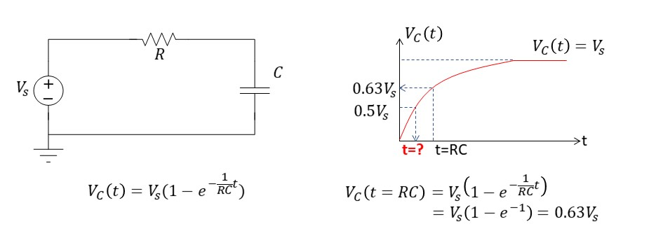
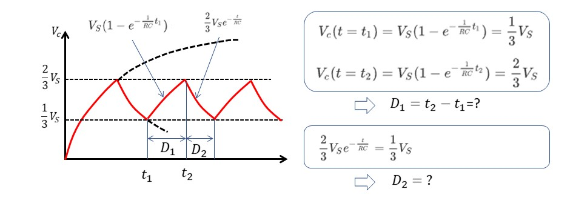
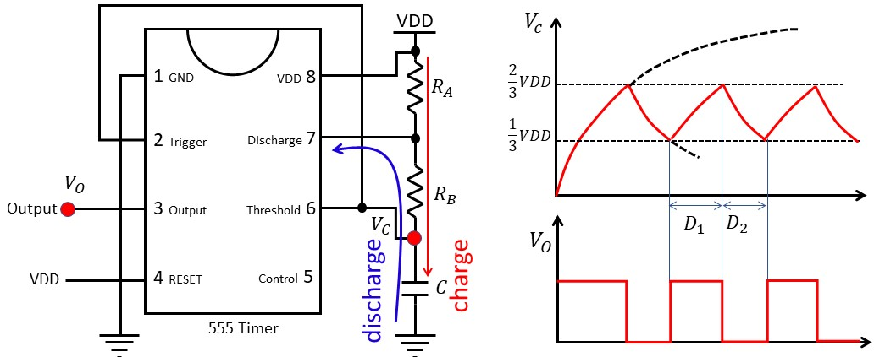
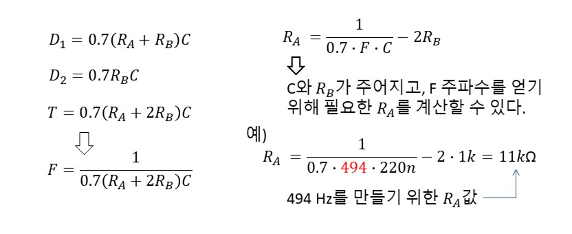
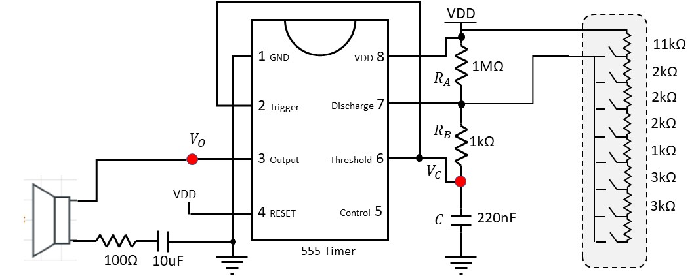
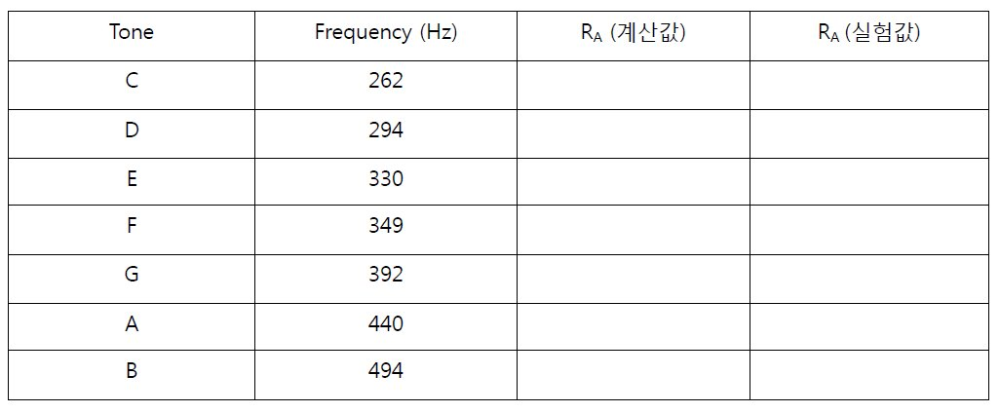
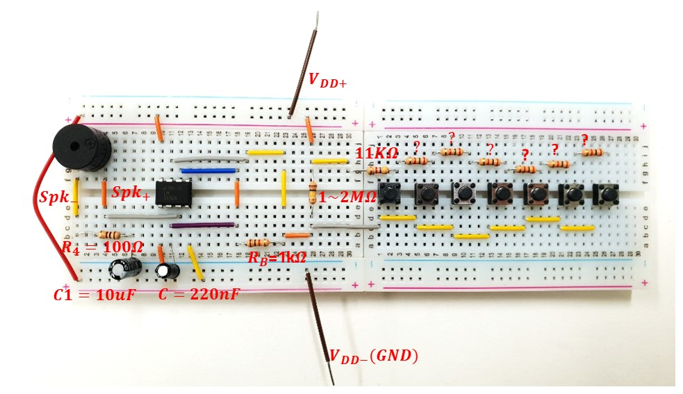

# 심화실험3: 피아노 (소리 합성)

본 실험에서는 555 타이머와 R-C 충방전 원리를 이용하여 원하는 주파수의 펄스를 만들고 이를 이용하여 스피커를 구동하는 실험을 실시한다. 아래 링크를 클릭하여 실험 데모를 확인한다.

https://www.dropbox.com/s/t8atqsenduk12a9/ezgif.com-rotate.mp4

<video width="100%" controls="true" poster="" >
<source src="https://www.dropbox.com/s/t8atqsenduk12a9/ezgif.com-rotate.mp4?raw=1" type="video/mp4" />
</video>

## 실험목표
1. R-C회로에서 시정수의 개념을 다시 한번 복습하고 충방전 하는데 걸리는 시간을 계산해본다.
2. 555 타이머에 저항과 커패시터를 연결하여 Oscillation 출력을 생성할 수 있는 회로를 구성한다.
3. 도,레,미,파,솔,라,시 각각에 해당하는 주파수의 출력 펄스를 생성할 수 있도록 R, C값을 결정한다.
4. 스위치를 이용하여 저항값을 단계적으로 조절하여 버튼을 누를때마다 도,레,미,파,솔,라,시의 소리를 낼 수 있는 스피커를 구현한다.
-------------------------
### 예비보고서

아래 그림의 저항-커패시터 (R-C) 회로에서 시간에 따른 커패시터 전압 변화에 대한 수식을 다시 한번 상기해본다.   



1. 오른쪽 그림과 같이 C 양단 전압이 시간에 따라 천천히 상승한다. 특히 t=RC일때 커패시터 전압이 입력에 대해 63%에 도달함을 확인하고 수식으로 다시 한번더 계산해본다.
2. 1번의 과정을 활용하여, 이번에는 커패시터 전압이 50%에 도달할 때의 시간을 계산해본다.

```


```


555 타이머를 이용하면 아래 그림과 같이 최대 전압값의 2/3지점에서 다시 방전하고 1/3에서 다시 충전하도록 제어할 수 있다. 상승할 때의 충전곡선의 식과, 하강할 때의 방전곡선의 식이 아래 그림 왼쪽에 화살표로 표시되어 있다. t1지점에서 Vc(t)=1/3Vs이 되고 t2지점에서는 Vc(t)=2/3Vs가 된다. 이 값을 만족하는 t1과 t2를 아래 그림 오른쪽 식을 이용하여 계산한 뒤 최종적으로 D1=t2-t1을 계산할 수 있다. 마찬가지로 하강시 Vc(t)=1/3Vs를 만족하는 t값이 D2가 된다. 이러한 계산과정을 이용하여 D1, D2값을 R과 C의 관계식으로 계산해본다.



1. 충전을 통한 상승곡선에 대해 t1과 t2를 계산하고 D1을 계산한다.
2. 방전시 D2를 계산해본다.
3. 1번,2번 항목에서 계산한 D1,D2 식을 이용하여 R=1k, 2k, 5k, 10k, C=100uF일 경우 각각에 대한 D1,D2와 함께 주기 T=D1+D2 및 F=1/T에 대해서도 계산해본다.

```


```


555 타이머의 핀 다이어그램과 발진 출력을 낼 수 있는 타이머 주변부 회로 구성을 인터넷에서 조사해보고 아래에 그려본다.

```


```


------


## 세부실험 Lab3-1: 555 타이머를 이용한 발진 출력 생성

555 타이머를 이용하여 발진 출력을 생성하기 위한 회로 구성은 아래와 같다. 충전시 RA와 RB를 거쳐 C가 충전되지만, 방전시에는 C와 RB만을 거친다는 사실에 주목하자. 555 타이머에 아래와 같이 RA, RB, C를 연결하였을때 Vc값이 아래 오른쪽 그림과 같이 충방전을 반복하게 되고, 최종적으로 Vc 전압 변화의 주기와 동기되어 출력 Vo의 펄스가 생성된다. 즉 RA, RB, C 조절하면 최종 출력 펄스의 주파수를 조절할 수 있게된다.




충전할 때는 저항 RA와 RB를 거치고 방전할 때는 RB만을 거치므로 충방전시 D1, D2는 아래와 같다. (계산과정은 예비보고서에서 실시함). 주어진 RA, RB, C에 대해 출력 주파수의 식은 아래 그림 오른쪽 맨 밑과 같다. 따라서 C, RB가 결정되어 있을 때 원하는 주파수를 생성하기 위한 RA값을 아래 오른쪽 식과 같이 결정할 수 있다.




### 실험

상기에 기술한 555타이머와 RA,RB,C를 적절히 배치하여 회로를 구성한 뒤 다음의 실험을 각 조별로 실시한다.

1. 브레드보드에 555 타이머를 배치하고 전원, 저항 등을 위의 그림과 같이 적절히 연결한다. (RA=11kΩ, RB=1kΩ, C=220nF)
2. Vc전압과 Vo전압을 오실로스코프로 측정한다.
3. RA, RB, C를 교체해보면서 출력파형의 주파수가 달라지는지 확인하고 계산결과로부터 얻어진 예상주파수와 비교해본다.


## 세부실험 Lab3-2: 회로 구현

이제 555 타이머의 출력펄스를 스피커에 연결하여 소리를 만들어보자. 저항 RA값을 단계적으로 조절하여 도레미파솔라시에 대등되는 주파수를 가지는 펄스를 생성하여 피아노를 구현해본다.


### 회로개념도

아래 그림은 555 타이머와 R,C와 연결하여 발진출력 생성하고 그 출력을 스피커에 연결한 모습이다. 특히 RA자리에 스위치와 여러개의 저항을 연결하여 토탈 RA저항값을 단계적으로 선택할 수 있도록 하였다.

1. 브레드보드에 아래 555타이머에 전원공급, 저항, 커패시터를 먼저 연결한다.
2. 출력 Vo를 확인한다. 
3. 스피커를 아래와 같이 연결한다.
4. 도레미파솔라시에 대응하는 주파수 출력을 생성하기 위한 RA값을 계산한 뒤 실험준비실에 비치된 저항중에 가장 비슷한 값의 저항을 선택하고 아래 표를 채우시오.
5. 아래 그림 오른쪽의 회색 영역과 같이 스위치를 이용하여 저항 증가분을 연속적으로 연결해서 저항값을 누적시키면서 점진적으로 저항크기를 조절할 수 있도록 한다.





### 브레드보드에 회로 구현

최종적으로 아래 그림과 같이 브레드보드에 피아노 회로를 구현해보고 음계에 맞는 소리가 나오는지 확인한다.  (음색이 이상하면 저항값 등 다시 확인), 그리고 버튼 누를때의 오실로스코프로를 이용하여 스피커로 들어가는 파형을 관찰해본다.




---------------------------
## 결과보고서

1. 담당교수의 지시사항을 숙지하여 해당 내용에 대한 실험을 실시한다. 실험과정, 측정데이타를 결과 보고서에 작성하여 제출한다.
2. 본 실험자료에서 제시된 기본적인 실험 과정, 장비사용방법, 측정 결과들을 충실히 요약 정리한다. 
3. 실험과 관련된 이론과 실측치를 비교하여 회로의 전기적 동작 원리에 대한 결론을 내려본다. (Optional) 
