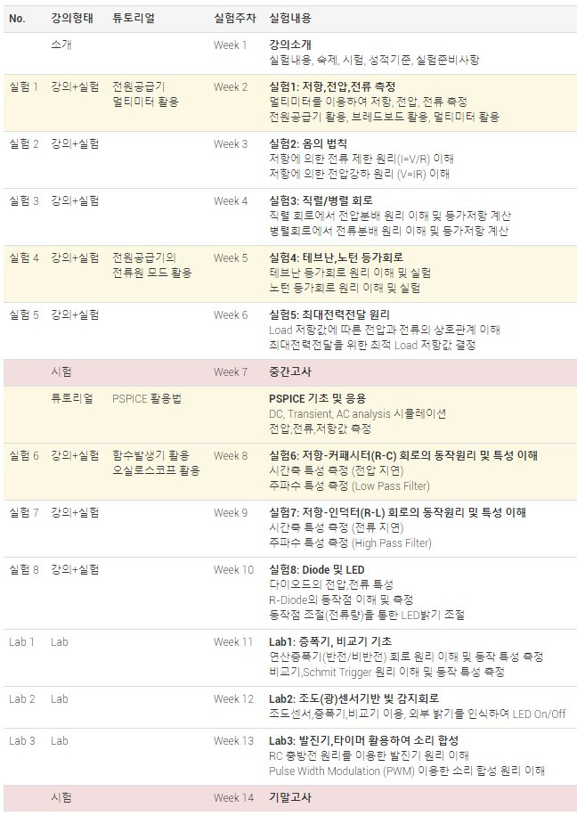
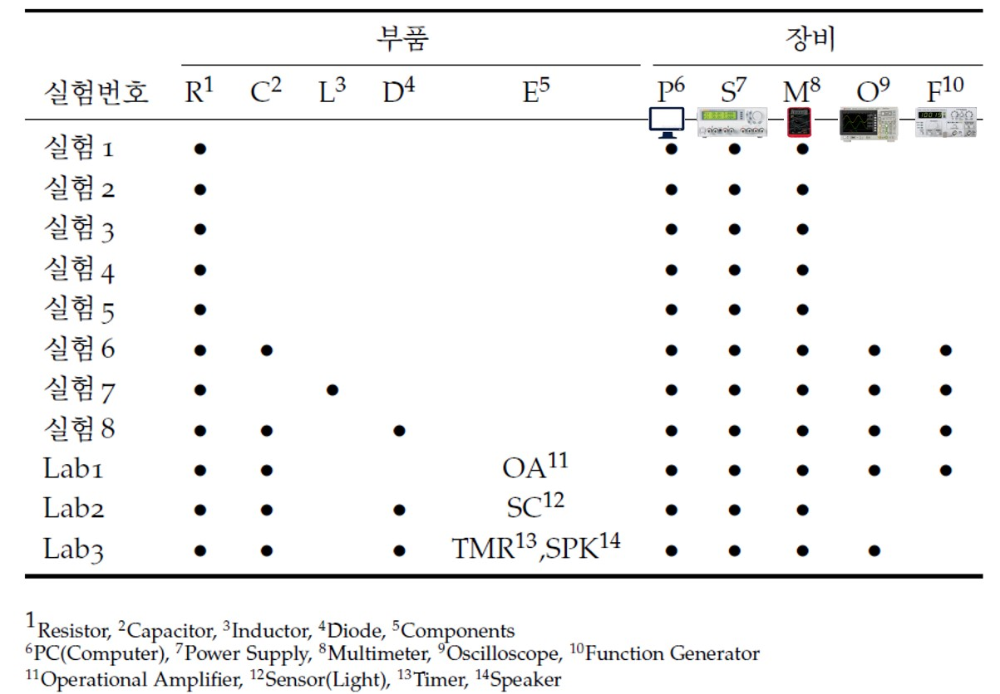
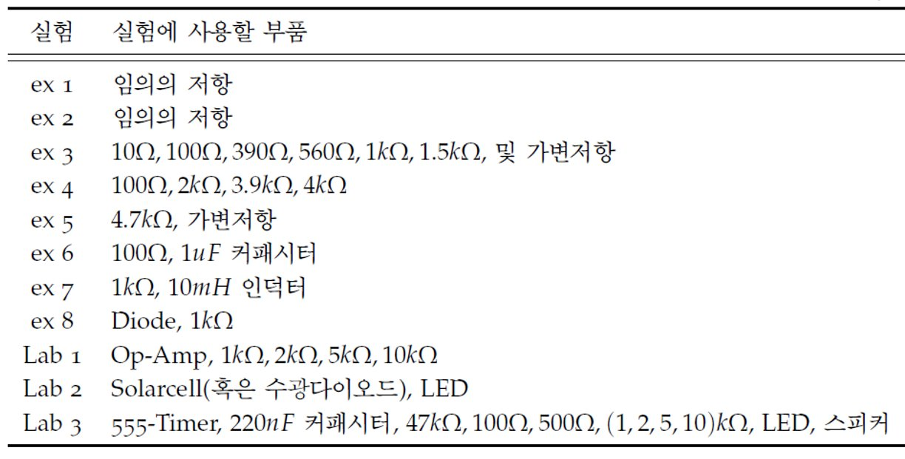

# ELEC211: 기초전자실험 및 설계 (경북대학교 전자공학부) 

본 자료는 경북대학교 전자공학부 기초전자실험 및 설계 실험을 수행하기 위한 각종 실험요령, 장비상용법, 실험 절차 등을 상세히 기술한 문서이다.

상단의 폴더를 클릭하면 상세한 자료를 확인할 수 있다. 실험과정을 실사로 촬영하여 각 부분을 번호로 표기하고 번호 순서대로 그대로 따라해보면서 실험을 진행할 수 있도록 상세히 설명하였다.  

1. [01_equipment](./01_equipment/) 폴더는 실험에 사용할 장비, 계측기들의 활용법을 튜토리얼 자료를 담고 있다.
2. [02_experiments](./02_experiments/) 폴더를 클릭하면 기초실험 8개에 대한 상세한 실험 절차를 확인할 수 있다.
3. [03_pspice](./03_pspice/) 폴더에는 R,L,C 회로 동작을 PSPICE 시뮬레이션을 수행하기 위한 튜토리얼 자료를 담고 있다. 
4. [04_lab](./04_lab/) 자료는 학기 후반부에서 심화 실험 2~3개 세트를 선택적으로 수행하기 위한 Lab 절차를 담고 있다. (추후 업데이트)

주요스케쥴은 다음과 같다.
 

실험별 필요부품, 장비, 계측기들은 다음과 같다.

각 실험에서 사용되는 부품목록은 다음과 같다. 세부 값은 추후 변경가능

실험 테이블에 준비된 장비, 계측기는 다음과 같다.

